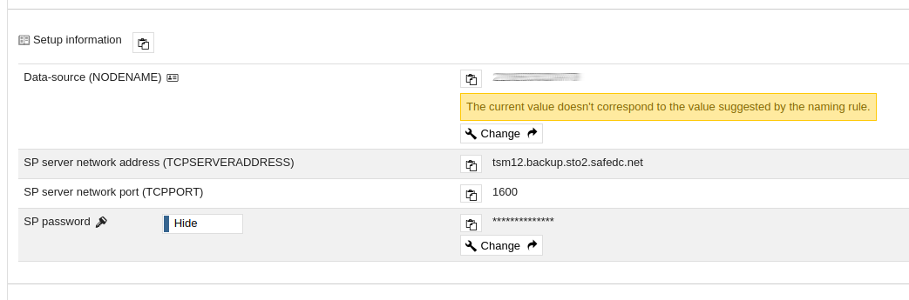
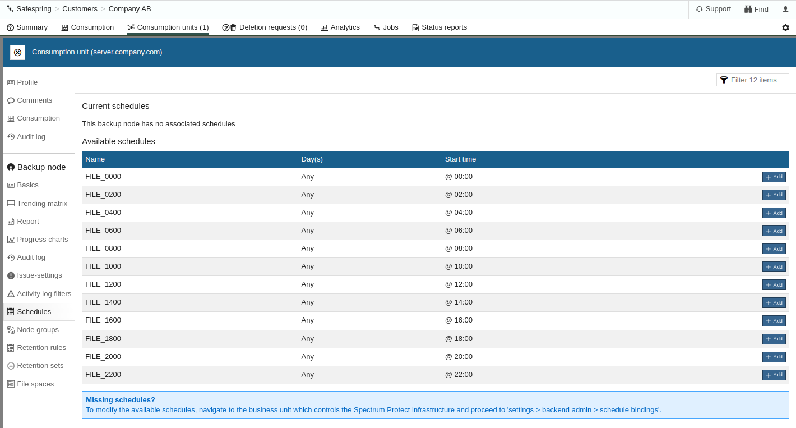

# Linux Installation (64-bit)
## Manual Installation

_This document describes how to **manually** install IBM Spectrum Protect Backup-Archive Client on Linux Operating system like Ubuntu and RedHat Enterprise Linux (64-bit)._

Required files:

- [IBM Spectrum Protect Backup-Archive Client](https://public.dhe.ibm.com/storage/tivoli-storage-management/patches/client/v8r1/Linux/)
- [SafeDC Root CA PEM File](linux-ca-pem) (Right-click and Save)
- [SafeDC Default Option file dsm.opt](linux-dsm-opt) (Right-click and Save)
- [SafeDC Default Configuration file dsm.sys](linux-dsm-sys) (Right-click and Save)

### Installation and Configuration

#### Installation

1. Download the required files according to above into a temporary folder
    1. Ubuntu / Debian
    ```
    wget https://public.dhe.ibm.com/storage/tivoli-storage-management/patches/client/v8r1/Linux/LinuxX86_DEB/v81xx/8.x.xx.x-TIV-TSMBAC-LinuxX86_DEB.tar
    ```

    1. RHEL / RPM based distros
    ```
    wget https://public.dhe.ibm.com/storage/tivoli-storage-management/patches/client/v8r1/Linux/LinuxX86/BA/v81xx/8.x.xx.x-TIV-TSMBAC-LinuxX86.tar
    ```

1. Extract the package `8.x.x.x-TIV-TSMBAC-LinuxX86.tar` for RPM based Linux distros or `8.x.x.x-TIV-TSMBAC-LinuxX86_DEB.tar` for Debian based Linux distros
    1. Ubuntu / Debian
    ```
    tar xvf 8.1.xx.x-TIVBAC-LinuxX86_DEB.tar
    ```

    1. RHEL / RPM based distros
    ```
    tar xvf 8.1.xx.x-TIVBAC-LinuxX86.tar
    ```

1. Install the minimum requirment packages, `gskcrypt64`, `gskssl64`, `tivsm-api64`, `tivsm-ba`. All other packages has other functionalities like journaling.
    1. Ubuntu / Debian
    ```
    sudo apt-get install ./gskcrypt64_x.x-xx.x.linux.x86_64.deb ./gskssl64_x.x-xx.x.linux.x86_64.deb ./tivsm-api64.amd64.deb ./tivsm-ba.amd64.deb
    ```

    1. RHEL / RPM based distros
    ```
    sudo dnf install ./gskcrypt64-x.x.xx.x.linux.x86_64.rpm ./gskssl64-x.x.xx.x.linux.x86_64.rpm ./TIVsm-API64.x86_64.rpm ./TIVsm-BA.x86_64.rpm
    ```

#### Install Safespring Root Certificate

1. Download the [SafeDC Root CA PEM File](linux-ca-pem). In a command prompt with elevated privileges, install the Safespring BaaS Root CA into the GSK (IBM crypto kit) trust database.
    ```
    wget https://raw.githubusercontent.com/safespring/cloud-BaaS/master/pki/SafeDC-Net-Root-CA.pem
    sudo dsmcert -add -server SafeDC -file ./SafeDC-Net-Root-CA.pem
    ```

#### Create Configuration File
1. Download the [dsm.sys.sample](linux-dsm-sys) & [dsm.opt.sample](linux-dsm-opt)
    ```
    wget https://raw.githubusercontent.com/safespring/cloud-BaaS/master/unix/dsm.sys.sample
    wget https://raw.githubusercontent.com/safespring/cloud-BaaS/master/unix/dsm.opt.sample
    ```

1. Retrieve client node configuration and password from the [Safespring Backup Portal](baas-portal), download and modify the `dsm.sys.sample` file, copy the *Setup Information* from the portal and paste it in to `dsm.sys.sample` file and remove `.sample`  on both `dsm.opt` and `dsm.sys` 



Paste the information to the `dsm.sys` file between the `*** Copy and Paste Information from Safespring Backup Portal ***` sections

```
* sample dsm.sys for SafeDC

SERVERNAME SafeDC
  *** Copy and Paste Information from Safespring Backup Portal ***
  NODENAME XXXXXXXXXX
  TCPSERVERADDRESS tsm12.backup.sto2.safedc.net
  TCPPORT 1600
  *** Copy and Paste Information from Safespring Backup Portal ***

  COMMMETHOD         V6TCPIP
*  legacy clients may have to use TCPIP
*  COMMMETHOD         TCPIP
  SSL                yes
  SSLREQUIRED        yes
  PASSWORDACCESS     GENERATE
  MANAGEDSERVICES    SCHEDULE
  VIRTUALMOUNTPOINT  /dev
  SCHEDLOGRETENTION  28
  SCHEDLOGNAME       /var/log/dsmsched.log
  ERRORLOGRETENTION  28
  ERRORLOGNAME       /var/log/dsmerror.log
  SCHEDCMDDISABLED   yes
  SCHEDCMDEXCEPTION  "tbmr_license"
  SCHEDCMDEXCEPTION  "db_full"
  SCHEDCMDEXCEPTION  "db_incr"
  SCHEDCMDEXCEPTION  "mail_full"
  SCHEDCMDEXCEPTION  "mail_incr"
  SCHEDCMDEXCEPTION  "client_maintenance"

  SCHEDRESTRETRDISABLED   yes
  SRVPREPOSTSCHEDDISABLED yes
  SRVPREPOSTSNAPDISABLED  yes

  REVOKEREMOTEACCESS Access
  TESTFLAG disable_tls13
```

Save both `dsm.sys` and `dsm.opt` in `/opt/tivoli/tsm/client/ba/bin/`

1. Test the connection, easiest way is via CLI.
    1. **Login via Linux Terminal**
    
    Start a Linux terminal and run the `dsmc`, it will now ask you to confirm the *User ID* that is the same as your node name, and copy and paste the password from the [Safespring Backup Portal](baas-portal)
    
     

    ```
    $ sudo dsmc
    IBM Spectrum Protect
    Command Line Backup-Archive Client Interface
    Client Version 8, Release 1, Level 15.2 
    Client date/time: 2022-11-08 11:47:33
    (c) Copyright by IBM Corporation and other(s) 1990, 2022. All Rights Reserved. 

    Node Name: XXXXXX
    ANS1051I Invalid user id or password
    Please enter your user id <XXXXXX>:      

    Please enter password for user id "XXXXXX":  <-- Paste Password from Backup Portal

    Session established with server TSM12: Linux/x86_64
    Server Version 8, Release 1, Level 15.000
    Server date/time: 2022-11-08 12:47:36  Last access: 2022-11-08 11:07:10

    Protect> 
    ```

    Run `quit` to exit Spectrum Protect Backup-Archive Client CLI.

#### Schedule Daily Backups

1. IBM Spectrum Protect Backup-Archive Client are polling the backup server on regular basis to see when it will backup your data next time.
To assign a predefined schedule, open [Safespring Backup Portal](baas-portal) and go to the *consumption unit* you want to define an schedule too and click on *schedule* 


Here can you schedule the backup for your consumption unit.

1. Setup IBM Spectrum Protect Backup-Archive Client schedule polling.
    1. **Setup schedule via Linux Terminal**
     
    ```
    sudo systemctl enable dsmcad 
    
    sudo systemctl start dsmcad
    ```

### Finish
Basic installation for Backup-Archive Client is now finish, if you need to setup a Online agent for e.g Microsoft SQL, Orable Database or any other application, you can continue with that installation.


[baas-portal]:https://portal.backup.sto2.safedc.net/
[linux-ca-installer]:https://raw.githubusercontent.com/safespring/cloud-BaaS/master/pki/Update-SafeDC-Net-CA.sh
[linux-ca-pem]:https://raw.githubusercontent.com/safespring/cloud-BaaS/master/pki/SafeDC-Net-Root-CA.pem
[linux-dsm-opt]:https://raw.githubusercontent.com/safespring/cloud-BaaS/master/unix/dsm.opt.sample
[linux-dsm-sys]:https://raw.githubusercontent.com/safespring/cloud-BaaS/master/unix/dsm.sys.sample