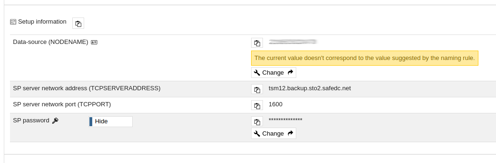

# Windows installation
## Manual installation

### Microsoft Windows (64-bit)

_This document describes how to **manually** install IBM TSM on Windows Windows (64-bit)._

Required files:

- [IBM Spectrum Protect Backup-Archive Client](https://public.dhe.ibm.com/storage/tivoli-storage-management/patches/client/v8r1/Windows/x64/)
- [SafeDC Root CA installer](https://raw.githubusercontent.com/safespring/cloud-BaaS/master/pki/SafeDC-Net-Root-CA-tsm12-win64.bat) (Right-click and Save)
- [SafeDC Default Configuration file dsm.opt](https://raw.githubusercontent.com/safespring/cloud-BaaS/master/windows/dsm.opt.sample) (Right-click and Save)

### Procedure

1. Download the required files according to above into a temporary folder
1. Run `8.x.x.x-TIV-TSMBAC-WinX64.exe` to install the program and *hold* at the following point:

    

    1. The installation process will by default require a reboot, due to the installation of a couple of VC redistributables.
    1. If a reboot is unpleasant, at the above decision point, jump to the _"Circumvent reboot during install"_ section below.
    1. Resume the installation, choose Typical installation and accept the UAC pop-up that comes up, "IBM manager".
    1. After installation, answer 'No' to the reboot question.

1. In a command prompt with elevated privileges, execute the "Safespring Root CA installer" to install the Safespring BaaS CA into the GSK (IBM crypto kit) trust database.
    ```
    SafeDC-Net-Root-CA-tsm12-win64.bat
    ```
1. Retrieve client node configuration and password from the [Safespring Backup Portal](baas-portal), and edit the `dsm.opt.sample`, copy the *Setup Information* from the portal and past it in to `dsm.opt.sample` file and save that file in `C:\Program Files\Tivoli\TSM\baclient`
    
    


    FORTSÄTT HÄR!!!!!!


1. Set the client's password.  In `C:\Program Files\Tivoli\TSM\baclient`, enter
    ```
    dsmc set password <PASSWORD> <PASSWORD> <PASSWORD>
    ```
1. E.g invoke client: `dsmc`.  Then to do full incremental on entire system: `i` for incremental.
1. Setup scheduling: Go to the portal, select Update on the node you are installing, choose a schedule and a retention period you want to have.

    For API users, https://github.com/safespring/cloud-BaaS/blob/master/API.md documents the various calls, including scheduling.

### Circumventing reboot during install

On Windows x64, *all* of the below packages are required to install.

```shell
:: Start command prompt
:: To avoid UAC questions, run the prompt as administrator.
:: Files are extracted to the directory where the installer is executed.
TSMClient\ISSetupPrerequisites\{270b0954-35ca-4324-bbc6-ba5db9072dad}
:: (contains MS 2010 x86 C++ Runtime - vcredist_x86.exe)
TSMClient\ISSetupPrerequisites\{BF2F04CD-3D1F-444e-8960-D08EBD285C3F}
:: (contains MS 2012 x86 C++ Runtime - vcredist_x86.exe)
TSMClient\iSSetupPrerequisites\{7f66a156-bc3b-479d-9703-65db354235cc}
:: (contains MS 2010 x64 C++ Runtime - vcredist_x64.exe)
TSMClient\ISSetupPrerequisites\{3A3AF437-A9CD-472f-9BC9-8EEDD7505A02}
:: (contains MS 2012 x64 C++ Runtime - vcredist_x64.exe)

Run each of them with these flags,
"vcredist_x(86|64).exe /install /quiet /norestart /log logfilename"
```
[baas-portal]:https://portal.backup.sto2.safedc.net/