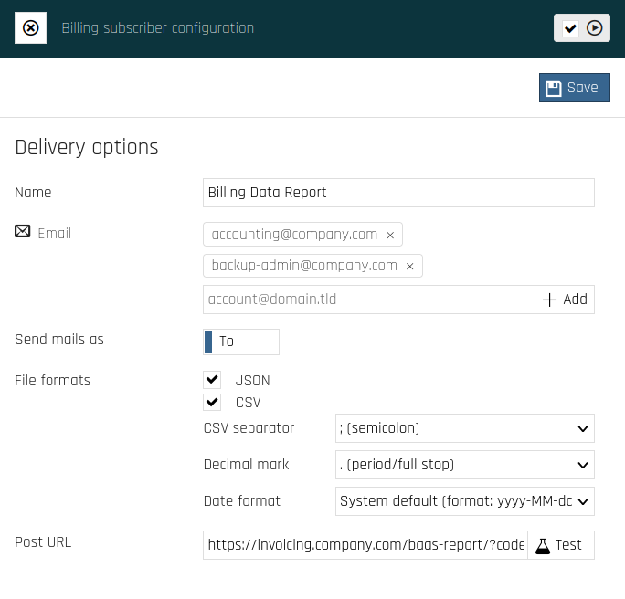

The Cloutility REST API
=====================
The Cloutility portal has a [REST API](https://restfulapi.net/) that can be used to programmatically 
perform Create, Retrieve, Update and Delete (CRUD) operations with various 
_resources_.

This document describes how you can manage several resource 
types on your account, including **Consumption Units** and **Backup Nodes**. 
This will lay the foundation for understanding how to manage other resource 
types in Cloutility.

Before talking about these features, 
we need to understand how authentication on Cloutility works.
In other words, 
how do you "log in"?

Authentication
---------------
Cloutility authentication & authorization is based on the OAuth v2 protocol. 
The way this works is by requesting an _access token_ that corresponds to our 
user account.
Once we have this access token, we can perform any operations that our 
account has permissions to do!

**An overview of the steps:**

1. Use Cloutility to generate a client ID for your origin URL 
   (such as "https://service.yourcompany.com").
2. Ask Cloutility for a seemingly random string called an "access token" by 
   giving it the client ID, origin, your username and your password.
3. Use the access token and the origin to perform operations, like creating 
   backup nodes or retrieving a list of all users, for example.

### Generating a Client ID

To get access tokens, you need a client ID. This client ID identifies 
your program. 
It can be generated in the Cloutility portal by clicking on 
Settings (cogwheel in the top-right corner) -> API access -> Add. You will 
be asked to provide an app name, an origin and a choice whether to 
allow token refreshing or not. The origin should be a URL, this is 
relevant because the origin must be sent with every API call, or else the 
call will fail.

This step should only be done once for every app you have that utilizes the 
API. Once you have a client ID, it can be embedded into the app and reused.

### Requesting an Access Token
Requesting an access token is done using the following HTTP route.
```
[POST] /v1/oauth
- Request Headers:
    * Origin: {client_origin}
- Request Body: PasswordGrant
- Response Body: AccessToken
```

The structure of the **PasswordGrant** HTTP request body is described below.

```
client_id={client_id}
&grant_type=password
&username={username}
&password={password}
```
_The HTTP request body should be on one line, but is split here into several 
lines for clarity._ 

The **grant_type** should always be the same. It should be set to the 
"password" [OAuth2 Grant Type](https://oauth.net/2/grant-types/). You have to specify the client_id, 
username and the password.

Once you have made the HTTP request, you should get an HTTP response with an 
**AccessToken** body. Its structure is as follows.
```json
{
  "access_token": "{access_token}",
  "token_type": "bearer",
  "expires_in": 299,
  "refresh_token": "{refresh_token}"
}
```

Do you see **access_token** above? That is what you want.

The **token_type** is always the same, it can be ignored. The **expires_in** 
tells us when the access token expires, in Cloutility it is always ~5 
minutes. In most situations this should give us plenty of time to execute a 
program that utilizes the API. If we need more time, we can use the 
**refresh_token** to generate a new access token. How this is done is described 
under the Refreshing an Access Token section.

### How to Use an Access Token

Let us take the `GET /v1/fullVersion` API endpoint as an example. It is 
used 
to get the full version of the Cloutility API.

```
[GET] /v1/fullVersion
- Request Headers:
    * Authorization: Bearer {access_token}
    * Origin: {client_origin}
- Response Body: string
```

The response should be something like:

```
"1.0.4480.0"
```

### Refreshing an Access Token
If you do not need an access token for longer than 5 minutes, then you may 
ignore this section. If you do, then make an HTTP POST request to 
`/v1/oauth` as you did before, but as an authenticated user, and instead send a 
**RefreshTokenGrant** request body. The body structure is as follows.

```
client_id={client_id}
&grant_type=refresh_token
&refresh_token={your_refresh_token}
```
_Again, this is written on multiple lines for clarity. Everything should be on 
one line._

The placeholder **your_refresh_token** is replaced with the refresh token 
that you got when you first authenticated yourself, see **AccessToken** in 
the Requesting an Access Token section above. This refresh token will always 
be the same.

### Full Python Example Program

In this example we authenticate, and then call the `/v1/fullVersion` using 
the `requests` module. To install this module, run `python3 -m pip install 
requests`.

```python
import requests

# Change these
USERNAME = "cloutility username"
PASSWORD = "cloutility password"
CLIENT_ID = "your client ID"
CLIENT_ORIGIN = "your client origin"

# Do not change this
CLOUTILITY_API_URL = "https://portal-api.backup.sto2.safedc.net/v1/"

# Step 1: Get an access token
response = requests.post(
    url=CLOUTILITY_API_URL + "oauth",
    headers={
        "Origin": CLIENT_ORIGIN
    },
    data={
        "client_id": CLIENT_ID,
        "grant_type": "password",
        "username": USERNAME,
        "password": PASSWORD
    }
)

if response.status_code == 200:
    response_body = response.json()
    access_token = response_body["access_token"]
    refresh_token = response_body["refresh_token"]
    expires_in = response_body["expires_in"]
    print(f"Got access token! Expires in {expires_in} seconds.")
else:
    print("Authentication failed.")
    exit(1)

# Step 2: Make an API call
response = requests.get(
    url=CLOUTILITY_API_URL + "fullVersion",
    headers={
        "Authorization": "Bearer " + access_token,
        "Origin": CLIENT_ORIGIN
    }
)

if response.status_code == 200:
    print("API call successful!")
    print("API full version is:", response.json())
else:
    print("Failed to perform API call.")
    exit(1)

# Step 3: You can reuse the same access_token for about 5 minutes...
# If you need to renew the access token, check out step 4.
...

# Step 4: Refresh the access token by using refresh_token
response = requests.post(
    url=CLOUTILITY_API_URL + "oauth",
    headers={
        "Authorization": "Bearer " + access_token,
        "Origin": CLIENT_ORIGIN
    },
    data={
        "client_id": CLIENT_ID,
        "grant_type": "refresh_token",
        "refresh_token": refresh_token
    }
)

if response.status_code == 200:
    response_body = response.json()
    access_token = response_body["access_token"]  # New access token
    expires_in = response_body["expires_in"]
    print(f"Refreshed access token. Expires in {expires_in} seconds.")
else:
    print("Failed to refresh access token.")
    exit(1)
```

Define the first four constants, and run the program. The output should be 
something like:

```
Got access token! Expires in 299 seconds.
API call successful!
API full version is: 1.0.4480.0
Refreshed access token. Expires in 299 seconds.
```

API Endpoints
----------------
**The Cloutility REST API is documented [here](https://portal-api.backup.sto2.safedc.net/v1/help) 
in great detail.** 
We will just cover a few useful endpoints,
but you should be aware that there are many more.

For all listed API endpoints, the HTTP request headers `Origin` and 
`Authorization` are obligatory. 
For brevity, these headers will be omitted from the rest of the document. 
In other words,
it is implicitly implied that they should be sent with every HTTP request.

### Business units

Consumption units (backup nodes) are managed under [Business units](../howto/business-units.md). 
Therefore, to create new consumption units, 
we have to know which business units we have, 
and more specifically their _id numbers_.

Below are some endpoints that you can use to find your business units 
programmatically.

* Returns the descendant tree of the active profile's business unit.
  ```
  [GET] /v1/bunits
  - Response Body: SimpleBusinessUnit
  ```
  **Example output**
  ```json
  {
    "id": 22,
    "name": "Company AB",
    "groupName": "Safespring",
    "reportRemotely": false,
    "businessUnits": [
      {
        "id": 76,
        "parentId": 22,
        "name": "Marketing Department",
        "groupName": "Safespring",
        "reportRemotely": false,
        "businessUnits": [],
        "tags": [],
        "invoiceDay": 0
      },
      {
        "id": 94,
        "parentId": 22,
        "name": "HR Department",
        "groupName": "Safespring",
        "reportRemotely": false,
        "businessUnits": [],
        "tags": [],
        "invoiceDay": 0
      }
    ],
    "tags": [],
    "invoiceDay": 0
  }
  ```
!!! note 
    The `id` numbers in the output example above will be referred to as 
    `{bunitId}` in the rest of the document. 
    You should replace this placeholder with the ID number of the business 
    unit you intend to operate on.

* Get detailed information about a single business unit.
  ```
  [GET] /v1/bunits/{bunitId}
  - Response Body: BusinessUnit
  ```
  **Example output**
  ```json
  {
    "href": "https://portal-api.backup.sto2.safedc.net/v1/bunits/22",
    "parentBusinessUnit": {
      "domainFilter": [],
      "clientOptionSetFilter": [],
      "name": "Safespring - Sverige",
      "supportResponsible": false,
      "registrationNumber": "",
      "invoiceDay": 0,
      "billingStorageTypeId": 1,
      "billingStorageType": 1,
      "useScheduleBindings": false,
      "consumers": [],
      "storageLimit": 0,
      "transferLimit": 0,
      "nodeLimit": 0,
      "passwordExpirationDays": 0,
      "requiredApproversOfDeleteRequest": 0,
      "finalDeleteRequestApprover": false,
      "usersCanApproveOwnRequests": false,
      "reportRemotely": false,
      "tags": [],
      "id": 13,
      "createdDate": "2022-08-22T15:01:45.027Z"
    },
    "timeZone": {
      "$type": "CloudPortal.Web.Api.Hyper.TimeZone, CloudPortal.Web.Api",
      "href": "https://portal-api.backup.sto2.safedc.net/v1/timezones/4",
      "actions": [
        {
          "name": "Calculate UTC offset",
          "method": "GET",
          "href": "https://portal-api.backup.sto2.safedc.net/v1/timezones/4/offset?date"
        }
      ],
      "name": "(GMT+01:00) Amsterdam, Berlin, Bern, Rome, Stockholm, Vienna",
      "windowsId": "W. Europe Standard Time",
      "offset": 0,
      "id": 4,
      "createdDate": "2022-06-10T06:33:19.337Z"
    },
    "users": {
      "$type": "CloudPortal.Web.Api.Hyper.Collection`1[[CloudPortal.Web.Api.Hyper.User, CloudPortal.Web.Api]], CloudPortal.Web.Api",
      "href": "https://portal-api.backup.sto2.safedc.net/v1/bunits/22/users",
      "total": 0,
      "items": []
    },
    "addresses": {
      "$type": "CloudPortal.Web.Api.Hyper.Collection`1[[CloudPortal.Web.Api.Hyper.Address, CloudPortal.Web.Api]], CloudPortal.Web.Api",
      "href": "https://portal-api.backup.sto2.safedc.net/v1/bunits/22/addresses",
      "total": 0,
      "items": []
    },
    "businessUnits": {
      "$type": "CloudPortal.Web.Api.Hyper.Collection`1[[CloudPortal.Web.Api.Hyper.BusinessUnit, CloudPortal.Web.Api]], CloudPortal.Web.Api",
      "href": "https://portal-api.backup.sto2.safedc.net/v1/bunits/22/bunits",
      "total": 0,
      "items": []
    },
    "domainFilter": [],
    "clientOptionSetFilter": [],
    "name": "Company AB",
    "supportResponsible": false,
    "registrationNumber": "SE556612345678",
    "invoiceDay": 0,
    "billingStorageTypeId": 2,
    "billingStorageType": 2,
    "useScheduleBindings": false,
    "consumers": [],
    "storageLimit": 0,
    "transferLimit": 0,
    "nodeLimit": 0,
    "passwordExpirationDays": 0,
    "requiredApproversOfDeleteRequest": 0,
    "finalDeleteRequestApprover": false,
    "usersCanApproveOwnRequests": false,
    "reportRemotely": false,
    "tags": [],
    "id": 22,
    "createdDate": "2023-06-10T11:10:11.321Z"
  }
  ```
  
* Get business units directly under a specific business unit.
  ```
  [GET] /v1/bunits/{bunitId}/bunits
  - Response Body: Collection of BusinessUnit
  ```

#### Create a business unit
If you wish to create a business unit, first pick the right time zone using:
```
[GET] /v1/timezones
- Response Body: TimeZoneList
[GET] /v1/timezones/{timeZoneId}
- Response Body: TimeZone
```

Then create the business unit with:
```
[POST] /v1/bunits/{bunitId}/bunits
- Request Body: BusinessUnit
- Response Body: BusinessUnit
```

The request body can have the following format:
```json
{
  "name": string,
  "registrationNumber": string,
  "timeZone": TimeZone
}
```

Note that not all fields of the BusinessUnit resource type have to be defined 
in the request, 
this is normal.

#### Modifying business units
If you wish to modify existing business units, use the following endpoint:
```
[PUT] /v1/bunits/{bunitId}
- Request Body: BusinessUnit
- Response Body: BusinessUnit
```

#### Deleting business units
If you wish to delete business units, use the following endpoint:
```
[DELETE] /v1/bunits/{bunitId}
- Request Body: BusinessUnit
```


#### More details
For more details about the objects sent as responses and what the meanings of 
the fields are, please refer to Cloutility's REST API documentation:

- [BusinessUnit](https://portal-api.backup.sto2.safedc.net/v1/help/ResourceModel?modelName=BusinessUnit)
- [SimpleBusinessUnit](https://portal-api.backup.sto2.safedc.net/v1/help/ResourceModel?modelName=SimpleBusinessUnit)

!!! note
    Many times endpoints return incomplete objects, contrary to what the 
    Cloutility documentation may appear to be saying. 
    
    This actually saves network bandwidth as the size of these objects along 
    with all their components may be huge.
    But it can cause confusion to someone that is not used to Cloutility's API.
    
    We recommend that you use the most explicit endpoint for what you want to 
    retrieve. For example, if you want all users of a Business Unit, 
    do not use `/v1/bunits/{bunitId}`, use instead `/v1/bunits/{bunitId}/users`.

### Consumption units
Once you have the ID number (`bunitId`) of the business unit you wish to 
operate under, 
you can start managing **consumption units** for this business unit. 
In the Cloutility API, these are referred to as "consumers". 
But we will use the term that the web interface uses for consistency, 
that is "consumption units".

#### Retrieving units
Just like with business units, you can retrieve consumption units in an 
analogous fashion:
```
[GET] /v1/bunits/{bunitId}/consumers
- Response Body: Collection of Consumer
[GET] /v1/bunits/{bunitId}/consumers/{consumerId}
- Response Body: Consumer
```

A Consumer (consumption unit) object will have the following structure:
```json
{
  "href": "https://portal-api.backup.sto2.safedc.net/v1/bunits/22/consumers/408",
  "dataSourceType": {
    "id": 1,
    "name": "SP Backup node"
  },
  "dataSourceIsPotentialParent": false,
  "dataSourceState": {
    "id": 3,
    "name": "Active"
  },
  "name": "JennysWS",
  "billingStartDate": "2023-06-09T00:00:00Z",
  "businessUnit": {
    "$type": "CloudPortal.Web.Api.Hyper.BusinessUnit, CloudPortal.Web.Api",
    "href": "https://portal-api.backup.sto2.safedc.net/v1/bunits/22",
    "ancestors": {
      "href": "https://portal-api.backup.sto2.safedc.net/v1/bunits/22/ancestors",
      "total": 0,
      "items": []
    },
    "users": {
      "$type": "CloudPortal.Web.Api.Hyper.Collection`1[[CloudPortal.Web.Api.Hyper.User, CloudPortal.Web.Api]], CloudPortal.Web.Api",
      "href": "https://portal-api.backup.sto2.safedc.net/v1/bunits/22/users",
      "total": 0,
      "items": []
    },
    "addresses": {
      "$type": "CloudPortal.Web.Api.Hyper.Collection`1[[CloudPortal.Web.Api.Hyper.Address, CloudPortal.Web.Api]], CloudPortal.Web.Api",
      "href": "https://portal-api.backup.sto2.safedc.net/v1/bunits/22/addresses",
      "total": 0,
      "items": []
    },
    "businessUnits": {
      "$type": "CloudPortal.Web.Api.Hyper.Collection`1[[CloudPortal.Web.Api.Hyper.BusinessUnit, CloudPortal.Web.Api]], CloudPortal.Web.Api",
      "href": "https://portal-api.backup.sto2.safedc.net/v1/bunits/22/bunits",
      "total": 0,
      "items": []
    },
    "domainFilter": [],
    "clientOptionSetFilter": [],
    "name": "Marketing Department",
    "note": "some note...",
    "supportResponsible": false,
    "registrationNumber": "123456789999",
    "invoiceDay": 0,
    "billingStorageTypeId": 2,
    "billingStorageType": 2,
    "useScheduleBindings": false,
    "consumers": [],
    "storageLimit": 0,
    "transferLimit": 0,
    "nodeLimit": 0,
    "passwordExpirationDays": 0,
    "requiredApproversOfDeleteRequest": 1,
    "finalDeleteRequestApprover": true,
    "usersCanApproveOwnRequests": true,
    "reportRemotely": false,
    "tags": [],
    "id": 22,
    "createdDate": "2023-06-10T11:10:11.321Z"
  },
  "lastCommentTime": "2023-10-20T16:58:26.237Z",
  "lastCommentTypeId": 2,
  "comments": [],
  "note": "Jenny's workstation.",
  "limitHighStorage": 100.0,
  "allowNoActivity": false,
  "tags": [],
  "jobs": [],
  "id": 408,
  "createdDate": "2023-07-09T15:10:20.133Z"
}
```

As mentioned before, 
the level of detail varies depending on which endpoint you use. 
See the note above. 
It can also depend on which fields you have defined. 
Sometimes if a field has not been defined yet, 
it will simply not be a part of the retrieved object at all.

#### Creating new consumption units
The endpoint used to create new consumption units is:
```
[POST] /v1/bunits/{bunitId}/consumers
- Request Body: Consumer
- Response Body: Consumer
```

The absolutely simplest way to create a consumption unit is to just specify 
its **name** in the request body.

```json
{
  "name": "LisasWS"
}
```

Of course, if you want to, more fields are [available](https://portal-api.backup.sto2.safedc.net/v1/help/Api/POST-v1-bunits-bunitId-consumers).

The response, after it has been created, 
will be a significantly more detailed version of the consumption unit.

#### Editing consumption units

```
[PUT] /v1/bunits/{bunitId}/consumers/{consumerId}
- Request Body: Consumer
- Response Body: Consumer
```

#### Deleting consumption units

```
[DELETE] /v1/bunits/{bunitId}/consumers/{consumerId}?deleteAssociations={true/false}&deletionComment={comment}
- Request Body: Consumer
```

#### Audit log
To query the audit log, use:
```
[GET] /v1/bunits/{bunitId}/consumers/{consumerId}/auditlogs?includeDescendants={true/false}&limit={limit}&offset={offset}&orderDesc={true/false}&startTime={start_date}&endTime={end_date}&types=0&types=100&types=200&types=300&types=400
```
You can add/remove the following parameters to include/exclude log-entry types:

- `&types=0` for info
- `&types=100` for create-actions
- `&types=200` for modify-actions
- `&types=300` for delete-actions
- `&types=400` for errors

The query parameters `startDate` and `endDate` are optional. 
But if you define them, make sure that the values are [ISO 8601](https://en.wikipedia.org/wiki/ISO_8601) formatted. 
For example `2023-11-03T08:00:00Z`.

#### Reports
Consumption unit reports hold information about its usage over time. 
More concretely, it is values such as how much storage is used, 
and how much data has been transferred.

To find reports over a time interval, use this endpoint:
```
[GET] /v1/bunits/{bunitId}/consumers/{consumerId}/reports?startDate={startDate}&endDate={endDate}&status={true/false}&warnings={true/false}
- Response Body: NodeReportList
```

Use `startDate` and `endDate` to specify a time interval, 
the format of their values is the same as in the Audit Log endpoint above.

Set `status` or `warnings` to `true` to retrieve the status of the report or 
the warnings of the report respectively.

All query parameters are optional.

If you have requested node warnings, 
you may want to also use the following endpoint to interpret their types:
```
[GET] /v1/nodewarningtypes
- Response Body: NodeWarningTypeList
```

To find the latest report, use:
```
[GET] v1/bunits/{bunitId}/consumers/{consumerId}/reports/latest?userId={userId}
- Response Body: NodeReport
```

The `userId` parameter can be used to customize the report for a specific user. 
It is optional.

#### Jobs
To retrieve information about jobs 
(e.g., restore or backup jobs) against a backup node, 
you have to first get retrieve the very first job. 
We will explain why later. 
Use this endpoint to get the first job:

```
[GET] /v1/bunits/{bunit_id}/consumers/{consumer_id}/jobs/first
- Response Body: Job
```

!!! warning 
    Do not use `/v1/bunits/{bunit_id}/consumers/{consumer_id}/jobs/first` for 
    anything other than getting the first job date. 
    Many fields returned by this endpoint will have bogus values 
    (0, 0.0, empty string, etc.). 
    So do not rely on it for actual job status data.

The reason why we did this is that the next endpoint, 
which retrieves jobs at a specific time interval, 
is very strict about how you define **the start** of this interval.

```
[GET] /v1/bunits/{bunit_id}/consumers/{consumer_id}/jobs/first?startTime={startTime}&endTime={endTime}
- Response Body: JobList
```

The parameters `startTime` and `endTime` _are_ optional. 
But omitting them will only get you the jobs from the latest 24 hours. 

If you use this endpoint, you probably want more control over the time interval.

To specify a custom interval, make sure that `startTime` is **greater 
than or equal to** the value of the `completed` field of the first job.

The `endTime` parameter can be any date.

### Backup servers
There is only _one_ backup server that we will consider, 
and that is the default one.

The reason these endpoints are useful is that they give us access to all the 
available policy domains and client option sets, 
which can be used during backup node creation.
```
[GET] /v1/bunits/{bunit_id}/defaultserver
- Response Body: BackupServer
[GET] /v1/bunits/{bunit_id}/defaultserver/domains
- Response Body: DomainList
[GET] /v1/bunits/{bunit_id}/defaultserver/clientoptionsets
- Response Body: ClientOptionSetList
```

### Backup node operating systems and types
When creating or modifying backup nodes, we have to specify an operating 
system and node type. Therefore, it is necessary to know how to retrieve 
`NodeOperatingSystem` and `NodeType` resources.

```
[GET] /v1/nodeoperatingsystems
- Response Body: NodeOperatingSystemList
[GET] /v1/nodeoperatingsystems/{os_id}
- Response Body: NodeOperatingSystem
[GET] /v1/nodetypes
- Response Body: NodeTypeList
[GET] /v1/nodetypes/{nodetype_id}
- Response Body: NodeType
```


### Backup nodes
A consumption unit is mapped one-to-one with a backup node. 
But in the API they are treated as different resources. 

!!! note
    The reason for having consumption units and not just backup nodes, 
    is that consumption units _can_ technically be other services.
    In other words, the "consumption unit" abstraction was created to accompany 
    other consumable services and treat them similarly. 
    But here, they are only used as backup units.

To retrieve the backup node of a consumption unit:
```
[GET] /v1/bunits/{bunit_id}/consumers/{consumer_id}/node
- Response Body: Node
```

#### Creating a backup node
```
[POST] /v1/bunits/{bunit_id}/consumers/{consumer_id}/node
- Request Body: Node
- Response Body: Node
```

The request body can have the following format:
```json
{
  "clientOptionSet": ClientOptionSet,
  "contact": string,  // Contact information
  "cpuCount": integer,
  "domain": Domain,
  "operatingSystem": NodeOperatingSystem,
  "server": BackupServer,
  "type": NodeType
}
```

The required resources such as the `ClientOptionSet` and the `Domain` and can 
be retrieved using the endpoints above.

#### Editing a backup node
This endpoint is used to edit a backup node's attributes.
```
[PUT] /v1/bunits/{bunit_id}/consumers/{consumer_id}/node
- Request Body: Node
- Response Body: Node
```

To change the **password** of the backup node, there is this specific endpoint:
```
[POST] /v1/bunits/{bunit_id}/consumers/{consumer_id}/node/password
- Request Body: Node
- Response Body: Node
```

The request body only needs one attribute from the `Node` resource, 
and that is `tsmPassword`. In other words, the request body should look like 
this:
```json
{
  "tsmPassword": "[your new password]"
}
```

#### Deleting a backup node
_This will remove the entire consumption unit as well._
```
[DELETE] /v1/bunits/{bunit_id}/consumers/{consumer_id}/node
- Request Body: Node
```

#### Activate
To actually be able to use a backup node, it has to be activated first. 
This is done by using the following endpoint:
```
[GET] /v1/bunits/{bunit_id}/consumers/{consumer_id}/node/activate?tsmName={tsm_node_name}
- Response Body: string
```

Make sure to give the backup node a name by replacing the `{tsm_node_name}` 
placeholder. 
The name that you give must obey IBM Storage Protect's 
[object naming rules](https://www.ibm.com/docs/en/storage-protect/8.1.24?topic=commands-naming-storage-protect-objects). 
Because this is the name that will be used to configure the respective 
computer's backup client.

#### Filespaces
You can use the following endpoint to manage the filespaces of a node. 

```
[GET] /v1/bunits/{bunit_id}/consumers/{consumer_id}/node/filespaces?tsmSync={true/false}
- Response Body: FilespaceList
```
Setting tsmSync to `true` will manually sync Cloutility with the backup server 
before returning the filespaces. 
Setting it to `false` will make the call faster.

#### Setting proxy nodes
You can allow a node to act as another node, in other words, making a node a 
_proxy agent_ for a _proxy target_. 
The proxy agent can then, for example, restore the proxy target's files. 

With the API, this relationship can be established from either side.

To find possible nodes to establish such a relationship with, you can use:
```
[GET] /v1/bunits/{bunit_id}/consumers/{consumer_id}/node/possibleproxynodes
- Response Body: NodeList
```

To establish a proxy relationship, you may use either one of these endpoints:
```
[POST] /v1/bunits/{bunit_id}/consumers/{target_consumer_id}/node/proxyagents?proxyAgentId={proxy_consumer_id}
- Request Body: Node
- Response Body: Node
```
```
[POST] /v1/bunits/{bunit_id}/consumers/{proxy_consumer_id}/node/proxytargets?proxyTargetId={target_consumer_id}
- Request Body: Node
- Response Body: Node
```

To severe a proxy relationship, you may use either one of these endpoints:
```
[DELETE] /v1/bunits/{bunit_id}/consumers/{target_consumer_id}/node/proxyagents/{proxy_consumer_id}
- Request Body: Node
[DELETE] /v1/bunits/{bunit_id}/consumers/{proxy_consumer_id}/node/proxytargets/{target_consumer_id}
- Request Body: Node
```

### Billing Information
It is possible to retrieve information about which services a business unit is 
subscribed to, how much has been consumed, and how much it all costs.

#### Contract
This endpoint allows you to retrieve the contract that a business unit is 
participating in.
```
[GET] /v1/bunits/{bunit_id}/contract
- Response Body: Contract
```

#### Invoices
The following endpoint allows you to retrieve invoice data for a Business Unit.
```
[GET] /v1/bunits/{bunit_id}/invoices
- Response Body: InvoiceList
[GET] /v1/bunits/{bunit_id}/invoices/{invoice_date_str}
- Response Body: Invoice
```

`invoice_date_str` has the YYYY-MM-DD format and can be retrieved from the 
`Invoice.href` field.

If invoices (usually PDF files) have been uploaded for a business unit
 to Cloutility, they can be accessed using:
```
[GET] /v1/bunits/{bunit_id}/invoicefiles
```

If you are reselling backup services to a business unit, you can upload invoices
using:
```
[POST] /v1/bunits/{bunit_id}/invoicefiles?erpReference={erpReference}&sendToBillingAddress={sendToBillingAddress}
```

`erpReference` is an optional ERP code, used when integrating invoicing 
software.
`sendToBillingAddress` is a boolean (can be `true` or `false`).

#### Billing data
If a business unit is a reseller of backup services to its children, the 
following endpoint allows you to retrieve the billing data.
```
[GET] /v1/bunits/{bunit_id}/billing?includeNext={count}
- Response Body: BillingDataList
[GET] /v1/bunits/{bunit_id}/billing/{invoice_date_str}
- Response Body: BillingData
```

When integrating invoicing software, it can be useful to automatically be
notified when new billing data is generated, 
at the end of the month, for example. 
You can subscribe to these events by clicking on Reseller Business Unit -> 
Settings -> Billing -> Subscribers -> Add. 



The "Post URL" field is an HTTP endpoint that you host. 
It should be able to process POST-requests from Cloutility that are sent every 
time billing data is generated.
This end point must be at the very least accessible to Cloutility, and can be
firewalled off from other clients.

You can click on the "Test" button next to the "Post URL" field to send a test
request from Cloutility your endpoint.
The test request will look something like this:
```
POST /baas-report/?code=xyz HTTP/1.1
Content-Type: application/json; charset=utf-8
Host: invoicing.company.com
Content-Length: 49
Expect: 100-continue

{"trigger":"test for new billing data available"}
```

The header `Expect: 100-continue` is the HTTP client's way 
(Cloutility in this case) to ask the HTTP server if it is okay to send the data.
The server should normally reply with status code 100 (continue).
```
HTTP/1.1 100 Continue
```
Then read the incoming HTTP request data.

Your HTTP server should handle this automatically, 
but it is worth mentioning in case it does not do so.

Once your server has recieved this trigger, 
it can retrieve the latest billing data by invoking `/v1/bunits/{bunit_id}/billing`, 
as mentioned above.

Resources
-----------
To find an overview of the REST API resources, please visit [this page](api-resources.md).
