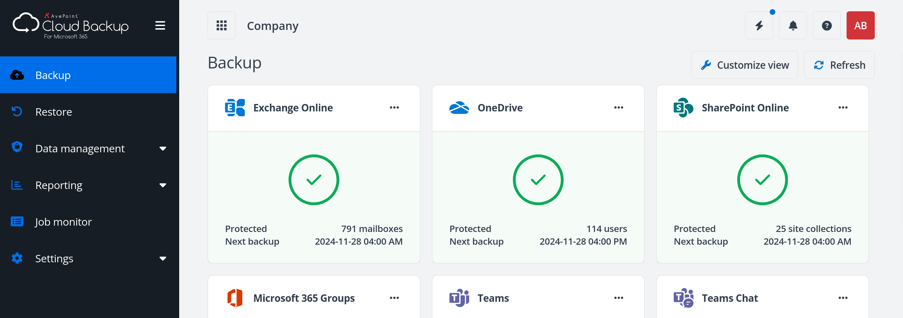
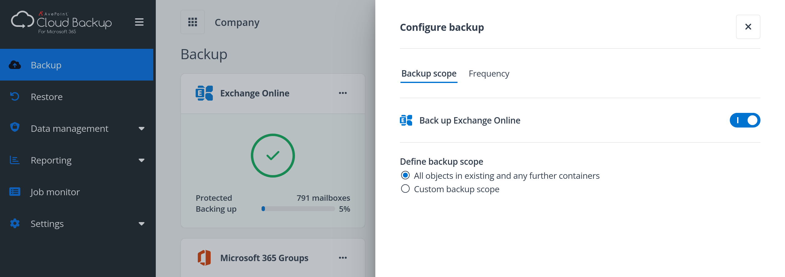
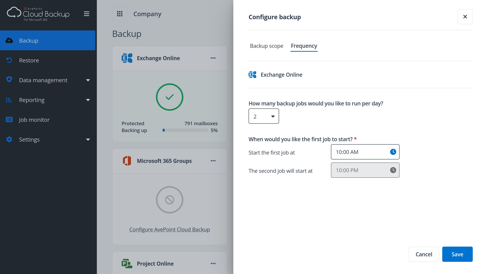
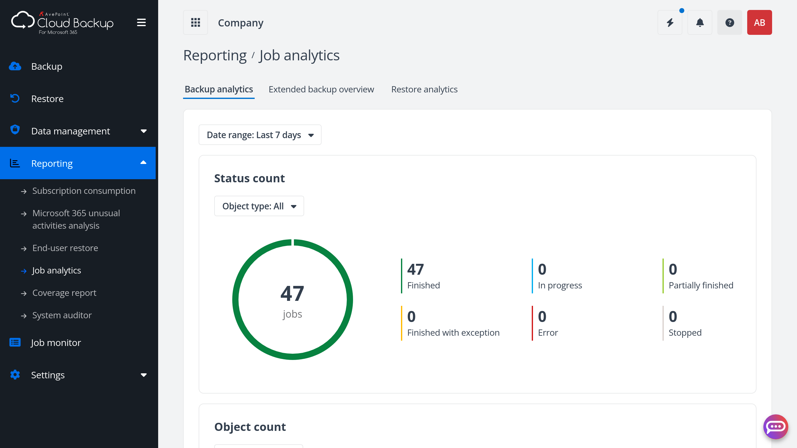
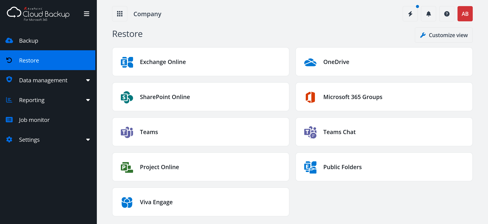
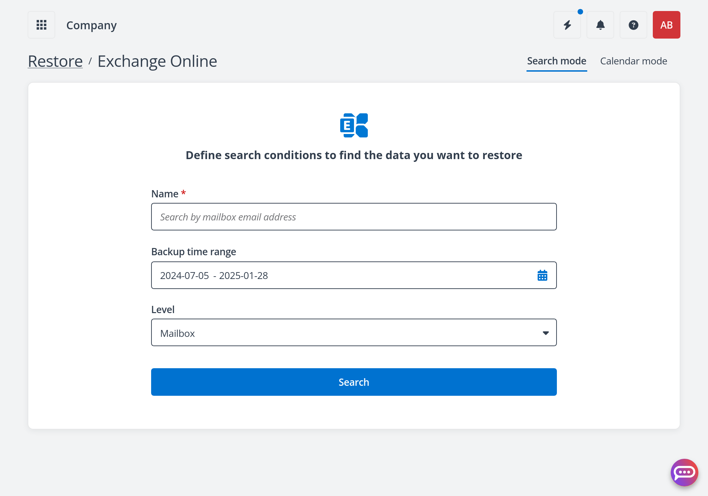
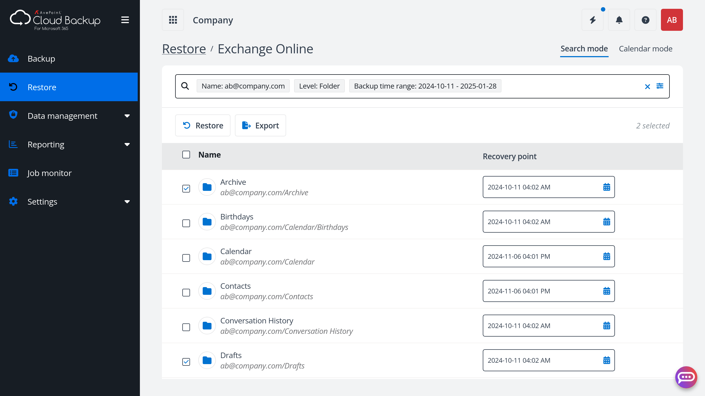

Microsoft 365 Backup
=====================

If your organization is backing up Microsoft 365 data at Safespring, 
you will be using the AvePoint service to manage backups and restore data. 
The backups themselves are stored in the Safespring S3 storage in Sweden.

To access the administration panel, sign in at 
<a href="https://m365backup.avepointonlineservices.com/" target="_blank">
AvePoint Cloud Backup for Microsoft 365</a>.

Backup
--------

You can decide what to back up from Microsoft 365 and how often
by visiting **Backup**:

Services that can be protected are:

- Exchange Online
- OneDrive
- SharePoint Online
- Microsoft 365 Groups
- Teams
- Project Online
- Viva Engage

!!! note "Teams Chat"
    Backup of Microsoft Teams Chat data will require its own App Profile of type _Custom Azure App_. 
    You will have to:

    1. <a target="_blank" href="https://cdn.avepoint.com/assets/webhelp/avepoint-online-services/index.htm#!Documents/createacustomazureapp.htm">Register a new app</a> for Teams Chat in the Microsoft Entra Admin Center (or Microsoft Azure Portal).
    2. Make sure to grant the app the necessary permissions for Microsoft Teams Chat backup as described <a target="_blank" href="https://cdn.avepoint.com/assets/webhelp/avepoint-cloud-backup-for-microsoft365/index.htm#!Documents/requiredpermissionsofmicrosoft365appprofile.htm">here</a>.
    3. Then, in the Confidence Platform, <a target="_blank" href="https://cdn.avepoint.com/assets/webhelp/avepoint-online-services/index.htm#!Documents/consenttocustomapps.htm">add the custom app profile</a>.
    4. Once done, you will be able to proceed with this guide to enable Teams Chat backup. _Note that it may take some time for the previous steps to take effect and allow you to proceed._

Click on **"..."** on top of the service you wish to protect, and then
**Configure backup**:

If you wish to enable backing up this specific service, toggle
**Back up [Service Name]** to on.

### Backup scope

Options will appear to set the scope of the backups, in other words, configuring 
_which_ objects from the service to back up. 
If you intend to protect everything, 
leave **All objects in existing and further containers** as selected.
If you want to back up a subset of the data, select **Custom backup scope**.

### Frequency

You can configure how frequently backups are made by clicking on **Frequency**.

Set the number of backups per day, and then set which time(s) during the day 
the backup jobs for this service should run.

Once done, click **Save**.

Reports
---------

### Subscription consumption

A subscription has a limit on the number of user seats which depends on your 
contract. To see this number and how many of them are in use, visit 
**Report center → Subscription consumption**.

If you wish to increase the limit, contact [Support](../../service/support.md), 
and we will help you do so.

### Job analytics

To get an overview of how the most recent backup jobs have gone, you can 
visit **Report center → Job analytics**.

### Job monitoring

For more detailed information about every backup or recovery job, visit
**Job monitor**.

To generate a detailed report, click on **"..."** next to the job, and then 
click **Generate report**. Once it is available, the **Generate report** will
turn into a download button.

### Audit log

The AvePoint portal has an audit log where sign-ins and administrative 
operations are recorded.
To see the audit log, visit **System auditor**.

The log can be exported by clicking the **Export** button. You will be asked to
specify a time interval to export from the log. The maximum is 1 year.

Restore
---------

Users can restore backed-up data using [ReCenter](user-data-recovery.md).
As an administrator, you can restore arbitrary Microsoft 365 accounts by 
visiting the **Restore** page.

Click on the service you wish to restore for, for example, Exchange Online. 
Then select an account for which backups to restore from.
You also have to define a couple of search conditions to find the backups you
are interested in.

_Level_ is the granularity of the search. 
For example, when restoring Exchange Online data, 
you can search for entire mailboxes, folders or individual items in the folders.

After clicking **Search**, you will be taken to the items that belong to the 
specified account and match the provided search conditions.

Once you have selected the objects you wish to restore, you have two options. 
Either to **Restore** the data back to an account 
or to **Export** the data as a file which can then be imported to a local
mail client for offline reading.

!!! note "Users exporting their own data"
    When users want their own data; it can be easier to allow them to export 
    it themselves by enabling the export option for the 
    ReCenter portal. 
    This should _reduce_ the need for a backup administrator to export the data 
    for them. Although, sometimes you still have to, for example, when the user 
    cannot sign in to their organization account.
    

    To ensure that this option is available, 
    **go to Settings → End user restore → 
    End user restore settings for ReCenter and AVA users** and enable 
    **Export (ReCenter)** for the services you wish to allow the users to 
    export data for.
    

### Restore data back to the service

To restore data back to the original account or another account, click on the
**Restore** button after you have searched for and selected the objects you wish
to restore.

### Export as a file

To export the backup data as a file, click on **Export**. 
An export job will be started, and once the job is done you will be able to 
download the content by visiting **Job monitor**, clicking on the export job, 
then clicking **"..." → Download content**.

When exporting Microsoft Exchange data, you will receive a .pst file. 
We have an [article on how to read .pst files](pst-files.md).
