Microsoft Entra ID Backup
===========================

If your organization is backing up Microsoft Entra ID (Active Directory on 
Microsoft's cloud) data at Safespring, you will be using the AvePoint service to
manage backups and restore data. The backups themselves are stored in the 
Safespring S3 storage.

To access the dashboard, sign in at 
<a href="https://iaas.avepointonlineservices.com/" target="_blank">
AvePoint Cloud Backup for IaaS + PaaS</a>.

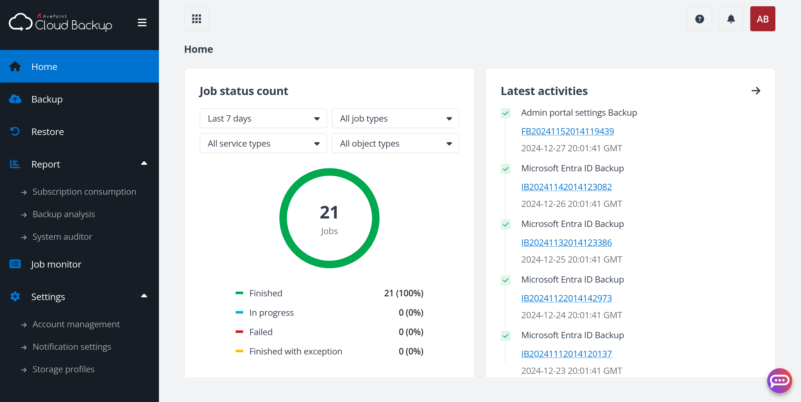

Backup scope
-------------

You can decide what to back up from Microsoft Entra ID, how often, and what the 
retention time will be by visiting **Backup**:

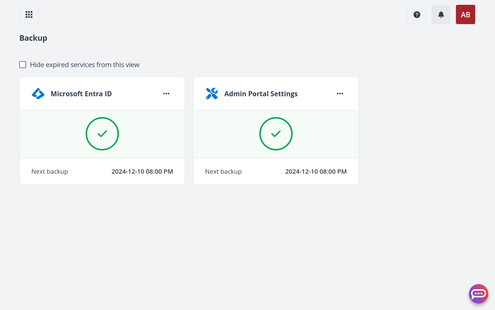

Then **Microsoft Entra ID**:

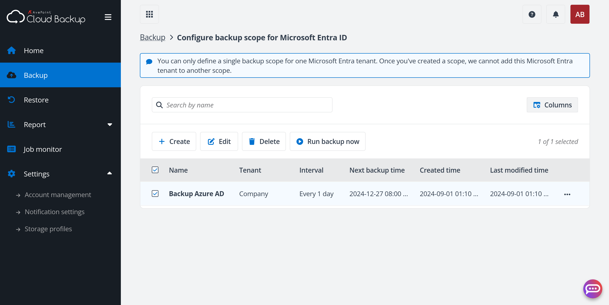

Every <a href="https://learn.microsoft.com/en-us/microsoft-365/education/deploy/intro-azure-active-directory#what-is-a-microsoft-entra-tenant" target="_blank">Microsoft Entra tenant</a> 
needs its own _scope_ which defines what to back up, backup schedule and 
retention time.
The scopes are listed on the table. To add a scope or edit an existing one, 
follow the instructions below.

### What to protect
To configure what to protect from Microsoft Entra ID, click on **Edit**
to edit the scope, or **Create** if it is a new scope. 

You will be asked what to back up.

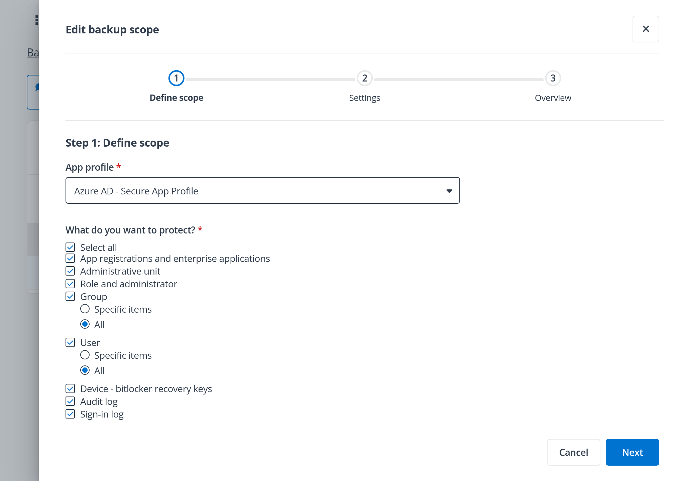

The types of data that can be backed up are:

- <a href="https://learn.microsoft.com/en-us/entra/identity/enterprise-apps/what-is-application-management" target="_blank">App registrations and enterprise applications</a>
- <a href="https://learn.microsoft.com/en-us/entra/identity/role-based-access-control/administrative-units" target="_blank">Administrative units</a>
- <a href="https://learn.microsoft.com/en-us/entra/identity/role-based-access-control/concept-understand-roles" target="_blank">Roles and administrators</a>
- <a href="https://learn.microsoft.com/en-us/entra/fundamentals/concept-learn-about-groups" target="_blank">Groups</a> _(specific ones or all)_
- <a href="https://learn.microsoft.com/en-us/entra/fundamentals/how-to-create-delete-users" target="_blank">Users</a> _(specific ones or all)_
- <a href="https://learn.microsoft.com/en-us/windows/security/operating-system-security/data-protection/bitlocker/recovery-process#self-recovery-in-microsoft-entra-id" target="_blank">Device — BitLocker recovery keys</a>
- <a href="https://learn.microsoft.com/en-us/entra/identity/monitoring-health/concept-audit-logs" target="_blank">Audit log</a>
- <a href="https://learn.microsoft.com/en-us/entra/identity/monitoring-health/concept-sign-ins" target="_blank">Sign-in log</a>

If you choose to select specific groups and/or users, then an additional step
will be revealed where you can make these selections:

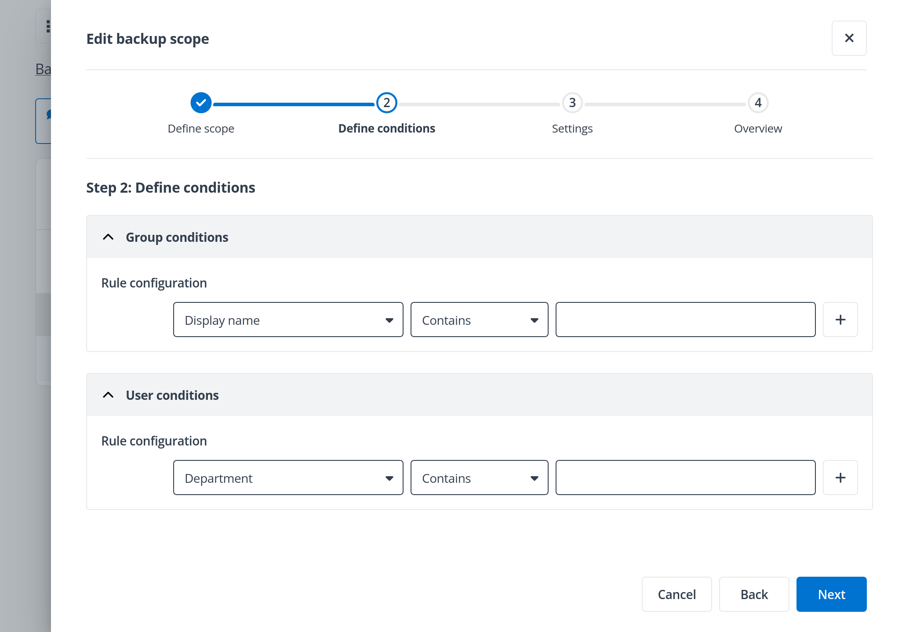

### Name and description

After defining what to back up, the next step will be to set general settings.

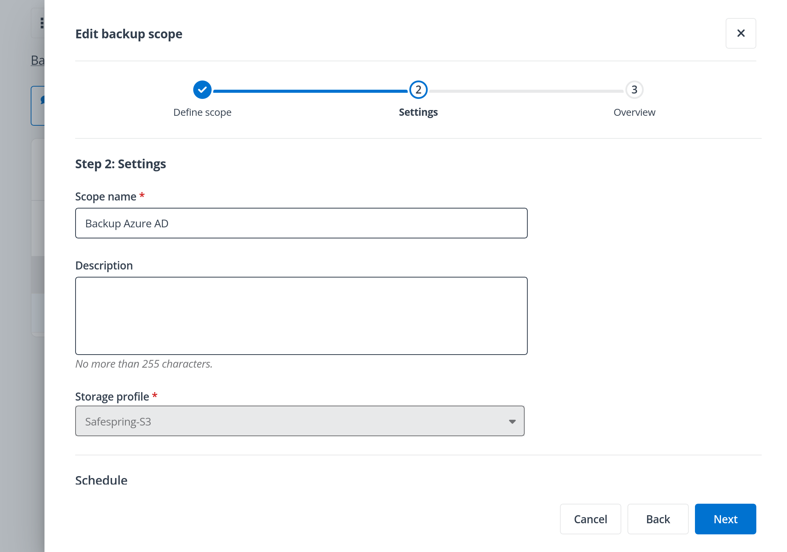

You are asked to set the _scope name_ and optionally a _description_.

### Storage profile

The storage profile determines where the backups will be stored. 
When backing up with Safespring, it should be set to Safespring S3.

### Schedule

The schedule determines how often incremental backups are made.

### Retention time

The retention time determines how long the backups must be retained.

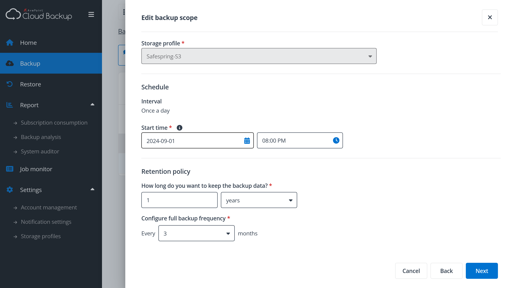

If the time unit is set to "years," a 
_full backup frequency_ option will appear, which defaults to (every) 3 months.

Back up manually
-------------------

Backup jobs run according to the schedule set in the backup scope. If you wish
to run a backup job manually, click on **Backup -> Microsoft Entra ID**, then 
select the backup scope on the table. A **Run backup now** button should appear.
Click it to run a new backup job.

Reports
---------

### Subscription consumption

A subscription has a limit on the number of user seats which depends on your 
contract. To see this number and how many of them are in use, visit 
**Report -> Subscription consumption**.

If you wish to increase the limit, contact [Support](../../service/support.md), 
and we will help you do so.

### Backup analysis

To get an overview of how many objects of each category have been protected
over the last week, visit **Report -> Backup analysis**.

### Audit log

The AvePoint portal has an audit log where sign-ins and administrative 
operations are recorded.
To see the audit log, visit **Report -> System auditor**.

The log (up to 30 days back) can be exported by clicking the **Export** button.

### Job monitoring

The status of backup and restore jobs can be monitored from **Job monitor**.

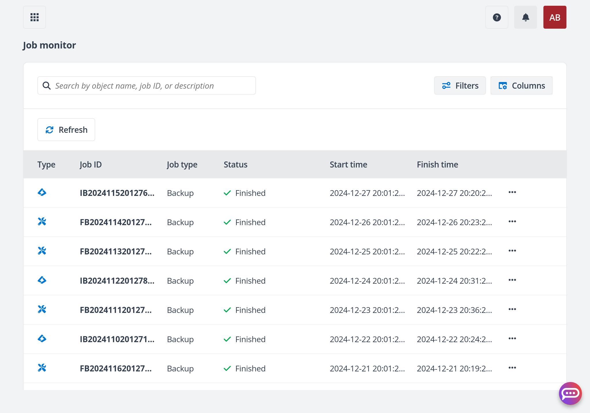

From the same page, you are also able to generate and download detailed reports
about jobs.

### E-mail notifications

A backup administrator can subscribe to a finished and/or failed jobs by 
visiting **Settings -> Notification Settings**. From there, select a 
_notification profile_ and click on the revealed **Edit** button, or create a
new profile. 

Specify the email addresses of the subscribers to under
**Send notifications to the following email addresses**. Then under
**Send an email notification for the jobs in the following statuses** select
which types of jobs the subscribers should receive notifications for, and which
statuses.

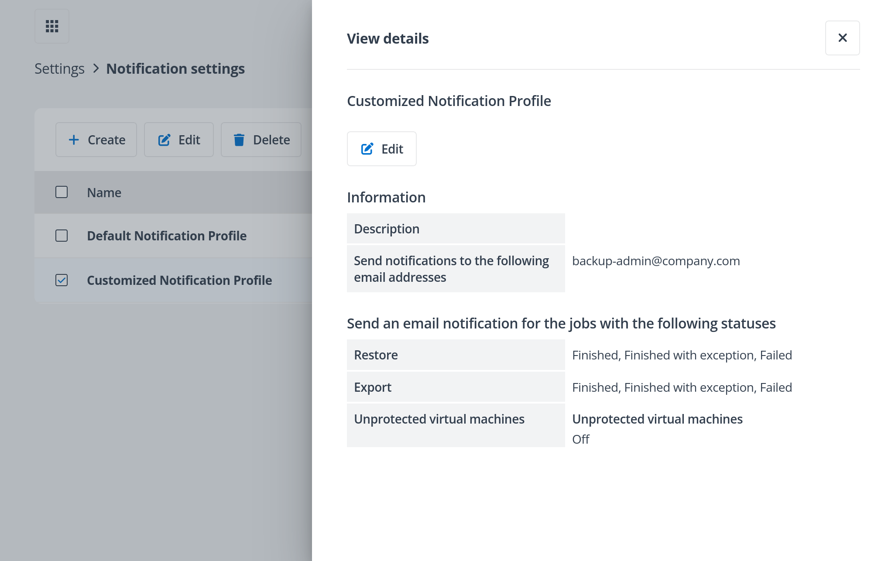

For example, under **Backup**, you can select only the **Failed** and 
**Finished with exception** statuses.
This will make it so that the subscribers will only receive notifications about
jobs that have either failed entirely, or partially.

Restore
---------

To restore objects from any point-in-time within your retention time, visit
**Restore -> Microsoft Entra ID -> Recovery Point**. 

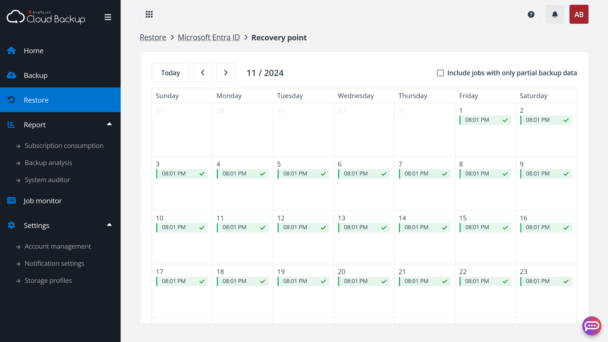

Then click on the point-in-time you wish to restore from. This will take you
to a table where you can view and select objects from that point-in-time for 
restoration.

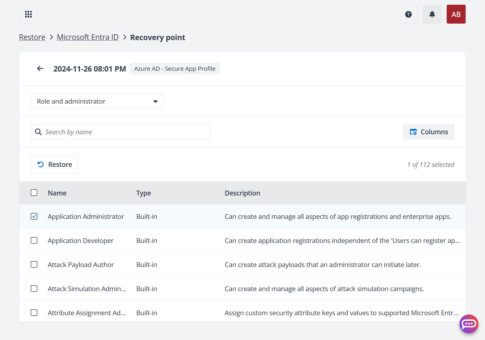

On the top, there is a drop-down menu that is used to filter by data category.
Once you have selected the objects you wish to restore, click on the 
**Restore** button above the table.
