Microsoft Exchange PST files
==============================

When exporting Microsoft Exchange backup data from AvePoint, 
you will receive the data as a .pst file. 
This file can contain mailboxes, contacts, calendars, or tasks.

Here we explain how to extract this data on different operating 
systems.

Extract on Windows
--------------------

To extract the .pst file on Windows, you will need to use Outlook. 
We recommend reading the following article from <a href="https://support.microsoft.com/en-us/office/export-emails-contacts-and-calendar-items-to-outlook-using-a-pst-file-14252b52-3075-4e9b-be4e-ff9ef1068f91" target="_blank">Microsoft's Documentation</a> on how to do so.

Extract on Linux (graphical)
------------------------------

The absolutely easiest way to read the data of a .pst file on Linux is to use
the <a href="https://wiki.gnome.org/Apps/Evolution" target="_blank">
Evolution mail client</a>.

!!! info
    Unlike the Windows method, 
    extracting .pst files on Linux requires no proprietary software.

### Step 1: Installation

#### Ubuntu or Debian-based systems

Depending on the Ubuntu or Debian-based Linux distribution, it can vary _wildly_ 
which "app store" you have, or if you have one at all installed.

If you have one, search for "Evolution" and install it. 
Make sure to also install the Outlook PST import add-on.

The most universal and consistent way of installing the Evolution mail client, 
including its PST import add-on, is to use the **Terminal** and run:

```shell
sudo apt install -y evolution evolution-plugins evolution-plugin-pstimport
```

#### Fedora

Open the **Software** app, and search for "Evolution".

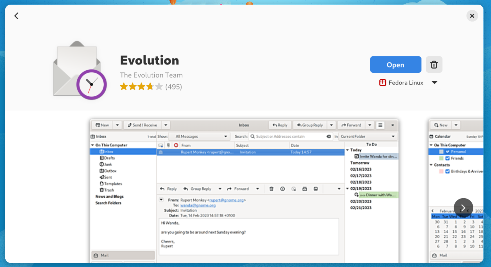

Make sure to install it, and then scroll down to the bottom and install the 
"Outlook PST Import" add-on.

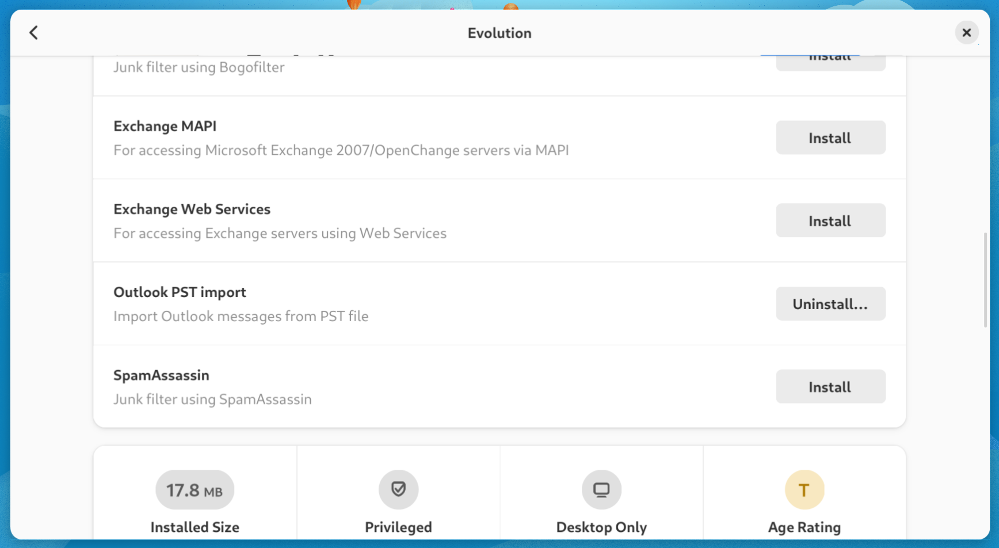

Alternately, to do the same thing quicker, use the **Terminal** and run:

```shell
sudo dnf install evolution evolution-pst
```

!!! warning "Fedora 41 Evolution PST import bug"
    The Evolution client on Fedora 41 has a bug that can, in some circumstances, 
    cause the PST import process to block and never finish.
    <p>
    If you are running this version of the operating system, 
    or is otherwise running into this issue, we recommend 
    trying the [Thunderbird](#extract-on-linux-terminal-thunderbird) method 
    instead.
    </p>

### Step 2: Importing a PST file to the mail client

Open the Evolution mail client.

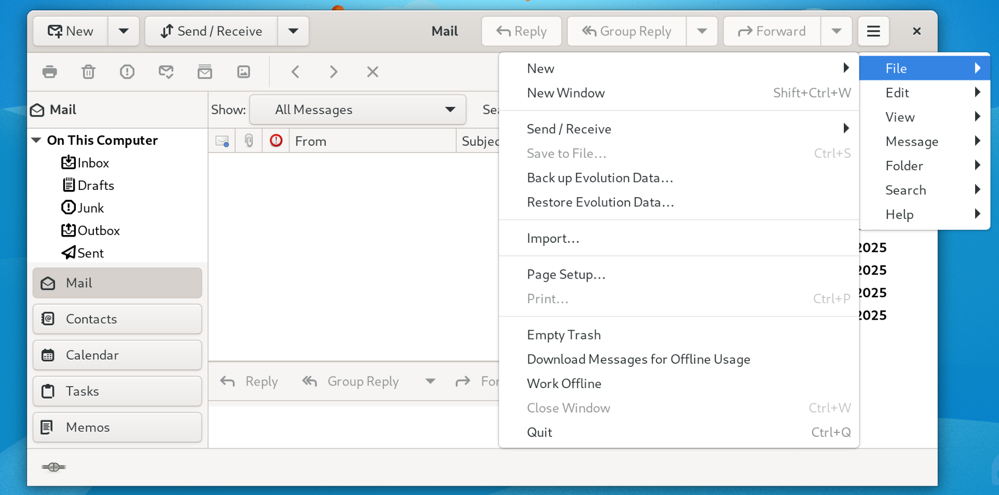

From the menu, click on **File → Import...**.

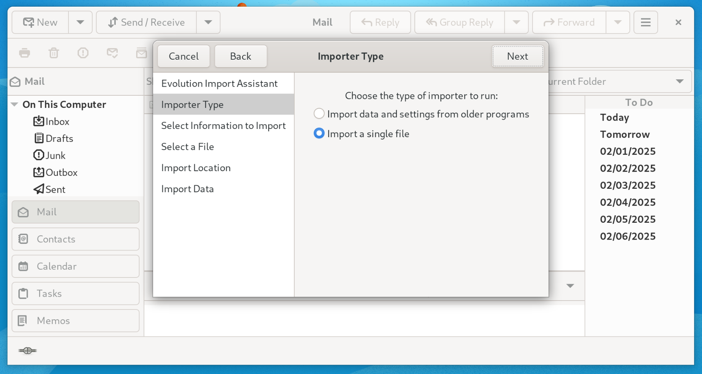

In the Import dialog, click **Next → Import a single file → Next**.

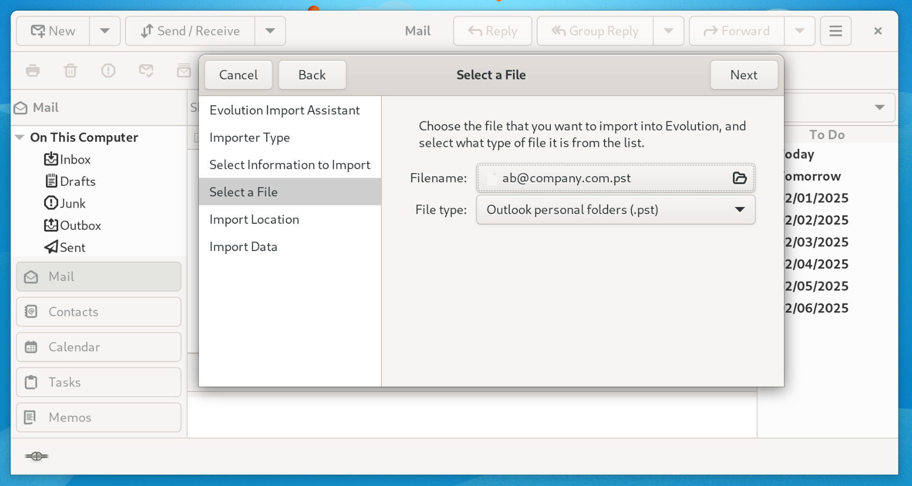

Select the .pst file to import and click **Next**.

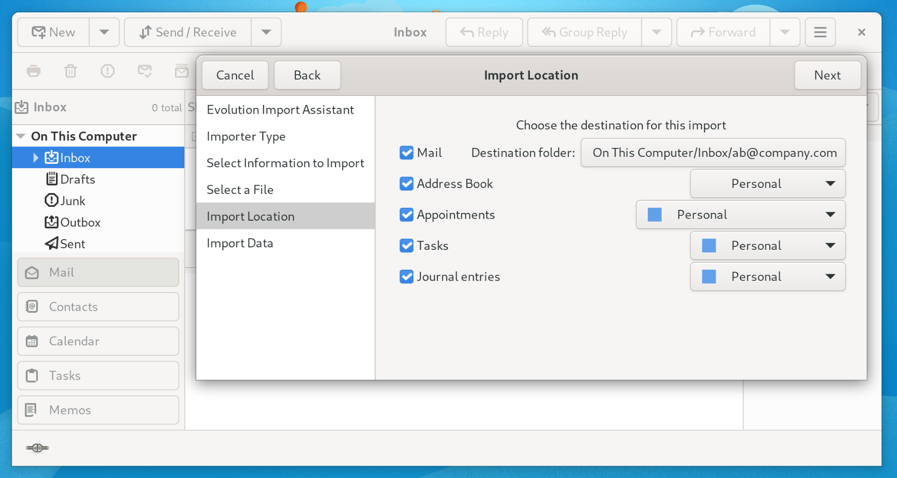

Select the types of objects to import from the file and click **Next**.

After the import is done, you should be able to view the imported content in 
the mail client.

Extract on Linux (Terminal & Thunderbird)
-------------------------------------------

If you prefer [Thunderbird](https://www.thunderbird.net/), 
you can also import the backup data in a similar way to the Evolution mail 
client.

However, by default, Thunderbird has no way of importing .pst files 
<a target="_blank" href="https://support.mozilla.org/en-US/kb/thunderbird-import/">
without Outlook being installed</a>. 
You can bypass the Outlook requirement by first using the command line tool 
`readpst` to convert the .pst file to .eml/.vcf/.ics files, 
install the 
<a target="_blank" 
href="https://addons.thunderbird.net/en-us/thunderbird/addon/importexporttools-ng/">
ImportExportTools NG addon</a>, 
and then use it to import those files. We will guide you through the process.

### Step 1: Installation

First, make sure to have Thunderbird installed by running the following command 
in the Terminal, depending on your operating system.

#### Ubuntu or Debian-based systems
```shell
sudo apt install -y thunderbird pst-utils
```

#### Fedora
```shell
sudo dnf install thunderbird libpst
```

Once Thunderbird has been installed, open it, go to the menu and click on 
**Add-ons and Themes**.

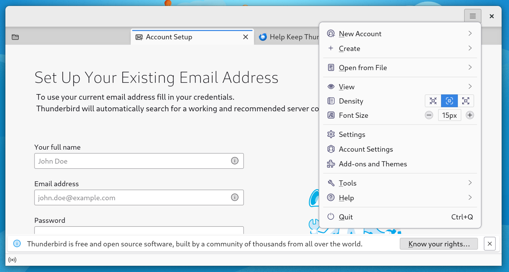

Search for "ImportExportTools NG", then click on **Add to Thunderbird**.

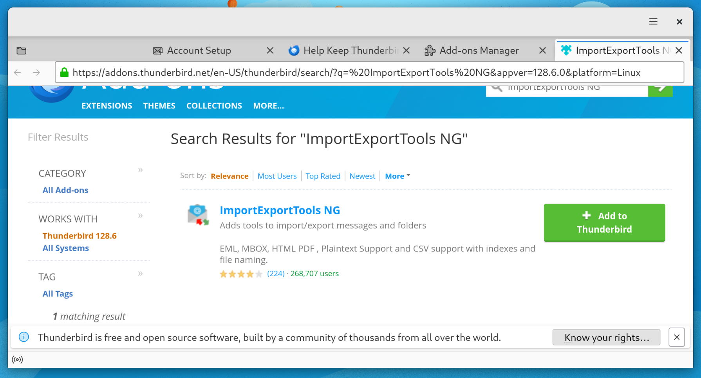

### Step 2: Create the local folders

_You may skip this section if the Local Folders already exist on your 
Thunderbird installation, as seen below._

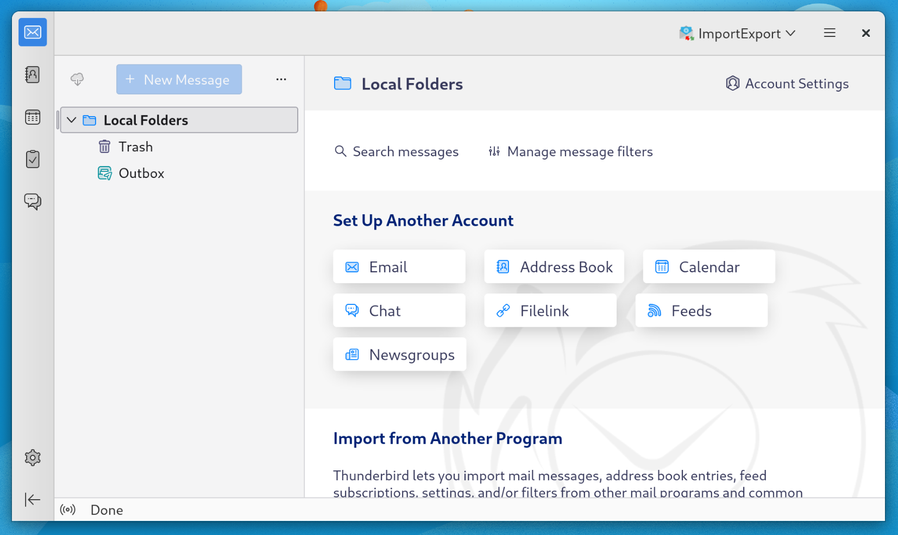

We need the _Local Folders_ section in Thunderbird to import the backup data to.
However, Thunderbird will not create it by default. 
You have to first add a mail account, and only then will the local folders 
section be created. We will therefore create a temporary fake account and 
remove it, just to have the local folders be initialized. 

!!! note "Adding a real email account"
    You are welcome to add a real email account if you wish to use Thunderbird 
    as a mail client.

To add a fake account, go to the menu, then click on **New Account → Email**. 
Type in any "full name" you want, then type in any email address such as 
"root@localhost". Then click on **Configure manually**.

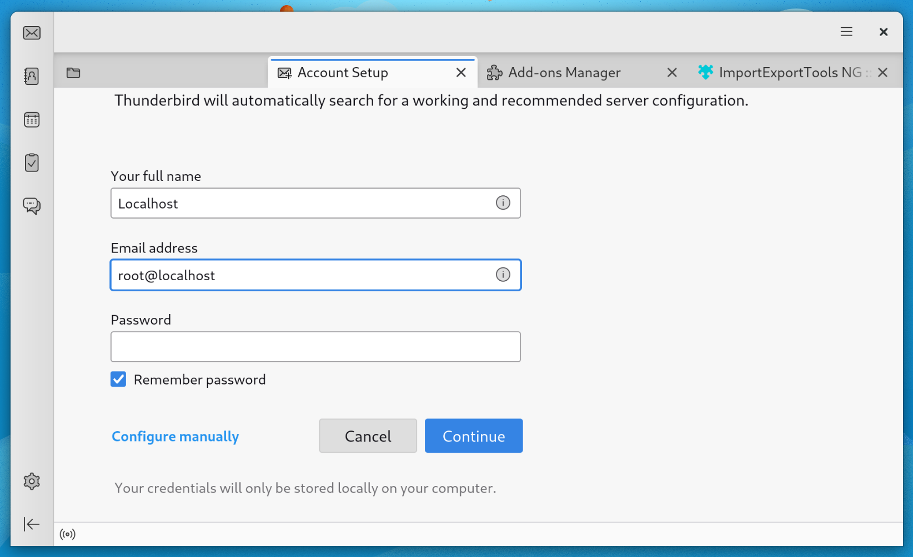

Scroll down, change the two hostnames to "localhost". 
Click on **Advanced config**, then click on **Ok**.

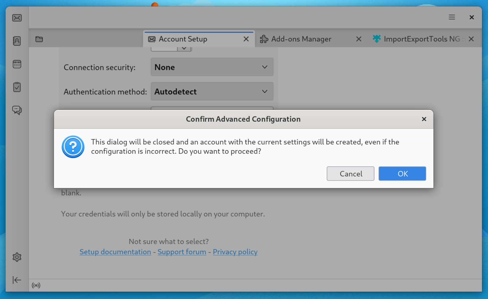

This will create a fake account, and along it, it will create the local folders.
You may now remove the fake account (as it has served its purpose) 
by clicking on **Account Actions → Remove Account**.
_The local folders will remain_.


Optionally, restart Thunderbird to stop it from trying to contact a 
mail server on "localhost".

The local folders should now be available.

### Step 3: Extract the PST file

Open the **Terminal** and run:

```shell
mkdir output
readpst -cv -e -o output your_pst_file.pst
```
Replace "your_pst_file.pst" with the actual name of the .pst file from AvePoint.

This will extract the content of the .pst file to output. Every output file can 
be either an .eml, .vcf, or .ics file depending on if it is an email message,
a contact, or a calendar respectively.

### Step 4: Import to Thunderbird

#### Import messages

To import email messages, right-click on _Local Folders_, then click on
**ImportExportTools NG → Import EML Messages → 
All EML Messages From A Directory And Subdirectories**.

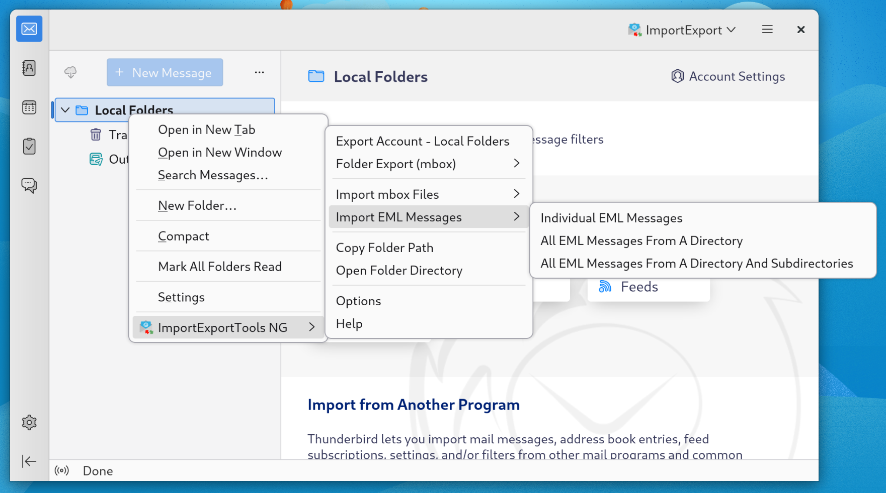

Select the folder with the name of your email account inside the `output` folder
from Step 3.

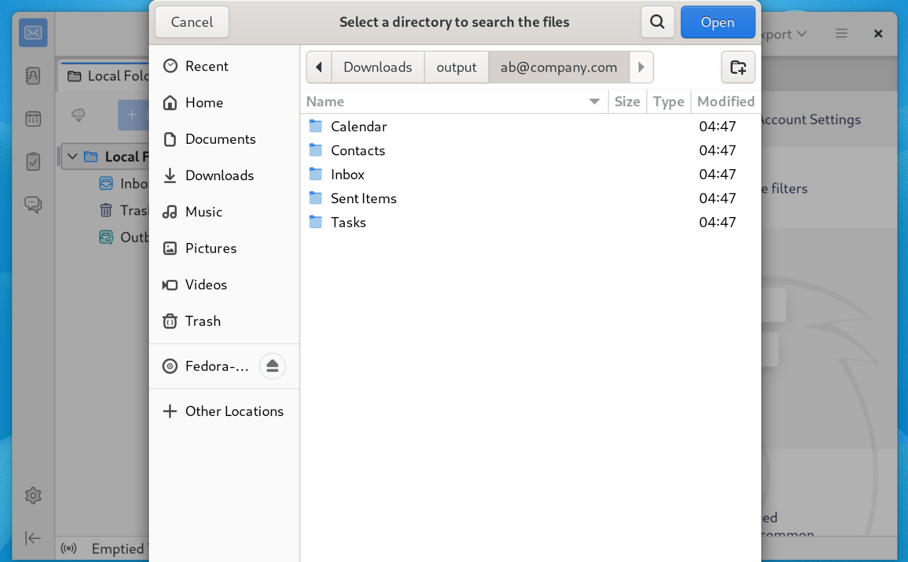

This will import all the folders inside to _Local Folders_.

!!! warning
    Do not try to import individual messages (.eml files) to the root of 
    Local Folders. 
    Thunderbird won't let you. Instead, import the files to Inbox
    or create a new folder under Local Folders and import them there.

#### Import calendars and contacts

Thunderbird has built-in support for importing calendars (.ics files) 
and contacts (.vcf files).
Go to the menu, then click on **Tools → Import**.

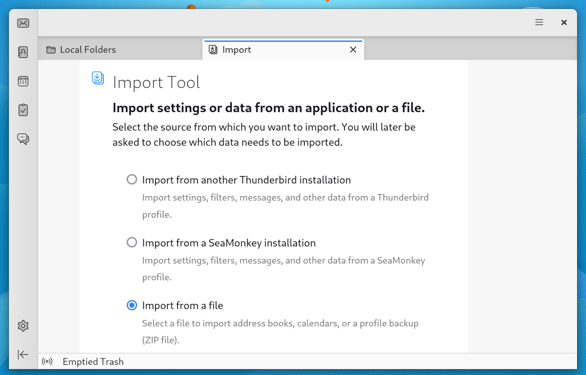

Select **Import from a file** then click **Continue**. Then select the type of
objects you wish to import. If you select contacts, make sure to choose .vcf 
format, because that is what was extracted in Step 3.

- Contacts are likely located in `output/your_email_address/Contacts`.
- Calendar entries are likely located in `output/your_email_address/Calendar`.
