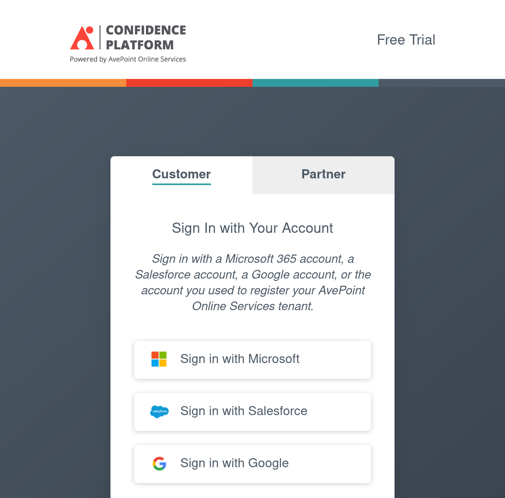
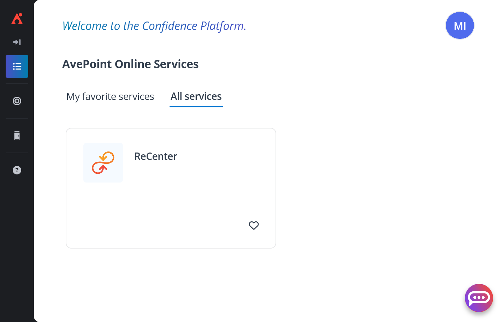
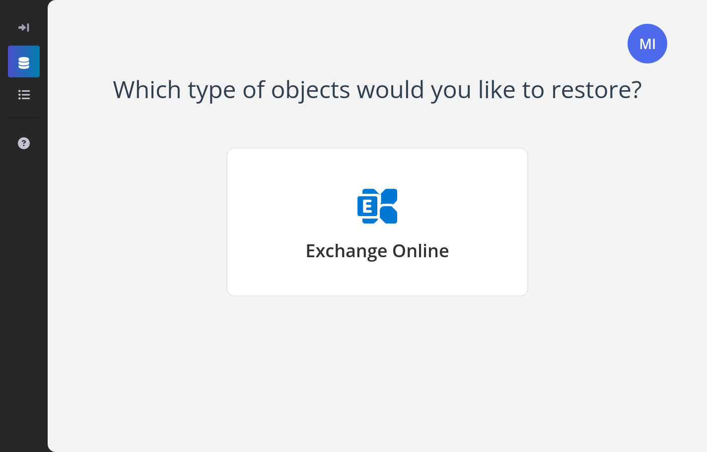
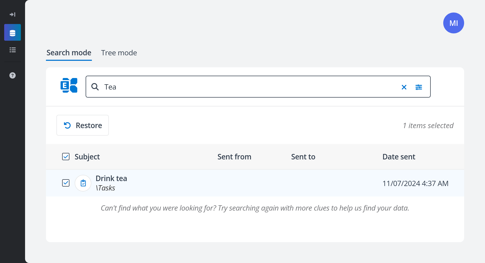
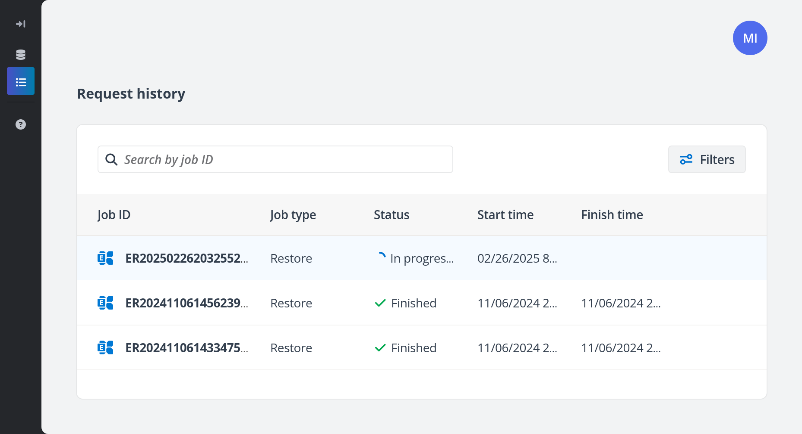

User Data Recovery
====================

If your organization is backing up Microsoft 365 data at Safespring, you will 
be able to restore this data with the help of a tool called 
**AvePoint ReCenter**.

How far back in time you can fetch your Microsoft 365 data from depends on the 
retention time your organization has set.

How to Recover Data
---------------------

1. Go to: https://www.avepointonlineservices.com/
2. **Sign in with Microsoft** using your email address at your organization.
    
    
    
3. Once signed in, click on **ReCenter**, the AvePoint portal for data recovery.

    

4. At **ReCenter**, click on the cloud service you wish to recover data of.
   

   For example, to recover emails, calendars, contacts or tasks, 
   click on <strong>Exchange Online</strong>.
   

    

    !!! note
        Exactly what kind of data you are allowed to restore through ReCenter 
        depends on the settings the IT administration of your organization has 
        chosen. 
        If you find the options limiting, 
        contact your IT department and ask them to help you with the recovery 
        process.

5. Use the search function to:
    - Search for and select specific items.
    - Search for and select items created within a specific time range. 
      Access this functionality by clicking on the filter button on the 
      right-hand side of the search bar.
   
    You can select all the search results by clicking on the checkbox in the
    top-left corner of the table.
    
    
    
6. Once you have selected the items you wish to recover, click on **Restore**. 
   AvePoint will then start recovering the selected items to your 
   Microsoft 365 account.

7. To track the progress, click on **Request History** on the menu. 
   While the recovery is running, the status should be _In progress_.
    
    
    
8. Once the items have been recovered, the status should change to _Finished_.

9. By now you should be able to access the recovered items from Microsoft 365!
