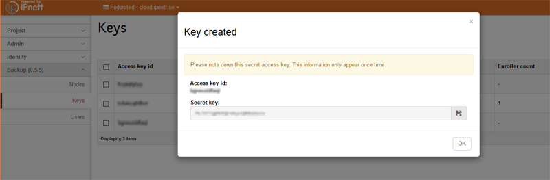

# FAQ

## How do I get keys to generate my API token?

* Login at the BaaS portal, https://portal.cloud.sunet.se/, goto "Backup" and then select "Keys" and press "Create key".
This will get you the access-key and secret-key that can be used to create your access token.  

## Where can I fetch IBM TSM client software?

- See our [TSM installation guide](Installation)

## How do I install TBMR (Bare machine recovery for TSM)

- See our [TBMR installation guide](TBMR)

## When will Operating System X version Y be fully supported by TSM?

IBMs official stance on the issue is that they will have a working client "within 6 months of the release", but it usually is faster than that.

## What known issues are there with the clients and the services on top of TSM?

* You currently can't take backups of files with dates outside 1970-Jan-1 00:00 and 2105-Feb-07. TSM uses 0 to represent both the date 1970-Jan-1 00:00 but also to mark expired files in the inventory, so files before that have undefined date stamps.

* We have a case where TSM up to the latest stable release (7.1.4.0) can fail to restore some files on Solaris x86. We have pre-release binaries one can test in case your Solaris box gives you strange errors (ANS4042E, which normally is related to locale settings like en_US and sv_SE) on large restores. Next patch release should contain the fixed code for it.

* MacOS X 10.11.x needs the latest TSM release (7.1.4.0), otherwise the Apple security framework will interfere with the backup client software locations and not allow you to install or use the backup client. If you update your MacOSX and TSM stops working, install the latest release on top of the old one. No need to change anything in the config files or certificate stores. The upgrade will not disturb those files either.

* If you forcibly kill the client while doing restore, it will take close to 10 minutes for the server to recognise that the client is not coming back to make a "restartable restore". If you run the client again, it will error out with "Restore already in progress". If the client restore was broken due to network hiccups or similar in-transit issues, it will restart by itself from where it left off as long as the issue is resolved within 10 minutes. If you forcibly kill the client, it will forget that it had a session running and you will have to wait until 10 minutes pass before being able to start a new full restore. "dsmc cancel restore" may or may not speed up this timeout.

* There is a known issue with the local deduplication cache if you run exactly Linux kernel 2.6.32 and TSM client version 7.1.0.2. If you have this combination, either upgrade the client (preferred, this is verified to help as a single action), or increase the DEDUPCACHESIZE in dsm.sys (which may workaround the problem).

