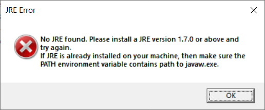
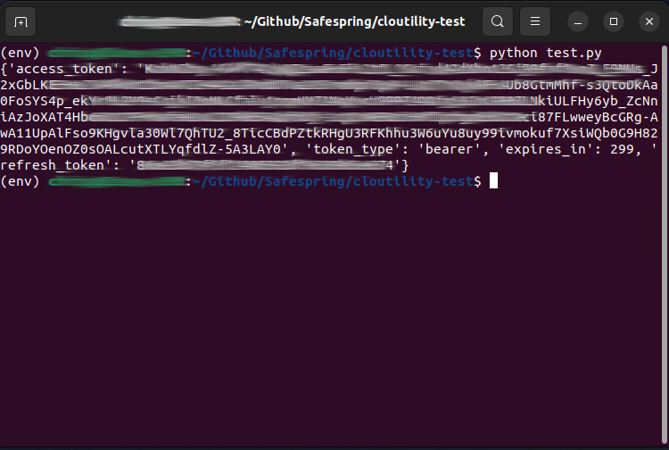

# FAQ

## Failure to launch the TSM BA GUI

- When trying to start the backup GUI the setup may be launched again.
If this happens, let it run through. You may get prompted and asked to continue, to restart services, please just accept and continue. If you're asked to *reboot*, then select "no".
- The GUI is a JAVA application so if you don't have JRE or any equivalent you might get this error.  

    You can then download https://github.com/AdoptOpenJDK/openjdk8-binaries/releases/download/jdk8u232-b09/OpenJDK8U-jre_x64_windows_hotspot_8u232b09.msi and
    run this command to install it,  

    ```sh
    msiexec /i OpenJDK8U-jre_x64_windows_hotspot_8u232b09.msi ADDLOCAL=FeatureMain,FeatureEnvironment,FeatureJarFileRunWith INSTALLDIR="c:\Program Files\AdoptOpenJDK\" ALLUSERS=1 /qn /l*v "%temp%\BaaS-openjdk8_jre_x64.log"
    ```

    You could use other providers of JRE according to our license preferences but we have not tried them all.

## How do I get keys to generate my API token?

- Login at the [Safespring Backup portal](baas-portal), goto "Settings" and then select "API access" and press "Add".
This will get you the client_id and together with your username and password you can create access token and a refresh token.


For more details and examples, see your [API Documentation](api.md)

## Where can I fetch IBM TSM client software?

- See our [TSM installation guide](./install/overview.md)

## How do I install TBMR (Bare machine recovery for TSM)

- See our [TBMR installation guide](TBMR) **MISSING**

## When will Operating System X version Y be fully supported by TSM?

IBMs official stance on the issue is that they will have a working client "within 6 months of the release", but it usually is faster than that.

## What ports need to be opened in the firewall?

During the installation, platforms with TBMR will want to make a https call to get a license for TBMR, so tcp/443 needs to be open until
the installation is done, then during backups and schedule calls, only tcp/1600 outwards.
All TSM communication is always initiated by the client to our server,
no inbound ports need to be configured, so installation and operations behind NAT are ok.

## What known issues are there with the clients and the services on top of TSM?

- You currently can't take backups of files with dates outside 1970-Jan-1 00:00 and 2105-Feb-07. TSM uses 0 to represent both the date 1970-Jan-1 00:00 but also to mark expired files in the inventory, so files before that have undefined date stamps.
- We have a case where TSM up to the release 7.1.4.0 can fail to restore some files on Solaris x86. We have pre-release binaries one can test in case your Solaris box gives you strange errors (ANS4042E, which normally is related to locale settings like en_US and sv_SE) on large restores. Next patch release contains the fixed code for it.
- MacOS X 10.11.x needs the TSM release 7.1.4.0 or newer, otherwise the Apple security framework will interfere with the backup client software locations and not allow you to install or use the backup client. If you update your MacOSX and TSM stops working, install the latest release on top of the old one. No need to change anything in the config files or certificate stores. The upgrade will not disturb those files either.
- If you forcibly kill the client while doing restore, it will take close to 10 minutes for the server to recognise that the client is not coming back to make a "restartable restore". If you run the client again, it will error out with "Restore already in progress". If the client restore was broken due to network hiccups or similar in-transit issues, it will restart by itself from where it left off as long as the issue is resolved within 10 minutes. If you forcibly kill the client, it will forget that it had a session running and you will have to wait until 10 minutes pass before being able to start a new full restore. "dsmc cancel restore" may or may not speed up this timeout.
- There is a known issue with the local deduplication cache if you run exactly Linux kernel 2.6.32 and TSM client version 7.1.0.2. If you have this combination, either upgrade the client (preferred, this is verified to help as a single action), or increase the DEDUPCACHESIZE in dsm.sys (which may workaround the problem).
- The 8.1.0.0 TSM client (not 8.1.0.2 or later) will fail if you have 1400+ directories in a single directory. The error will be something like this: "ANS6718E The path contains too many nested subdirectories. The maximum number of nested  directories is 1400". The solution is to either upgrade to 8.1.0.2 or later, or edit the dsm.opt to include this line: "TESTFLAGS threadstacksize:2048" if you can't upgrade.

## Why can't I delete filespaces from the client?

- This is a security feature since some cryptolockers and ransomwares target [backups][ransomware]. If you want to delete a filespace from the backup, please contact our [support](../service/support.md) to enable the feature temmporarily.

## Credentials to Safespring Backup Portal?

- To get credentials for [Safespring Backup Portal](baas-portal) you need to talk to your backup admin to invite you, if you are the first one in your organisation, please open a ticket with your [support](../service/support.md).

[ransomware]:http://www.backupcentral.com/forum/5/254427/ransomware_deleted_tsm_backups_from_node
[baas-portal]:https://portal.backup.sto2.safedc.net/