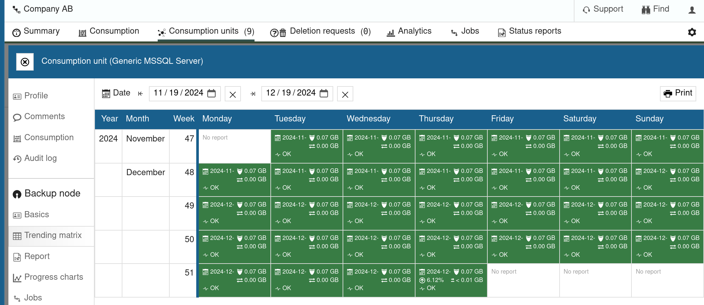
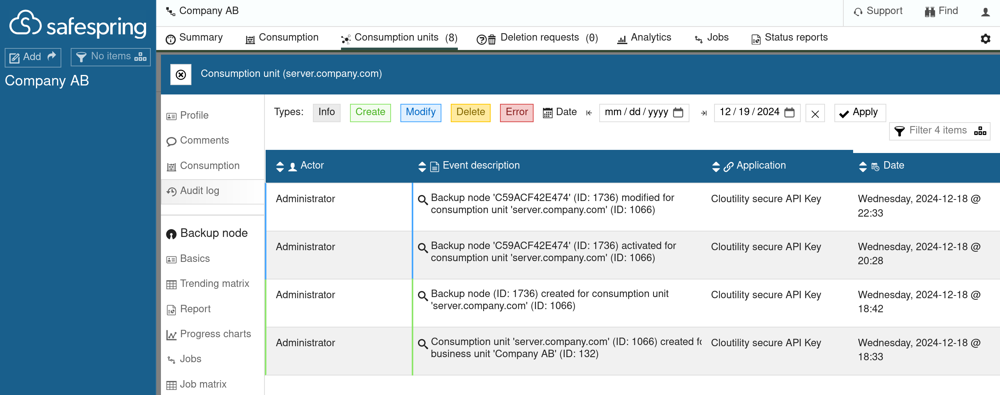
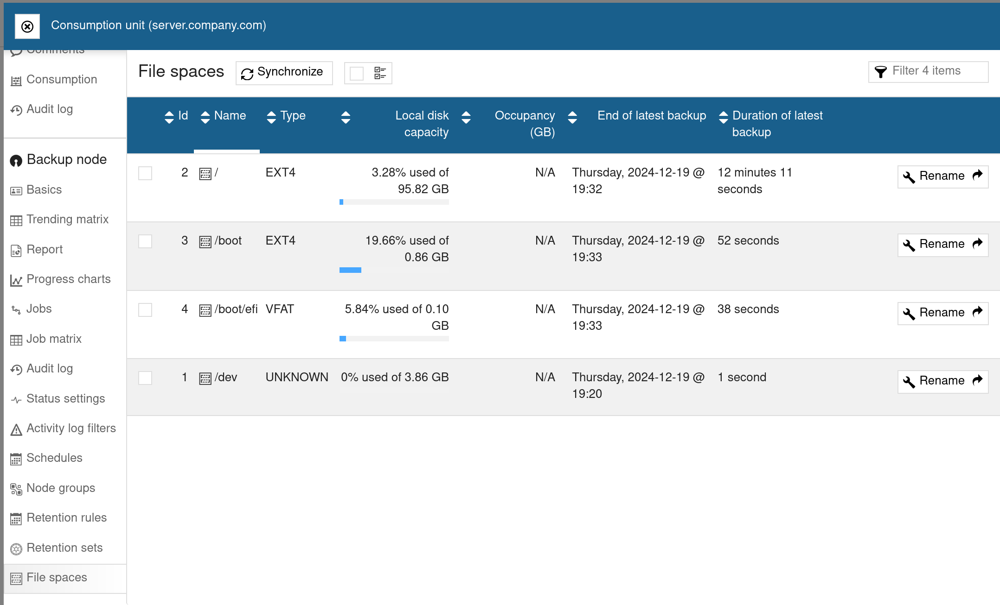
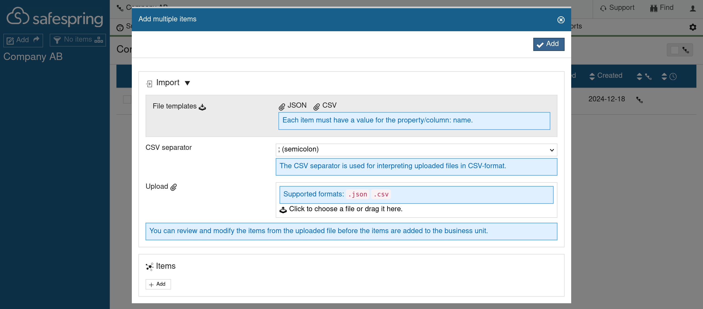
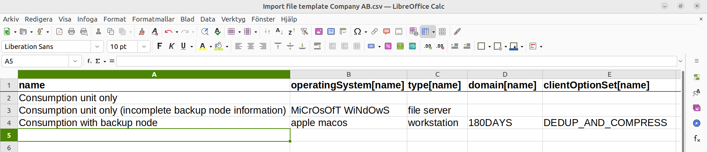
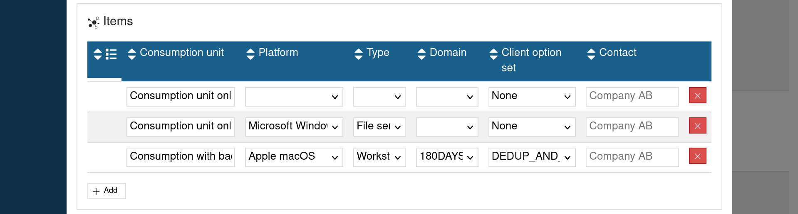

Consumption Units
====================

To back up data from a machine, you will have to register a node in the 
<a href="https://portal.backup.sto2.safedc.net/" target="_blank">
Backup Portal</a>. The _backup node_ will have its own node name 
(like a username)
and a password which are then provided to the backup-archive client installed 
on the machine. Once the backup-archive client is authenticated, it will be able
to back up data from the machine to Safespring's Backup Server.

This article explains how to create and configure a backup node in the 
Backup Portal, and get your node name and password for your machine. 
To install and configure the backup-archive client on the machine, see instead 
the installation instructions for your operating system:

- [Microsoft Windows](../install/windows.md)
- [Linux](../install/linux.md)
- [Apple macOS](../install/apple-macos.md)

For Microsoft SQL Servers, there is a specialized backup-archive client. We
recommend reading the installation instructions for 
[Microsoft SQL Servers](../install/mssql-windows.md).

What is a consumption unit?
-----------------------------
The Backup Portal software is designed to handle more data sources than 
just IBM Storage Protect backup nodes, it handles multiple types of data 
sources in a unified way, called _consumption units_.

**In the Safespring Backup Portal, the only type of data source a consumption 
unit can have is an IBM Storage Protect backup node.**

Due to this one-to-one association between consumption units and backup nodes,
you could see them as the same thing in practice.

Creating a consumption unit
------------------------------
If you have a new machine that needs to back up data, start by creating
a consumption unit in the 
<a href="https://portal.backup.sto2.safedc.net/" target="_blank">
Backup Portal</a>. 

!!! note
     If you do not have an account, please consult the 
     [FAQ](../faq.md#credentials-to-safespring-backup-portal) for information on
     how to get one.

Once logged in to the Portal, click on **Consumption units -> Add**.

Give the consumption unit a descriptive name, for example, its hostname. Then
click on **Add**.

You will be asked if you wish to create a data source (backup node) for the 
consumption unit. Click **Yes**. 
Next, you will be presented with initial options for the backup node. Please see
[Backup node fields](#backup-node-fields) for more information 
about what each field means.

Once done, click **Add**.

For the backup node to actually be created, you will need to _activate_ it.

You can name the node before activating it, or you can leave the Data-source 
field blank and a random name will be set (recommended). The node name can be 
changed later.

!!! note
     There is a checkbox called "Rename consumption unit".
     If checked, the descriptive name of the consumption unit that you set in 
     the beginning will be overwritten to be the same as the node name. Since
     the consumption unit name should be descriptive, and it is recommended that 
     the node name be random, we also recommend that you _leave this checkbox
     unchecked_.

Next, click on **Activate**. 

By now your backup node has been created is ready for use. 
You should see your credentials under "Setup information" at the bottom of the
page.

Next, if you have not done so already, follow the installation tutorial for your
operating system or application. Use the credentials of the newly created node.

Backup node fields
----------------------------

### SP ID
This ID uniquely identifies your backup node on the backup server. 
You can change the name of the node and many other properties, but you can 
never change its Storage Protect ID.

### Platform
The operating system or application of the backup source. This 
should normally be set to the machine operating system. If you are 
(or intend to be) using the specialized Microsoft SQL Server backup-archive 
client for database backup, then set this field to "Microsoft SQL Server".

### Type
Describes the type of machine.
This field has no effect on backups apart from determining 
which schedules are available.
The options "File Server" and "Workstation" both have the same set of available 
schedules.
The final option, "Application server", will only allow you to pick 
Microsoft SQL Server-specific schedules.
It is possible to filter nodes in 
[Status Reports](../howto/reports-by-email.md) based on their type.

### Backend server
Which backup server the backups will be stored in. There is
currently only one backup server available, which is the default one.

### Domain
This option decides the retention time of the backed-up data. The
options are:

- 30DAYS: Objects are retained for 30 days.
- 60DAYS: Objects are retained for 60 days.
- 90DAYS: Objects are retained for 90 days.
- 180DAYS: Objects are retained for 180 days.
- 1YEAR: Objects are retained for 1 year.
- 2YEAR: Objects are retained for 2 years.
- STANDARD: Objects are retained for 180 days (same as 180DAYS).

### Client option set
What set of options the server should tell the client 
to set. You have three possible choices:

- DEDUP_AND_COMPRESS: Enables client-side deduplication and compression by 
  setting the following options on the client (unless overwritten by 
  dsm.opt / dsm.sys):
     - <a target="_blank" href="https://www.ibm.com/docs/en/storage-protect/8.1.26?topic=reference-compressalways">COMPRESSALWAYS</a> yes
     - <a target="_blank" href="https://www.ibm.com/docs/en/storage-protect/8.1.26?topic=reference-compression">COMPRESSION</a> yes
     - <a target="_blank" href="https://www.ibm.com/docs/en/storage-protect/8.1.26?topic=reference-deduplication">DEDUPLICATION</a> yes
- FORCE_ENCRYPT: Forces client-side encryption of all data. Please see the 
  article on [Encryption](../howto/encryption.md#how-to-handle-keys) for more 
  details. Only one option is (forcefully) set:
     - <a target="_blank" href="https://www.ibm.com/docs/en/storage-protect/8.1.26?topic=reference-include-options">INCLUDE.ENCRYPT</a> /.../*
- None: The server sets no client options.

### Contact
Who is responsible for this machine?

### No. of CPUs
The number of CPU cores on the machine. This field
has no effect on the backups. It is only there because some licensing models
require it. _It is not relevant for you or us and can be left as the default
value (1)._

### State
The lock state. If the node is locked, no client will be able to 
access it or perform backups. If for whatever reason, a client tries the wrong
password too many times, the node will lock itself without notice. It will take
some time before the lock state is synced with the Backup Portal and become 
visible to you from there. For more information, see the 
[Passwords](../howto/password.md#invalid-sign-on-attempts) article. 
The button next to this field will _immediately_ lock or unlock the node.

### Session security
What security state the node is in. A new node is always 
set to the "Transitional" security state when first created. Once a client logs
in for the first time, it is changed to "Strict". See the 
[Passwords](../howto/password.md#session-security-transitional-vs-strict) 
article for the meaning of these two states.

### Migration
This option allows Safespring administrators to merge the node
with a node on the Backup Server that is not yet managed by the Backup Portal. 
This is a special-purpose feature that you will most likely not need.
_Leave it as Inactive._

### Proxy configuration—Agents
Nodes that are allowed to access the data of 
this node. This is useful for restore testing, see 
[Restore Testing](../recovery/testing.md) article.

### Proxy configuration—Targets
Nodes that this node is allowed to access the 
data of. This is useful for restore testing, see 
[Restore Testing](../recovery/testing.md) article.

### Replication—State
Whether to allow this node to be replicated to 
another backup server. This is not relevant at the moment, and should be left
disabled.

### Data-source (NODENAME)
The name of the backup node, it functions like a username.
A randomized alphanumeric string of size 12 is the convention. But you can name
your node anything you like as long as it follows IBM Storage Protect's 
<a href="https://www.ibm.com/docs/en/storage-protect/8.1.26?topic=commands-naming-storage-protect-objects" target="_blank">object naming rules</a>.

#### Microsoft SQL node naming
If the node is used to store MS SQL backup data on a Windows machine that also
has its own node (let us call it `ABCDEF123456`) for the file system, then
it is normal to name the MS SQL node `ABCDEF123456_DB` 
(the machine node name suffixed with `_DB`).

### SP server network address (TCPSERVERADDRESS)
The backup server hostname.

### SP server network port (TCPPORT)
The backup server TCP port.

### SP password
The [password](../howto/password.md) of the backup node.

Backup node status
-------------------
There are several ways for you to get status reports on a backup node.
We will cover some of them here.

### Trend matrix and Report
The trend matrix offers a quick overview of how healthy a machine's 
(or an application's) backup routine has been over a period of time.

To get detailed information, click on one of the dates in the matrix, this will
take you to the **Report** tab.

### Job matrix and Jobs

The **Job matrix** is very similar to the Trend matrix, but is more focused on
individual jobs, rather than the overall status of the backup routine at each 
date.

Detailed information about individual backup jobs can be viewed from by 
clicking the **Jobs** tab.

### Progress chart

The progress chart can be accessed at 
**Consumption units -> [Your Consumption Unit] -> Progress charts**.

It shows how much storage the backup node has used over a period of time, and
how much data has been transferred.

Audit log
----------
All changes made to a consumption unit in the Backup Portal are logged in an
Audit log.

A consumption unit's Audit log can be found at 
**Consumption units -> [Your Consumption Unit] -> Audit Log**.

Filespaces
-----------
All backup data is stored in filespaces. Information about your backup node's
filespaces can be found at 
**Consumption units -> [Your Consumption Unit] -> Filespaces**.

Normally, every filesystem on a machine will automatically get its own 
filespace in the backup node. 
There are exceptions, for example, when defining 
[virtual mount-points](../howto/include-exclude.md#virtual-mount-points), 
in which case each such mount-point will have its own filespace 
even when they are not independent filesystems, but regular directories.
Also, when backing up Windows machines using VSS, some resulting filespaces
will not correspond to filesystems on the machine.
This can be seen on the "Type" column when the filespace type is "VSS" rather
than a filesystem name such as "NTFS".

Creating multiple consumption units
-------------------------------------
If you have a lot of machines, and want a fast way to create a consumption
unit for every machine, you can click on 
**Consumption units -> Add -> Add multiple items (backup nodes)** 
and follow the instructions below. 

!!! note 
     If you have not done so before, it is 
     recommended to create at least one consumption unit and backup node the 
     normal way to learn about the fields needed for each one.

You will be presented with a window that allows you to upload a JSON or a CSV 
file with all the data needed to create every consumption unit and its backup 
node.

You also have templates for both formats that you can follow. 
Download a template by clicking on JSON or CSV in the "File Templates" box.

You could, for example, 
use the CSV format and edit the file in LibreOffice Calc 
(or Excel or equivalent).
This will provide a nice interface to quickly input all the fields for every 
consumption unit.

Alternatively, you could add the consumption units in the browser directly by
clicking on the **Add** button in the bottom left corner.

Once done, re-upload the edited .CSV (or .JSON) file to the "Upload" box if 
you have chosen to use that method.
Verify the input in the table at the bottom.

Then click **Add** in the top right corner.

The consumption units should now be created, and backup nodes should be
ready to be activated.
