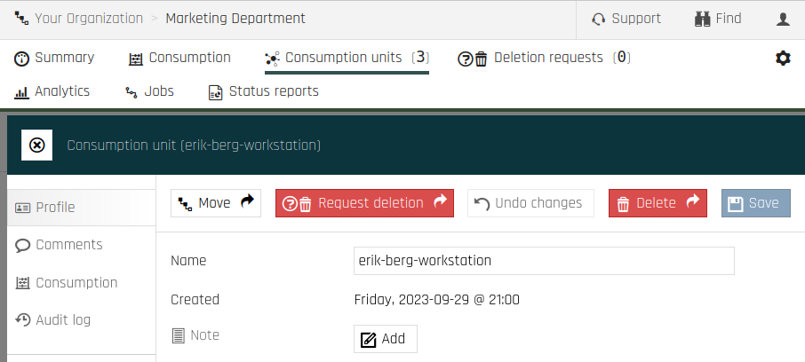
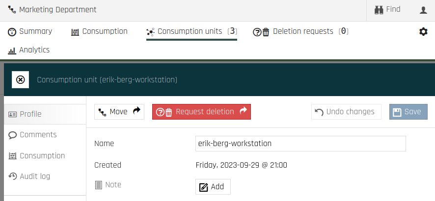

Deleting Nodes
===============

Deleting nodes from the backup server is done through <a href="https://portal.backup.sto2.safedc.net/" target="_blank">Cloutility</a>. A user may either 
delete the node directly, or submit a deletion 
request for backup administrators to accept/reject. A less privileged user may 
only have the option to submit a request rather than delete the node on 
their own. 

You as a backup administrator have the ability to assign new roles and 
create new accounts with these roles under your organization. In this way, 
you can choose if users with a specific role can or cannot delete nodes 
directly.

In the Cloutility portal, deleting backup nodes is done by deleting the 
_consumption unit_. 
Therefore, this article will (almost exclusively) describe deletion of 
consumption units rather than backup nodes, as the former implies the latter.

Relevant Role Permissions
------------------
The following are the most relevant permissions for consumption unit deletion. 
They can be adjusted for roles under Settings (cogwheel, top-right corner), then Roles.

* `Deletion request - Create` - Can make a _Deletion Requests_.
* `Deletion request - Approve` - Can approve deletion requests.
* `Deletion request - Delete` - Can reject deletion requests.
* `Consumption unit - Delete` - Can delete a consumption unit without making 
  a deletion request.

### Deletion request settings page

Under each _Business Unit_ you can find settings for how Delete requests should 
work. They are found under Settings, Identity and then Deletion request 
settings. The following permissions can be 
assigned to roles 
pertaining to 
these settings.

* `Deletion request settings - View` - View this page. `Create`, `Edit`, 
  `Delete` depend on this permission being granted.
* `Deletion request settings - View` - Edit deletion request settings.
* `Deletion request settings - Create` - Create date rules for deletion of Consumption Units as well as Filespaces.
* `Deletion request settings - Delete` - Remove date rules.

_Note: You may only change these settings for descendant Business Units of 
your Business Unit. This settings page will be disabled on the Business 
Units of your account regardless of which permissions you have._

### Extra
* `Backup node - Delete` - Can delete a backup node. _It is 
  unclear how any deletion option manifests itself in the Cloutility portal 
  because of this permission. However, it is recommended to turn it off for 
  roles that should not be able to delete backup nodes without making a 
  consumption unit deletion request._ 

### Example
Assume that you have two roles. 

1. **Backup Administrator:** all the _organization-wide_ backup-responsible IT people. 
2. **Department IT Administrator:** backup-responsible IT people for _specific 
   departments_.

Then you may want to let people with Role #1 have the ability to delete 
consumption units without asking for approval, in which case you leave 
the `Consumption unit - Delete` permission on.

**What Backup Administrators see:**

Conversely, for the sake of safety and security, you as a Backup 
Administrator may decide to turn off the `Consumption unit - Delete` for 
Role #2. But you leave `Deletion request - Create` on.

**What Department IT Administrators see:**

Deletion Requests
------------------
Users with the permission `Deletion request - Create` may request the deletion 
of a consumption unit. If such a request has been submitted, other users 
with the permissions `Deletion request - Approve` or `Deletion request - 
Delete` may then choose to 
**approve** 
or **reject** the 
request respectively. This choice can be done by visiting the "Deletion requests" page, from the top menu.

If enough approvals have been made, as specified by the "Required approvals 
per deletion request" setting under the "Deletion request settings" page, 
then the node will be marked for deletion at the requested date.