Complete Linux Recovery using TBMR
=====================================

Restoring a complete Linux system is made easier with TBMR which 
provides a bootable image (akin to an Ubuntu installer ISO) that is able to 
recover whole systems from the TSM backup server.

To be able to perform a restoration in the future with the help of TBMR, a 
utility has to be installed and set up on the system while the system is 
functional.
In other words, **you need TBMR installed and configured before data has been 
compromised and a disaster recovery is needed.**

This document will describe how to install and set up TBMR on Linux. 
Windows is supported as well, and can be set up in an equivalent way to how it 
is done on Linux. However, that will not be described here.

TBMR Preparation Guide
----------------------------

### Part one - Restore preparations

Safespring recommends all users to prepare and maintain bootable media of the recovery tool _before_ the required use of the tool.

To restore a machine, the following preparatory steps need to be taken:

 1. **Retrieve the bootable ISO image.**

    The bootable ISO of TBMR, called XBMR, is available at Safespring's [distribution site](https://archive.service.safedc.net/tbmr/Linux/). The bootable ISO-file is named `xbmr-for-safespring-x.x.x.x.linux.x86_64.iso`.

 2. **Prepare bootable media (DVD or USB) with this bootable image.**

    Using your favorite method, prepare, for example, a DVD or USB drive with 
    the ISO image retrieved in step 1.

### Part two - Client Installation

We will describe step by step how to install the TBMR utility on Linux
systems to make them recoverable using TBMR.

!!! note 
     These steps must be taken before data has been compromised!

#### Prerequisites

* The client machine must be running a Linux distribution.
* The TSM Backup-Archive client (dsmc) must be installed and configured to 
  perform a full incremental system backup. See the 
  [Quickstart Guide](../quickstart-guide.md) for information about how to do this.
* A license for TBMR. 
  As a customer, you have access to our site license. 
  Please contact [support](../../service/support.md) to receive a copy.

#### Installation
1. Install TBMR **(on Ubuntu/Debian)**:
    ```shell
    dpkg -i tbmr_*_amd64.deb
    ```
   Install TBMR **(on CentOS/Red Hat/Rocky Linux)**:
    ```shell
    rpm -i tbmr-*.x86_64.rpm
    ```
2. Install the TBMR site license:
    ```shell
    rm -f /etc/cbmr/TBMR.lic
    licmgr -p tbmr --cid [CONTRACT-ID] --act [ACTIVATION-CODE]
    ```
3. In `/opt/tivoli/tsm/client/ba/bin/dsm.sys` add the following line:
   ```
   PRESCHEDULECMD '"/usr/bin/tbmrcfg"'
   ```
   This option will run `tbmrcfg` before every scheduled event, such 
   as incremental backups. It will regenerate an important folder called 
   `/TBMRCFG`.
4. The special folder created by TBMR called `/TBMRCFG` contains 
   information about the OS, dsmc configurations and the hardware it is 
   running on. It is important that it is available in the backup during a 
   disaster recovery, so **make sure to back up the system one more time to 
   ensure that `/TBMRCFG` is included**.

!!! note
     For btrfs file systems, it is recommended to exclude snapshot directories.
     You can do so by appending the following line to 
     `/opt/tivoli/tsm/client/ba/bin/dsm.sys`:

      ```
      exclude.dir /.snapshots/*/snapshot      
      ```

System Recovery on Safespring Compute
-------------------------------------
This section covers the extra steps needed to recover a Linux instance running on Safespring Compute.

### Step 1: Create an image
Similar to the pre-defined images on the Compute platform such as ubuntu-22.04 or debian-12, 
you can upload your own images.

To upload the `xbmr-for-safespring-x.x.x.x.linux.x86_64.iso` ISO 
so that you can use it on the compute platform, 
go to Compute -> Images and click on "Create Image."
Then:

- Specify a descriptive name, such as `xbmr-x.x.x.x`. 
- Choose the ISO as the image file. 
- Select Format as ISO.

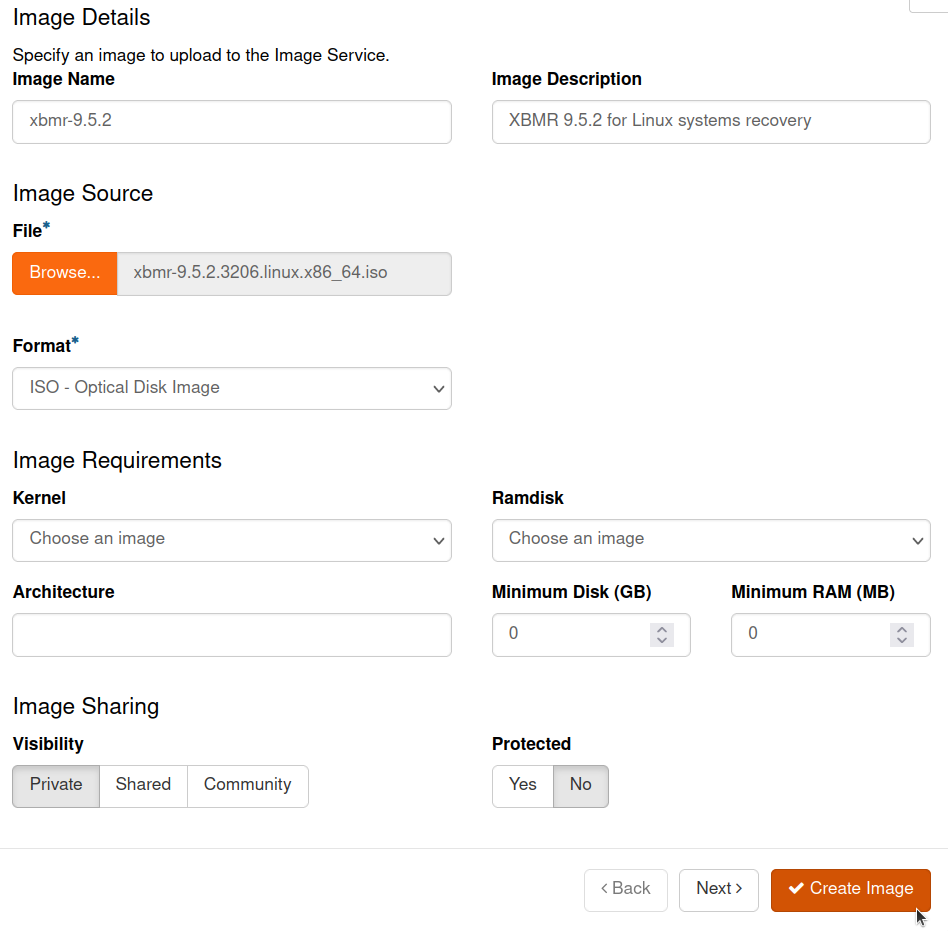

You may optionally change other settings if you would like to further customize the image.

Once done, hit "Create Image."

### Step 2: Create a volume to restore to
You need a new volume to restore the system to.
It should be at least the same size as that of the original system.

Go to Volumes -> Volumes, and click on "Create Volume."
Then:

- Specify a descriptive "Volume Name."
- Keep the "Volume Source" as "No source, empty volume."
- The "Size" should be at least the same or larger than the original boot 
  volume.


You may optionally change other settings if you would like to further 
customize the volume.
Once done, hit "Create Volume."

Click on "Edit Volume" next to the newly created volume, 
and make sure that the "Bootable" checkbox is ticked.

### Step 3: Create an XBMR instance
To use the ISO image, you must create a compute instance for XBMR. 
**This is not the instance for the system to be restored, rather it is for XBMR 
only. 
It can be safely discarded once the restoration is complete.**

Go to Compute -> Instances and click on "Launch Instance."

1. Specify a descriptive "Instance Name", such as `XBMR`.
   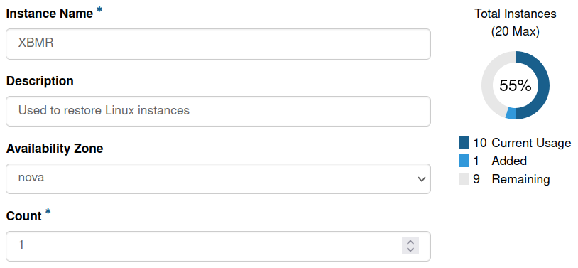
2. Click "Next >", then choose "Image" under "Select Boot Source." 
   Choose the XBMR image that you have created on "Step 1" by clicking on the
   arrow next to it.
   This will move it to the "Allocated" list.
   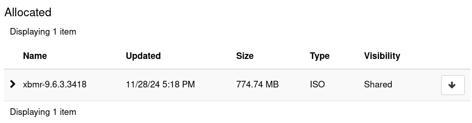
3. Click "Next >". 
   Then select an instance flavor that has storage allocated to 
   it, such as `l2.c4r8.100`, by clicking the arrow next to it. 
   **Make sure that it has at least 8GB of RAM.** 
   You will not need more than 100GB of storage because this space will only be used by the 
   XBMR ISO and not the system to be recovered.
   
4. Click "Next >". 
   Select either public or default.
   
5. Click on "Launch Instance."
6. Once the instance has been launched, on the "Actions" column, click on the
   arrow and then "Attach Volume." Select the volume from "Step 2" and attach 
   it. **This is the volume that the system will be recovered to.**

### Step 4: Perform the system recovery
At this point, you should have everything ready to perform the system recovery.
A secure way to interface with XBMR on the Safespring Compute platform is to use the Console (a web-based VNC client). 
It can be accessed from Compute -> Instances -> [Your TBMR instance] -> Console.

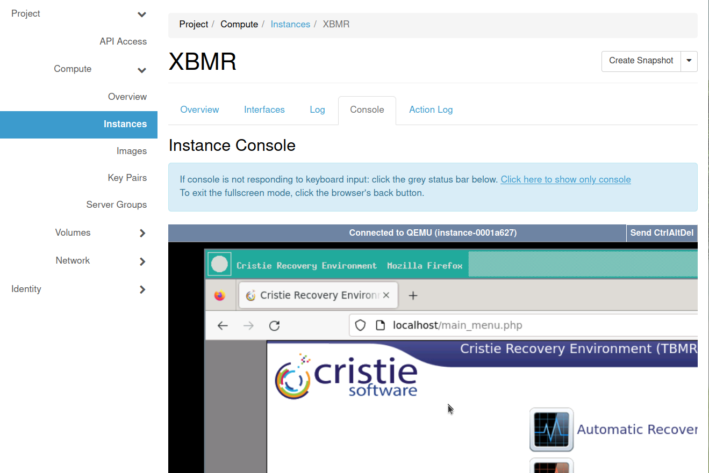

Perform all the obligatory steps described in the **System Recovery** section 
below as you would on any other machine.

Once done, go to Compute -> Instances and click on the arrow next to the 
XBMR instance, and click on "Detach Volume." 
Select the restored volume, and detach it. 
Proceed to Step 5.

### Step 5: Create an instance for the recovered system
With the recovered drive, 
you are ready to create the compute instance for the recovered drive. 

Make sure to:

- When creating the instance, choose a flavor without any storage.
- In the "Source" section, set "Select Boot Source" to "Volume" and 
"Delete Volume on Instance Delete" to "No." Next, select the recovered volume.

Once you have configured everything, you can launch the instance and test it
to see if it has booted up and is functional.

If everything worked correctly, you may delete the XBMR instance. 
The XBMR image can be kept around for future use if you want,
or be discarded as well.

System Recovery
------------------

To perform a restore of a machine with TBMR, the following steps must be taken:

 1. **Locate** a replacement machine for the broken machine.
 2. **Boot** the replacement machine with the bootable image, having Internet network access.
 3. **Generate** a new password for the node via API or portal.
 4. **Enter** the node name (12 characters A-Z) and password into the booted tool.
 5. **Optionally add** any additional missing drivers for the new machine.
 6. **Optionally partition** the devices for the new machine.
 7. **Restore** the old machine into a new system.

### More information

For further details at this point, please see:

 * [TBMR For Linux Usage Guide](https://archive.service.safedc.net/tbmr/Linux/UserGuide.pdf)
 * [TBMR For Windows Usage Guide](https://archive.service.safedc.net/tbmr/Windows/TBMR-722-UserGuide.pdf)

### Restore of a Linux machine

1. Make a bootable USB or DVD with `xbmr-for-safespring-x.x.x.x.linux.x86_64.iso` if you have not done so already.
2. Boot into the recovery environment using the ISO. X11 based Linux recovery environment is recommended. Automatic recovery wizard is recommended.
    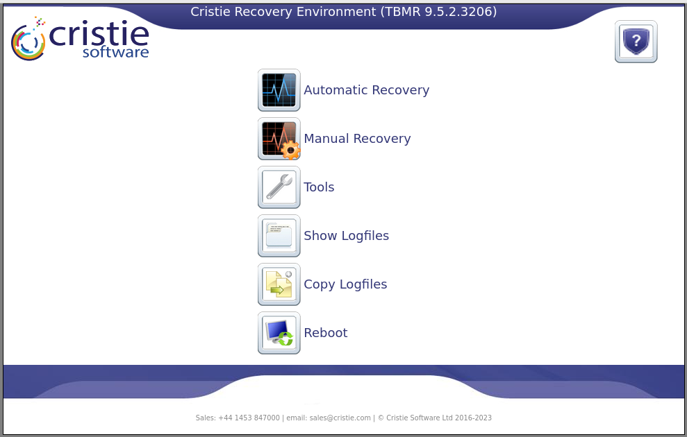
3. **(Optional)** Manually set network options, if needed, at Tools -> Network Setup.
    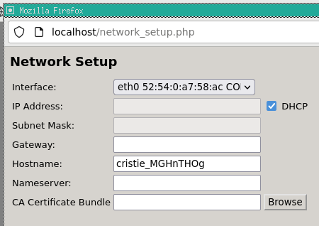
4. **(Optional)** Set the keyboard layout at Tools -> Keyboard Layout. 
    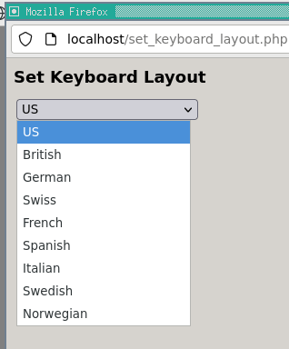
5. Select Automatic Recovery. Provide the following TSM server information:
     - Server address
     - Port
     - Node name
     - Password (You will probably have to rekey the node beforehand, since the client rotates passwords)
   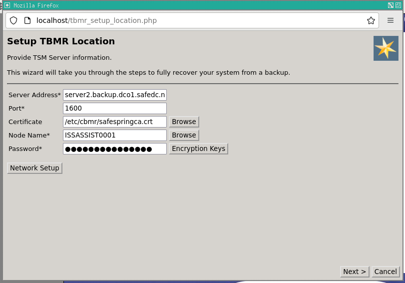
6. Hit "Next >" and select a recovery date.
    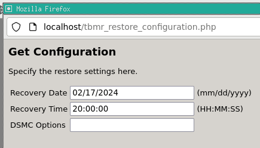
7. Proceed further, and click on "Recovery Options." A new window will open where you can map backed-up storage devices to local devices by dragging-and-dropping the target block devices. You can also select which filesystems to restore.
    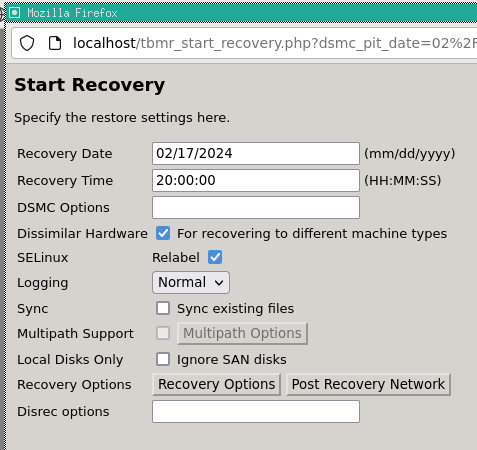
    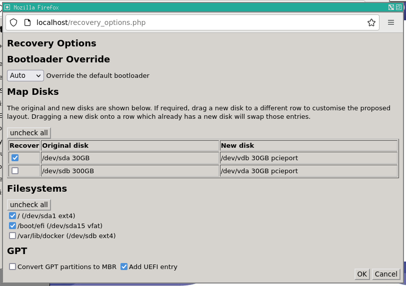
8. Click "Ok" and "Next >". The recovery process will begin.
    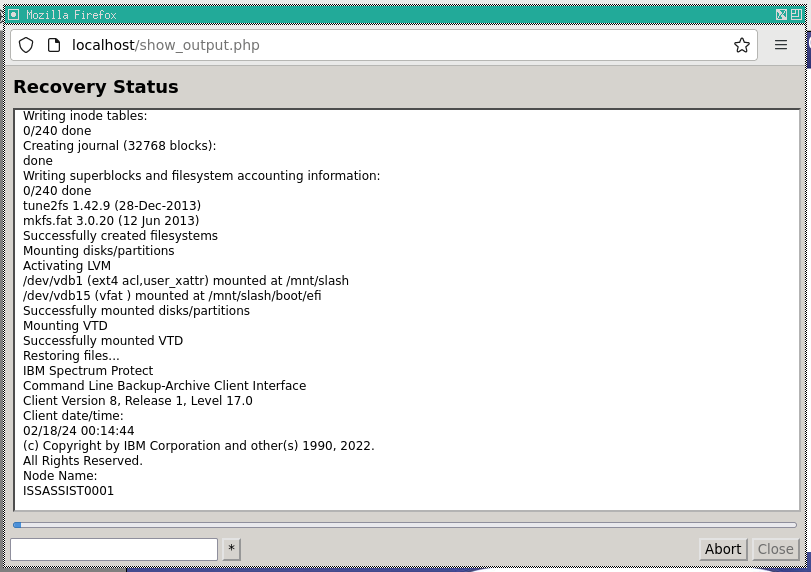
9. Once done, reboot into the recovered OS.


Creating Safespring's Custom XBMR ISO
----------------------------------
_The instructions in this section are optional._

The ISO that was provided to you by Safespring called 
`xbmr-for-safespring-x.x.x.x.linux.x86_64.iso` was created for your convenience
and includes the Safespring CA certificate as well as the right hostname and
port number already set. In this section, we document how we created this
ISO so that you have an idea of exactly what changes were made, and possibly 
use this information to create your own further customized ISO.

!!! note 
     This guide helps you prepare SSH connectivity for flexibility in Step 1. 
     But you could technically create the ISO without SSH, 
     and use the built-in terminal exclusively if you like as well.

### Prerequisites 
You need:

- Cristie's ISO `xbmr-x.x.x.x.linux.x86_64.iso` burned to a USB stick, a
   drive or a partition. _If you are using a VM (recommended), you should be able 
   to boot directly into the ISO without burning it to anything._
- Another drive, USB stick or partition to save the new ISO file to.
- Two machines on the same network. One for booting the Cristie's ISO, and 
   another for accessing the booted XBMR system through SSH.

### Step 1: Preparing the Environment
1. Boot into Cristie's ISO `xbmr-x.x.x.x.linux.x86_64.iso`. Make sure that this
   machine has an external storage device that you can save files to.
2. Change the keyboard layout at Tools -> Set Keyboard Layout.
3. Change the root password: Tools -> Change password.
4. Start the SSH server: Tools -> Start SSH.
5. Get the IP address of the machine. This should be used to connect via SSH 
   using another machine.
   1. Run the shell: Tools -> Run shell.
   2. Type:
      ```shell
      ip address
      ```
      Ignore the first `lo` loopback interface. Find the right local network
      or public IP address from among the other interfaces.
6. Once you have the IP address, you should be able to access the machine
   from another machine on the same network using SSH:
   ```shell
   ssh root@xxx.xxx.xxx.xxx
   ```

### Step 2: Creating the Custom ISO
1. Edit `/etc/cbmr/DRAnswer.ini`. Replace:
    ```ini
    [CustomISO]
    CDROMDevice="/dev/sr0"
  
    [TSM]
    TCPPort="1600"
    ```
    With:
    ```ini
    [CustomISO]
    CDROMDevice="/dev/sr0"
    IncludeCertificate="1"
    IncludeAnswerfile="1"
    OutputDir="/mnt/slash"
    OutputFile="xbmr.iso"
    LogfileDir=""
    Drivers=""
    ISOTitle=""
    KernelParameters=""
    IncludePassword="0"
    IncludeConfig="0"
    TimeoutBoot="iso"
    
    [TSM]
    TCPPort="1600"
    Certificate="/etc/cbmr/safespringca.crt"
    TCPServerAddress="server2.backup.dco1.safedc.net"
    COMMMethod="TCPIP"
    ```
2. Download Safespring's CA certificate to the right location:
    ```shell
    wget -O /etc/cbmr/safespringca.crt https://raw.githubusercontent.com/safespring/cloud-BaaS/master/pki/SafeDC-Net-Root-CA.pem
    ```
3. Mount the external storage device `/dev/xxx` to `/mnt/slash`. 
   Make sure to pick the right device.
    ```shell
    mount /dev/xxx /mnt/slash
    ```
4. Create the ISO.
    ```shell
    custom_iso
    ```
5. Verify that it has been created in the right location. It should be called
   `xbmr.iso`.
    ```shell
    ls /mnt/slash
    ```
6. Shut down XBMR and boot into the new ISO `xbmr.iso` instead. Now all the
   Safespring-specific settings, including the CA certificate, should be available by default.
