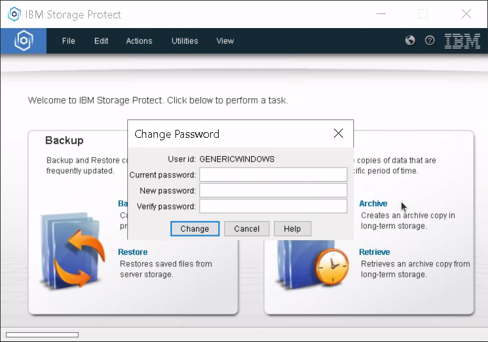

Backup Node Password
=====================

Initially, when a backup node is created and activated in Cloutility, a randomly generated password is set and will thereafter be made available from the portal under "Setup information."


When you log in with the backup-archive client for the first time using the initial password, it will be stored encrypted on the client system. On future logins, the stored password will be used automatically without you needing to enter it again. 

A backup node password has an expiration time of 30 days. 
If the backup-archive client attempts to log in while the password is expired, it will regenerate a new random password and send it to the server. 
This happens automatically. 
**Keep in mind that when it happens, the initial password found in Cloutility becomes obsolete.**

The above-mentioned automatic authentication and password generation is enabled by using the client option `PASSWORDACCESS GENERATE`. 
It should be set already if you were using the template provided by Safespring for [UNIX-based systems](https://raw.githubusercontent.com/safespring/cloud-BaaS/master/unix/dsm.sys.sample) or [Windows](https://raw.githubusercontent.com/safespring/cloud-BaaS/master/windows/dsm.opt.example) to configure the client. 
If not, you can enable this feature by adding the option to `/opt/tivoli/tsm/client/ba/bin/dsm.sys` or `C:\Program Files\Tivoli\TSM\Baclient\dsm.opt` on UNIX-based systems or Windows respectively.

### Further reading

The `passwordaccess` option: https://www.ibm.com/docs/en/storage-protect/8.1.21?topic=reference-passwordaccess

Retrieving the current password
------------------------
Within the first 30 days upon creating a backup node or changing a node's password from Cloutility, the "Setup information" section in Cloutility should be a reliable way to retrieve the current password.

However, if the password has been changed outside Cloutility for different reasons, such as password expiration, the password found in Cloutility is going to be obsolete.

!!! note 
      Normally, if you need access to the node password, for example, for data recovery, it is more convenient to just [change the password](#changing-the-password) in Cloutility rather than retrieving the current one. In case you still want the current password, read on!

The most reliable way of retrieving the current password is to read it from the encrypted store on the client system.

### Retrieving the encrypted password on Linux
On Linux, the password is stored encrypted in `/etc/adsm/TSM.KDB`. Start by listing the entries in the database:

```shell
gsk8capicmd_64 -cert -list -db /etc/adsm/TSM.KDB -stashed
```

The output should be something like:
```
Certificates found
* default, - personal, ! trusted, # secret key
#	1708990603_0
#	1708184881_0
```

Pick the first (latest) one, and run the following to retrieve the password in plain-text:
```shell
gsk8capicmd_64 -secretkey -extract -db /etc/adsm/TSM.KDB -label 1708990603_0 -target /root/1708990603_0 -stashed
grep -v "SECRET KEY" /root/1708990603_0 | base64 -d
```
_Remember to change the label above to the one you have on your system._

Clean up:
```shell
rm /root/1708990603_0
```

### Retrieving the encrypted password on Windows
On Windows, the encrypted password is stored in `C:\ProgramData\Tivoli\TSM\baclient\Nodes\[your node name]\DCO1-BACKUP-SERVER-2\TSM.KDB`.
Replace `[your node name]` with the name of your backup node. The name "DCO1-BACKUP-SERVER-2" above is the name of Safespring's backup server. If you are using the older TSM12 server, the name in the path should reflect that.

Open the Command Line Prompt in Administrative Mode, and enter:
```shell
cd "C:\Program Files\ibm\gsk8\lib64"
"C:\Program Files\ibm\gsk8\bin\gsk8capicmd_64.exe" -cert -list -db "C:\ProgramData\Tivoli\TSM\baclient\Nodes\[your node name]\DCO1-BACKUP-SERVER-2\TSM.KDB" -stashed
```

Again, replace `[your node name]` with your backup node name.

The output should be something like:
```
Certificates found
* default, - personal, ! trusted, # secret key
#       1710702970_0
```

Pick the first (latest) one, and run the following to retrieve the password in plain-text:
```shell
"C:\Program Files\ibm\gsk8\bin\gsk8capicmd_64.exe" -secretkey -extract -db "C:\ProgramData\Tivoli\TSM\baclient\Nodes\[your node name]\DCO1-BACKUP-SERVER-2\TSM.KDB" -label 1710702970_0 -target "C:\Windows\Temp\1710702970_0" -stashed
certutil -decode -f "C:\Windows\Temp\1710702970_0" "C:\Windows\Temp\1710702970_0.plain"
type "C:\Windows\Temp\1710702970_0.plain"
```
_Remember to change the label above to the one you have on your system._

Clean up:
```shell
del "C:\Windows\Temp\1710702970_0" "C:\Windows\Temp\1710702970_0.plain"
```

### Further reading
Password storage: https://www.ibm.com/docs/en/storage-protect/8.1.21?topic=started-secure-password-storage

Password encryption details: https://blog.sigterm.se/posts/the-joys-of-bootstrapping-ibm-backup-client/

Changing the password
-----------------------
You can whenever you want to change the password of a backup node from Cloutility. This will enforce the new password and update it on the backup server. To do so, go to Consumption Units -> [Your backup node] -> Basics. Click on "Change" on the right side of "SP password".

It is also possible to change the password directly from the backup-archive client. Keep in mind that this will make the password stored in Cloutility out of sync with the actual password. This is a technical limitation due to the backup server _only_ storing the hash digest of the password for security reasons. You will be the only one who can access the password in plain-text.

### On Linux
Enter the following command:
```shell
sudo dsmc set password 'old password' 'new password'
```

### On Windows - GUI
Open the application "Backup-Archive GUI." Go to Utilities -> Change Password...

 

### On Windows - command line
Open the Command Line Prompt in Administrative Mode, and enter:
```shell
cd "C:\Program Files\Tivoli\TSM\baclient"
dsmc set password "old password" "new password"
```

### Further reading

More about `dsmc set password`: https://www.ibm.com/docs/en/storage-protect/8.1.21?topic=commands-set-password

Session security: transitional vs. strict
-------------------------------------------
When a backup node is newly created and activated, it starts off with something called _transitional_ session security. Once a client has logged in to the node for the first time, the session security is normally automatically changed to the _strict_ state. 

This table highlights important differences between the two:


Invalid sign-on attempts
-------------------------
The limit for the number of consecutive invalid sign-on attempts is 5 for backup nodes with _strict_ session security, and 1 for backup nodes with _transitional_ session security. When the limit is reached, the backup node will be locked and will not be accessible unless it is unlocked again. You can unlock the backup node from Cloutility.

!!! note 
      If you have just been locked out from the backup node, Cloutility will still claim that the node is "unlocked" for a short while.
      This is because Cloutility syncs the lock-state with the backup server every hour, and may have not had time to sync yet. You can bypass this issue by "locking" the backup node and unlocking it again. The node should end up unlocked immediately after.

      This may be initially confusing because **the backup-archive client will not tell you that you have been locked out.**

We will go through a few scenarios which may be relevant if you experience authentication failures.

### Scenario #1—Correct password but authentication still fails?
You have just created and activated a new backup node. Because it is new, it is set to _transitional_ session security. This means that you have only **one login attempt** before getting locked out.

#### Problem
You accidentally type the wrong password, and the server silently locks the node. Then you type in the password (correctly this time) and still end up with an authentication failure. **The backup-archive client made no mention of the node being locked, and only reported authentication failures regardless of what you typed.** Cloutility has not synced the lock-state with the backup server yet, and therefore does not show that the node is locked.

#### Solution
Go to Cloutility -> Consumption Units -> [Your backup node] -> Basics.

If Cloutility hasn't synced the lock-state yet, the backup node will appear as "Unlocked." If so, click on "Unlocked" to change the state to "Locked," and hit Save.

Click on "Locked" to change the state back to "Unlocked" and hit save.

The node should now be unlocked. Try to log in again.

### Scenario #2—Correct password but the node still gets locked
Your client system runs Linux, and you are migrating your backups from an old node to a new one. 

After having created and activated the new backup node on Cloutility, you attempted to log in to the new node using the correct password, but still ended up with an authentication failure. Because it is a new node, it was set to _transitional_ session security. That meant you only had **one login attempt** before getting locked out. The solution in _Scenario #1_ did not help.

#### Problem
The backup-archive client is trying old credentials from `/etc/adsm/TSM.KDB` before giving you a chance to type the correct password. This causes the new backup node to instantly lock up.

#### Solution
Remove the old password store:
```
rm -f /etc/adsm/TSM.*
```
Then follow the instructions under Solution in _Scenario #1_.