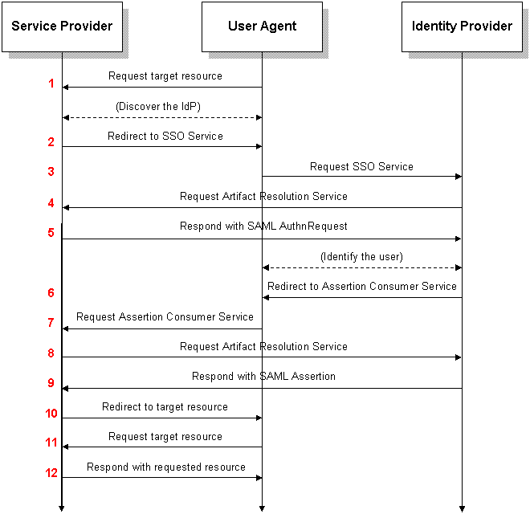

Single Sign-On to Cloutility
==============================

Cloutility supports Single Sign-On (SSO) using the SAML 2.0 protocol. If your organization uses an Identity Provider (IdP) such as Microsoft Active Directory Federation Services (AD FS), then it can be used for Cloutility user authentication as well. SSO should work with any Identity Provider that supports the SAML 2.0 protocol.

Overview
------------
The following diagram is an overview of how the SAML 2.0 authentication flow works.



_"Saml2-browser-sso-artifact" by <a href='https://en.wikipedia.org/wiki/User:Trscavo' target='_blank'>Trscavo</a> is licensed under CC BY-SA 3.0._

In Cloutility, any Business Unit can be turned into a Service Provider (SP) in SAML terms. If you set up a Business Unit as such, all accounts under it and under its descendants can be allowed to authenticate using the configured Identity Provider (IdP).

There are two ways that you can allow users to log in:

1. **Service Provider initiated.** Enable an SSO link on the Cloutility sign-in page to your Identity Provider. The user follows the link, authenticates from there, and gets automatically redirected back to Cloutility.
2. **Identity Provider initiated.** The user accesses the Identity Provider directly, get authenticated, and then manually selects Cloutility as the Service Provider to redirect to. _Note: The IdP may or may not support this variant by default._

Configure SSO for your Business Unit
--------------------------------

Click on **Settings -> Sign-in options -> Identity providers -> Add**. Next, you will be asked to fill in some configurations for your Identity Provider (IdP) and how it should be used.

### Inheritable
This configuration decides whether users of descendant business units should be allowed to authenticate using this IdP.

### Identity provider user ID
You have two options:

- **Custom**: Only selected users will be allowed to authenticate using this IdP. You must also choose an _identity_ for every such user that matches the account registered with the IdP. Such user (and identity) selection will be available after the IdP has been configured.
- **User email or custom**: All users within the business unit will be able to authenticate using the IdP. Their Cloutility user email addresses will be used as their respective _identities_ by default. Custom identities can still be configured.

### Sign-in page visibility
Whether a link to your SSO should be visible on Cloutility's sing-in page.

!!! note 
    If you disable this option, users must either use the Assertion Consumer 
    Service (ACS) URL, or use the Identity Provider initiated authentication 
    flow where the user starts at the IdP and manually chooses to redirect to 
    Cloutility.
    The ACS URL will be available to you after the IdP has been added.

### Multi-factor authentication
Whether to use Multi-factor authentication (MFA).

### Name
The name of your IdP. It will be shown on Cloutility's sing-in page if 
_Sign-in page visibility_ is enabled.

### (Single sign-on) SSO URL
This is the URL that the user will be redirected to when choosing to sign in 
using SSO.

For an AD FS IdP, you could use:
```
https://login.example.org/adfs/ls/idpinitiatedsignon.aspx
```
_Make sure to change the hostname to yours, and verify that the URL is working._

For other IdP software, the sign-in page URL will differ.

### Entity ID
In SAML terms, this is the identity of your IdP.

If you are using AD FS, this value can be found in **AD FS Management -> 
AD FS -> Edit Federation Service Properties -> Federation Service identifier**.

For other IdP software, the Entity ID will differ.

### Identity provider certificate
This is the certificate used to verify the SAML Assertion that is sent to 
Cloutility by the IdP (step 9 in the diagram).

If you are using AD FS, this certificate can be retrieved from 
**AD FS Management -> Certificates -> Token-signing**. 

1. Right-click the token-signing certificate and select View Certificate... 
2. Go to **Details -> Copy to File...**
3. Hit Next.
4. Select "DER encoded binary X.509 (.CER)". Hit Next.
5. Specify a location.
6. Upload the exported file to Cloutility.

For other IdP software, the location of this certificate will differ.

### Query type
This is the extraction method used by Cloutility to extract the authenticated
user's _identity_ from the SAML Assertion XML document (step 9 in the diagram).

The identity is the user ID that we described in **Identity provider user ID**.

Select **XPath**.

### Identity location
The identity location will be an <a href='https://extendsclass.com/xpath-tester.html' target='_blank'>XPath</a> query. 

For example, if the user identity is the text content of a NameID-tag, 
then you can use the query: 

```xpath
//*[local-name()='NameID']
```

After configuring the IdP, Cloutility will display the latest SAML Assertion for
debugging purposes. You can use that to adjust the XPath query if needed, and
learn what a SAML Assertion from your IdP to your Business Unit looks like.

### Sign-in page URL
The page that the IdP will redirect back to after authentication.

Should normally be:
```
https://portal.backup.sto2.safedc.net/signin
```

Configuring the Identity Provider
------------------------------------
Once done configuring the Business Unit, you have to configure the Identity 
Provider to recognize your Business Unit as a trusted Service Provider
(a.k.a. a trusted Relaying Party).

How a Service Provider (Relaying Party) is added depends on the IdP 
software. 

!!! note
    One thing to always keep in mind, regardless of IdP, is to make sure that the 
    right User ID is passed to the Service Provider in the SAML Assertion. 
    For example, if your Business Unit in Cloutility expects email addresses as
    user identities, make sure that your IdP sends the authenticated user's email
    address.

