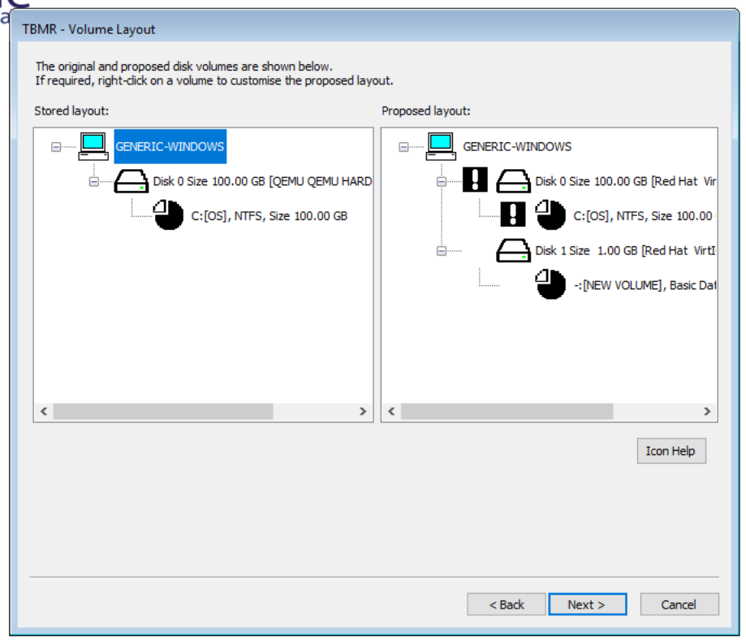
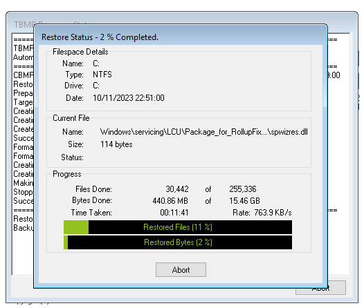

Complete Windows Recovery using TBMR
=====================================

Restoring a complete Windows system is made easier with TBMR which 
provides a bootable image (akin to an Ubuntu installer ISO) that is able to 
recover whole systems from the TSM backup server.

To be able to perform a restoration in the future with the help of TBMR, a 
utility has to be installed and set up on the system while the system is 
functional.
In other words, **you need TBMR installed and configured before data has been 
compromised and a disaster recovery is needed.**

This document will describe how to install and set up TBMR on Windows. 
Linux is supported as well, and can be set up in an equivalent way to how it is 
done on Windows. However, that will not be described here.

Prerequisites
---------------

* The client machine must be running Windows.
* The TSM Backup/Archive client (dsmc) must be installed and configured to 
  perform a full incremental system backup. See the 
  [Quickstart Guide](../quickstart-guide.md) for information about how to do this.
* A license for TBMR. 
  As a customer, you have access to our site license. 
  Please contact [support](../../service/support.md) to receive a copy.

Installation
--------------
We will describe step by step how to install the TBMR utility on Windows client
systems to make them recoverable using TBMR.

!!! note 
     These steps must be taken before data has been compromised!

1. Run SetupTBMRSuite.exe and select which components to install.
    1. If you have not generated a CRISP Recovery ISO before, select all 
       options except for "CRISP WinPE5 Recovery Environment Fileset".
    2. If you have generated a CRISP Recovery ISO before, select only
       "Cristie TBMR" (the first option).
   
    And proceed.

    !!! note 
          To install TBMR + CRISP automatically; you can run the following 
          command using the Command Prompt _with administrative privileges_:
          ```
          SetupTBMRSuite.exe /passive /log ./tbmr.log /norestart
          ```
          This allows for automatic deployment without user interaction.
          
          If you are **not** interested in using the machine for ISO creation, 
          you can install TBMR without CRISP the same way using SetupTBMR.exe
          instead.
          ```
          SetupTBMR.exe /passive /log ./tbmr.log /norestart
          ```

2. Make sure to configure the license key using the Command Prompt _with 
   administrative privileges_:
   ```shell
   rd  c:\ProgramData\Cristie\Licensing /s /q
   "c:\Program Files\Cristie\TBMR\licmgr.exe" /p tbmr /cid [CONTRACT-ID] /act [ACTIVATION-CODE]
   ```
   Replace `[CONTRACT-ID]` and `[ACTIVATION-CODE]` with the proper values.
3. In `C:\Program Files\Tivoli\TSM\baclient\dsm.opt` add the following line:
   ```
   preschedulecmd '"C:\Program Files\Cristie\TBMR\TBMRcfg.exe"'
   ```
   This option will run `TBMRcfg.exe` before every scheduled event, such 
   as incremental backups. It will regenerate an important folder called 
   `C:\TBMRCFG`.
4. The special folder created by TBMR called `C:\TBMRCFG` contains 
   information about the OS, dsmc configurations and the hardware it is 
   running on. It is important that it is available in the backup during a 
   disaster recovery, so **make sure to back up the system one more time to 
   ensure that `C:\TBMRCFG` is included**.

Creating the Recovery ISO
--------------------------
We need a Recovery ISO that can be used to actually recover a complete system 
from the TSM backup server. 
This ISO can be generated once using the Cristie Recovery ISO Producer (CRISP) 
tool, and then reused for future recoveries. The reason why it is not 
downloadable through Safespring and has to be generated by you 
is due to licensing restrictions.

### Steps

1. Install Microsoft Windows Assessment and Deployment Kit (WADK). The correct version (2004) can be 
   downloaded from [Microsoft Download Center](https://go.microsoft.com/fwlink/?linkid=2120254).
   Make sure to install the following feature:
    - Deployment Tools
2. Install the [Microsoft Windows PE add-on](https://go.microsoft.com/fwlink/?linkid=2120253) as well.
   Make sure to install the following feature:
    - Windows Preinstallation Environment (Windows PE)
3. Open the "Start CRISP" application.
4. Select "Build WinPE10 recovery ISO/USB media for TBMR".
5. Select a folder where the log file should be written.
6. Select a folder where the ISO should be output to.
7. Hit "Next>" twice.
8. Check "Select if you wish to include PowerShell in the ISO or bootable USB media".
9. Check "Select if you wish to include an SSL/TLS certificate file in the 
   ISO or bootable USB media." Download [SafeSpring's root CA certificate](https://raw.githubusercontent.com/safespring/cloud-BaaS/master/pki/SafeDC-Net-Root-CA.pem), and browse
   to the `SafeDC-Net-Root-CA.pem` file.
10. Hit "Next>" and wait until the ISO has been built. 

Once you have the ISO, you can optionally burn it to a USB drive if needed.
You should now be ready to use the ISO to perform full recoveries of 
backed-up Windows machines that have had TBMR set up.

System Recovery
---------------------

1. Boot the Recovery ISO. If it was booted successfully, you should see several buttons including "Recover System", "Tools", etc.
2. Click on "Tools".
3. Select "Advanced Options" and hit "OK".
4. Check "Edit Dsm.Opt". Hit "OK", and then "Close".
5. Click on "Recover System".
6. Optionally, you can select a location to save logs to. This can be useful for debugging potential errors. If you have a USB stick, or a volume connected to the node, you can save the logs there.
7. Hit "Next >" three times.
8. Fill in the following fields:

    - Server Name/IP Address: **tsm12.backup.sto2.safedc.net**
    - Port: **1600**
    - Node Name: **[Name of the Node to recover from]**
    - Password: **[Node password, can be found in Cloutility]**
    - (Optional) Point-in-time (PIT) restore: **[which point in time to restore from]** When not setting this option, TBMR will restore from the _latest_ backup.
   
9. Hit "Next >". Now you will be asked to apply final edits to `dsm.opt`. You have to add the line `TESTFLAG disable_tls13` to this file. Optionally, you may add other settings here if needed. Once you are done, save the file and close Notepad.
10. Next you will be asked to specify the volume layout. A proposed one will 
    initially be provided to you, but you should definitely make sure that it 
    looks like the way you want it.
    
    On the left-hand side you can see the current volumes. On the right, you 
    have the proposed layout. An **exclamation mark (!)** means that the object 
    will be formatted/partitioned. If it is blank where the (!) should be, then 
    it means the object will be ignored. Right-click the disks and partitions 
    to specify the desired layout.

11. Hit "Next >". Select the drive(s) to restore.
12. Hit "Next >". Optionally, set network settings and machine host name.
13. Hit "Next >". Optionally, specify the location of additional network or 
    storage drivers. If any additional drivers are needed, they can be provided 
    using a USB stick or a virtual volume, for example.
14. Hit "Finish" and wait for the system to be recovered.
    
