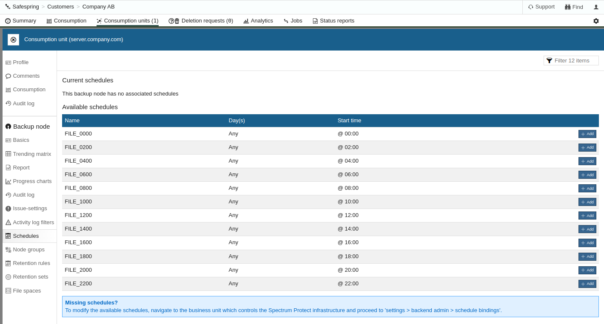

# Linux Installation (64-bit)

## Manual Installation

_This document describes how to **manually** install IBM Storage Protect 
Backup-Archive Client on Linux operating systems like Ubuntu and 
Red Hat Enterprise Linux (64-bit)._

Required files:

- <a href="https://public.dhe.ibm.com/storage/tivoli-storage-management/maintenance/client/v8r1/Linux/" target="_blank">IBM Storage Protect Backup-Archive Client</a>
- [SafeDC Root CA PEM File](https://raw.githubusercontent.com/safespring/cloud-BaaS/master/pki/SafeDC-Net-Root-CA.pem) (Right-click and Save)
- [SafeDC Default Option file dsm.opt](https://raw.githubusercontent.com/safespring/cloud-BaaS/master/unix/dsm.opt.sample) (Right-click and Save)
- [SafeDC Default Configuration file dsm.sys](https://raw.githubusercontent.com/safespring/cloud-BaaS/master/unix/dsm.sys.sample) (Right-click and Save)

### Installation and Configuration

#### Installation

1. Download the required files according to above into a temporary folder

    1. Ubuntu / Debian
       ```shell
       wget https://public.dhe.ibm.com/storage/tivoli-storage-management/maintenance/client/v8r1/Linux/LinuxX86_DEB/BA/v81xx/8.x.xx.x-TIV-TSMBAC-LinuxX86_DEB.tar
       ```
    
    2. RHEL / RPM-based distros
       ```shell
       wget https://public.dhe.ibm.com/storage/tivoli-storage-management/maintenance/client/v8r1/Linux/LinuxX86/BA/v81xx/8.x.xx.x-TIV-TSMBAC-LinuxX86.tar
       ```

2. Extract the package `8.x.x.x-TIV-TSMBAC-LinuxX86.tar` for RPM-based Linux distros or `8.x.x.x-TIV-TSMBAC-LinuxX86_DEB.tar` for Debian based Linux distros

      1. Ubuntu / Debian
         ```shell
         tar xvf 8.1.xx.x-TIVBAC-LinuxX86_DEB.tar
         ```

      2. RHEL / RPM-based distros
         ```shell
         tar xvf 8.1.xx.x-TIVBAC-LinuxX86.tar
         ```

3. Install the minimum requirement packages, `gskcrypt64`, `gskssl64`, `tivsm-api64`, `tivsm-ba`. All other packages have other functionalities like journaling.

      1. Ubuntu / Debian
         ```shell
         sudo apt-get install ./gskcrypt64_x.x-xx.x.linux.x86_64.deb ./gskssl64_x.x-xx.x.linux.x86_64.deb ./tivsm-api64.amd64.deb ./tivsm-ba.amd64.deb
         ```

      2. RHEL / RPM-based distros
         ```shell
         sudo dnf install ./gskcrypt64-x.x.xx.x.linux.x86_64.rpm ./gskssl64-x.x.xx.x.linux.x86_64.rpm ./TIVsm-API64.x86_64.rpm ./TIVsm-BA.x86_64.rpm
         ```

#### Install Safespring Root Certificate

1. Download the [SafeDC Root CA PEM File](https://raw.githubusercontent.com/safespring/cloud-BaaS/master/pki/SafeDC-Net-Root-CA.pem).
2.  In a command prompt with elevated privileges, install the Safespring BaaS Root CA into the GSK (IBM crypto kit) trust database.

This can be done as follows:
```sh
wget https://raw.githubusercontent.com/safespring/cloud-BaaS/master/pki/SafeDC-Net-Root-CA.pem
sudo dsmcert -add -server SafeDC -file ./SafeDC-Net-Root-CA.pem
```

#### Create Configuration File

1. Download the [dsm.sys.sample](https://raw.githubusercontent.com/safespring/cloud-BaaS/master/unix/dsm.sys.sample) & [dsm.opt.sample](https://raw.githubusercontent.com/safespring/cloud-BaaS/master/unix/dsm.opt.sample)

    ```sh
    wget https://raw.githubusercontent.com/safespring/cloud-BaaS/master/unix/dsm.sys.sample
    wget https://raw.githubusercontent.com/safespring/cloud-BaaS/master/unix/dsm.opt.sample
    ```

2. Retrieve client node configuration and password from the [Safespring Backup Portal](https://portal.backup.sto2.safedc.net/), download and modify the `dsm.sys.sample` file, copy the *Setup Information* from the portal and paste it in to `dsm.sys.sample` file and remove `.sample`  on both `dsm.opt` and `dsm.sys` 


Paste the information to the `dsm.sys` file between the `*** Copy and Paste Information from the Safespring Backup Portal ***` sections

```sh
* sample dsm.sys for SafeDC

SERVERNAME SafeDC
  *** Copy and Paste Information from Safespring Backup Portal ***
  NODENAME XXXXXXXXXX
  TCPSERVERADDRESS server2.backup.dco1.safedc.net
  TCPPORT 1600
  *** Copy and Paste Information from Safespring Backup Portal ***

  COMMMETHOD         V6TCPIP
*  legacy clients may have to use TCPIP
*  COMMMETHOD         TCPIP
  SSL                yes
  SSLREQUIRED        yes
  PASSWORDACCESS     GENERATE
  MANAGEDSERVICES    SCHEDULE
  VIRTUALMOUNTPOINT  /dev
  SCHEDLOGRETENTION  28
  SCHEDLOGNAME       /var/log/dsmsched.log
  ERRORLOGRETENTION  28
  ERRORLOGNAME       /var/log/dsmerror.log
  SCHEDCMDDISABLED   yes
  SCHEDCMDEXCEPTION  "tbmr_license"
  SCHEDCMDEXCEPTION  "db_full"
  SCHEDCMDEXCEPTION  "db_incr"
  SCHEDCMDEXCEPTION  "mail_full"
  SCHEDCMDEXCEPTION  "mail_incr"
  SCHEDCMDEXCEPTION  "client_maintenance"

  SCHEDRESTRETRDISABLED   yes
  SRVPREPOSTSCHEDDISABLED yes
  SRVPREPOSTSNAPDISABLED  yes

  REVOKEREMOTEACCESS Access
```

Save both `dsm.sys` and `dsm.opt` in `/opt/tivoli/tsm/client/ba/bin/`

1. Test the connection, the easiest way is via CLI.

    1. **Login via Linux Terminal**

    Start a Linux terminal and run the `dsmc`, it will now ask you to confirm the _User ID_ that is the same as your node name, and copy and paste the password from the [Safespring Backup Portal](https://portal.backup.sto2.safedc.net/)

     

    ```sh
    $ sudo dsmc
    IBM Spectrum Protect
    Command Line Backup-Archive Client Interface
    Client Version 8, Release 1, Level 15.2 
    Client date/time: 2022-11-08 11:47:33
    (c) Copyright by IBM Corporation and other(s) 1990, 2022. All Rights Reserved. 

    Node Name: XXXXXX
    ANS1051I Invalid user id or password
    Please enter your user id <XXXXXX>:      

    Please enter password for user id "XXXXXX":  <-- Paste Password from Backup Portal

    Session established with server TSM12: Linux/x86_64
    Server Version 8, Release 1, Level 15.000
    Server date/time: 2022-11-08 12:47:36  Last access: 2022-11-08 11:07:10

    Protect> 
    ```

    Run `quit` to exit Storage Protect Backup-Archive Client CLI.

#### Schedule Daily Backups

1. IBM Storage Protect Backup-Archive Client is polling the backup server 
   regularly to see when it should back up your data next time.
   To assign a predefined schedule,
   open the <a href="https://portal.backup.sto2.safedc.net/" target="_blank">
   Safespring Backup Portal</a>
   and go to the _consumption unit_
   you want to define a schedule too and click on _schedule_<br/>
   <br/>
   Here can you schedule the backup for your consumption unit.
2. Setup IBM Storage Protect Backup-Archive Client schedule polling.
    1. **Setup schedule via Linux Terminal**

    ```sh
    sudo touch /opt/tivoli/tsm/client/ba/bin/dsmcad.lang
    sudo systemctl enable dsmcad 
    sudo systemctl start dsmcad
    ```

### Finish

Basic installation for Backup-Archive Client is now finished, if you need to 
set up an Online agent for e.g., Microsoft SQL, Oracle Database or any other 
application, you can continue with that installation.
