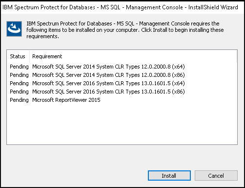
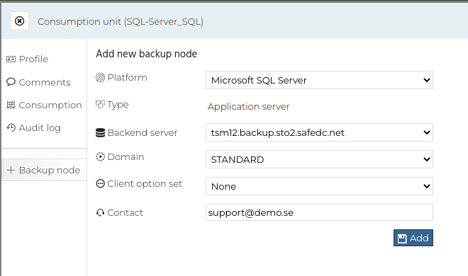
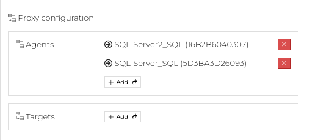
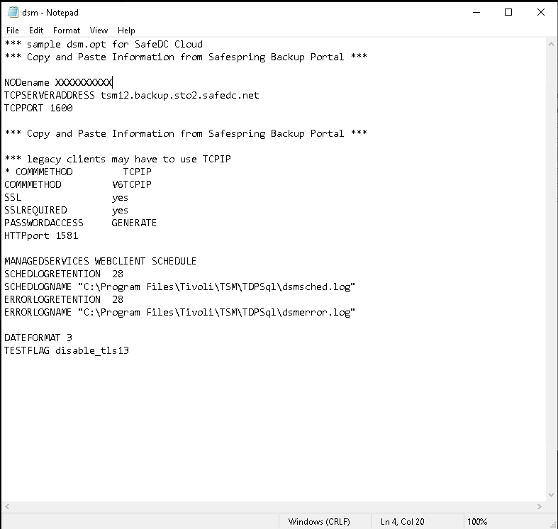
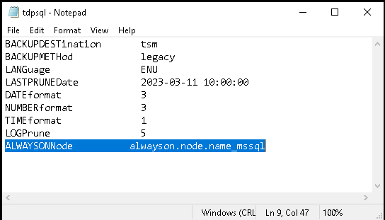
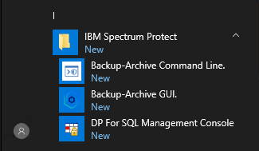
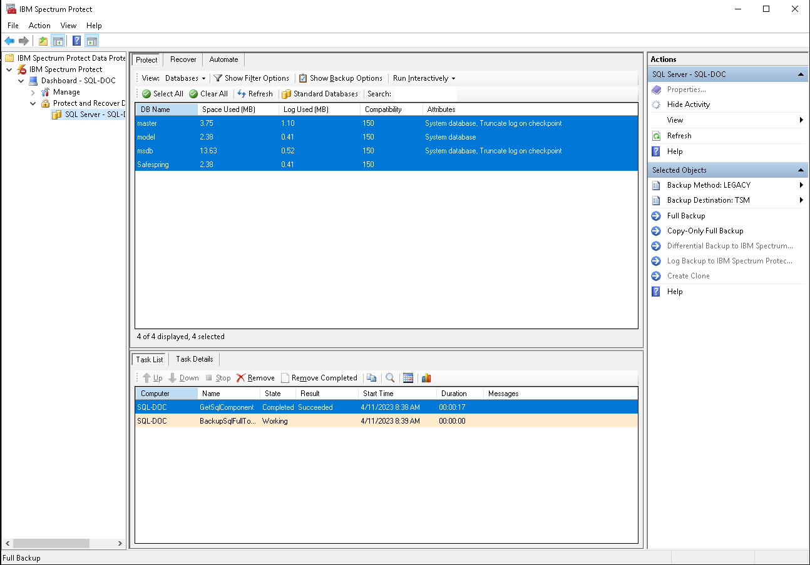
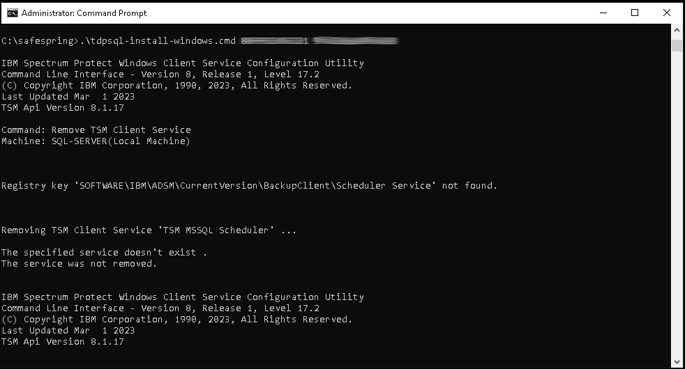

# Microsoft SQL Server Installation (64-bit)

## Manual installation

_This document describes how to **manually** install IBM Storage Defender Online Backup Agent for Microsoft SQL Server._

Requirement before you start:

You need to install [IBM Storage Defender Backup-Archive Client](./windows.md) before you start installing the Online agent for MS SQL.

Required files:

- [IBM Storage Defender Data Protection for Microsoft SQL](https://www3.software.ibm.com/storage/tivoli-storage-management/maintenance/tivoli-data-protection/ntsql/)
- [SafeDC Default Configuration file dsm.opt](https://raw.githubusercontent.com/safespring/cloud-BaaS/master/windows/mssql/dsm.opt.sample) (Right-click and Save)
- [SafeDC Default Configuration file tdpsql.cfg](https://raw.githubusercontent.com/safespring/cloud-BaaS/master/windows/mssql/tdpsql.cfg.sample) (Right-click and Save)

### Installation and Configuration

#### Installation
1. Download the required files according to above into a temporary folder
1. Run `8.1.xx.x-TIV-TSMSQL-Win.exe` to extract all installations files.
1. Open the `8.1.xx.x-TIV-TSMSQL-Win` Installation directory that just get created and run `SetupFCM.exe` and accept the UAC pop-up that comes up.
1. Follow the instructions on the screen, and if this is a new installation, you maybe need to install a few requirements

1. To make your configuration phase easier, we need to install one more package, under installation package directory, you need to open  `TSMSQL_WIN\fcm\x64\sql\81xxx\enu` and start installation program the `spinstall.exe`
1. Install all dependencies and follow the standard installation.

#### Configuration
1. Login on [Safepspring Backup Portal](https://portal.backup.sto2.safedc.net/)
1. Create a Microsoft SQL Backup Consumption Unit.

    1. If you use an **AlwaysOn** cluster, you need to create a consumption unit per host and one AlwaysOn Consumption Unit
    1. The AlwaysOn Consumption Unit, click on **[+ Add]** and select all AlwaysOn Cluster nodes. 
1. Modify `dsm.opt` and insert the unique configuration information for your host.

    1. If you are using an **AlwaysOn** cluster, you do also need to modify the tdpsql.cfg file
    
1. Copy the `tdpsql.cfg` and `dsm.opt` to the `C:\Program Files\Tivoli\TSM\TdpSql` directory.
    1. If you use an **AlwaysOn** cluster, you need to run the configuration on all the nodes.
1. Start the IBM Data Protection for Microsoft SQL Agent on your SQL Server 

1. Run a **Manuall Full Backup** to verify your password.

#### Schedule Backups
1. Download the required backup scripts and save them to `C:\Safespring`
- [Full Backup Script](https://raw.githubusercontent.com/safespring/cloud-BaaS/master/windows/mssql/sqlfull.ps1) (Right-click and Save)
- [Log Backup Script](https://raw.githubusercontent.com/safespring/cloud-BaaS/master/windows/mssql/sqllog.ps1) (Right-click and Save)
- [Differential Backup Script](https://raw.githubusercontent.com/safespring/cloud-BaaS/master/windows/mssql/sqldiff.ps1) (Right-click and Save)
- [Install Backup Schedule Services](https://raw.githubusercontent.com/safespring/cloud-BaaS/master/windows/mssql/tdpsql-install-windows.cmd) (Right-click and Save)
1. Open Powershell and run `Unblock-File C:\Safespring\*` to make the scripts runnable.
1. Login on [Safepspring Backup Portal](https://portal.backup.sto2.safedc.net/)
1. Select on the Microsoft SQL Backup Consumption Unit
    1. If you are using an **AlwaysOn** cluster, you need to do all the steps on 
       all the cluster nodes and not on the AlwaysOn Node.
1. Go to the Schedules tab and select the backup schedules you want to protect your environment.
    1. If you want to run Full Backup you need the Full Backup Script, for Log Backups you need the Log backup Script and Differential Backup you need the Differential Backup Script in your `c:\safespring` directory.
1. We recommend installing a separate `IBM Client Acceptor Service` that are only control Microsoft SQL Backup Service, so part of the installation do you need to start a **Command Line Window** and run the configuration script `tdpsql-install-windows.cmd` that you saved in the `c:\Safespring` directory. Run the script with two parameters `tdpsql-install-windows.cmd NODENAME PASSWORD`

     
