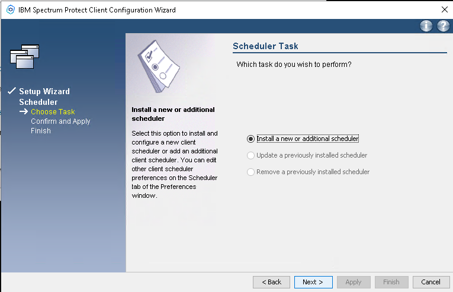
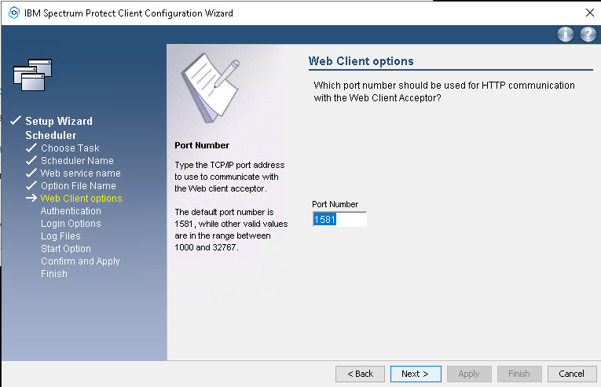

# Microsoft Windows installation (64-bit)

## Manual installation

_This document describes how to **manually** install IBM Storage Protect Backup-Archive Client on Windows (64-bit)._

Required files:

- [IBM Storage Protect Backup-Archive Client](https://public.dhe.ibm.com/storage/tivoli-storage-management/maintenance/client/v8r1/Windows/x64/)
- [SafeDC Default Configuration file dsm.opt](https://raw.githubusercontent.com/safespring/cloud-BaaS/master/windows/dsm.opt.sample) (Right-click and Save)
- [Certificate installation script](https://raw.githubusercontent.com/safespring/cloud-BaaS/master/pki/SafeDC-Net-Root-CA-win64.bat) (Right-click and Save)

### Installation and Configuration

#### Installation of the software

1. Download the required files according to above into a temporary folder.
1. Run `8.x.x.x-TIV-TSMBAC-WinX64.exe` to extract all installation files.
1. Open the `TSMClient` Installation directory that just got created and run
   `spinstall.exe` and accept the UAC pop-up that comes up,
   "Setup Launcher Unicode". 
 
Follow the instructions on the screen,
   and if this is a new installation,
   you maybe need to install a few requirements.

    

    1. The installation process could sometimes require a reboot, 
       due to the installation of a couple of VC redistributables.
    1. If a reboot is unpleasant, at the above decision point, jump to the _"Circumvent reboot during install"_ section below.
    1. Resume the installation, choose Typical installation.
    1. After installation, answer 'No' to the reboot question.

#### Create Configuration File

1. Retrieve client node configuration and password from the [Safespring Backup Portal](https://portal.backup.sto2.safedc.net/), and edit the `dsm.opt.sample`, copy the *Setup Information* from the portal and paste it in to `dsm.opt.sample` file and save that file in `C:\Program Files\Tivoli\TSM\baclient`.


Paste the information to the `dsm.opt.sample` file between the `*** Copy and Paste Information from Safespring Backup Portal ***` sections.


Save the file as `dsm.opt` in the Backup-Archive Directory e.g `C:\Program Files\Tivoli\TSM\Baclient\dsm.opt`.

#### Install the certificate

Run the
[SafeDC-Net-Root-CA-win64.bat](https://raw.githubusercontent.com/safespring/cloud-BaaS/master/pki/SafeDC-Net-Root-CA-win64.bat)
script as admin. It will remove all previous certificates and install
the correct CA Root for the BaaS service into the IBM cert
store. TSM/IBM will not use, nor touch the system certificate stores
in any way. This is safe to run several times, it will just remove and
reinstall the same CA Root certificate every time.

#### First connection
    
1. Test the connection, the easiest way is either via GUI or CLI.
    1. **Login via Command-Line**

    Start a Command-Line window in *Administrator Mode* and change to the 
   Backup-Archive Client directory e.g., `cd C:\Program 
   Files\Tivoli\TSM\Baclient`
    Start the `dsmc.exe` and it will now ask you to confirm the *User ID* that is the same as your node name, and copy and paste the password from the [Safespring Backup Portal](https://portal.backup.sto2.safedc.net/)

     

    Run `quit` to exit Storage Protect Backup-Archive Client CLI.

    1. **Login via GUI**

    The GUI icon can be found in the start-menu, search for 
    "Backup-Archive GUI". 

    

    When the Backup-Archive GUI starts, it will ask for Node Admin ID and 
   Password.
    These can be copied 
    and pasted from the [Safespring Backup Portal](https://portal.backup.sto2.safedc.net/).

     

    If the application starts, it has logged in successfully, and will save 
   the password (encrypted) for future use.

#### Schedule Daily Backups

1. IBM Storage Protect Backup-Archive Client is polling the backup server 
   regularly to see when it should back up your data next time.
   To assign a predefined schedule, open [Safespring Backup Portal](https://portal.backup.sto2.safedc.net/) 
   and go to the _consumption unit_ you want to define a schedule too and 
   click on _schedule_<br/>
   <br/>
   Here can you schedule the backup for your consumption unit.
1. Setup IBM Storage Protect Backup-Archive Client schedule polling.
    1. **Setup schedule via Command-Line**

     Start a Command-Line window in _Administrator Mode_ and change to the Backup-Archive Client directory e.g `cd C:\Program Files\Tivoli\TSM\Baclient`.
     Run the following commands to set up your schedule.

    ```sh
    dsmcutil install scheduler /name:"TSM Client Scheduler" /node:<NODENAME> /optfile:"<PATH TO DSM.OPT>" /password:<TSM PASSWORD> /autostart:no /startnow:no

    dsmcutil install cad /name:"TSM Client Acceptor" /node:<NODENAME> /password:<TSM PASSWORD> /optfile:"<PATH TO DSM.OPT>" /autostart:yes /startnow:no

    dsmcutil update cad /name:"TSM Client Acceptor" /cadschedname:"TSM Client Scheduler"

    net start "TSM Client Acceptor"
    ```

    1. **Setup schedule via GUI**

    The GUI icon can you find in the start-menu, search for Backup-Archive GUI 

    

    Click on *Utilities -> Setup Wizard* to start the Configuraton Wizard.

    

    A wizard will help you to go through the process step-by-step of setting up
    the schedule.

    

    Confirm that you want to *Install a new or additional scheduler*, if *Update ...* and *Remove ...* is enabled, 
    that means you already have an earlier Storage Protect Schedule configured. 

    

    Make sure you enable *[X] Use the client acceptor to manage the scheduler* 

    

    Confirm the name of the *TSM Client Acceptor* and press *Next*

    

    Confirm the Client Acceptor TCP Port, 
    this port doesn't need to be exposed externally.

    

    Insert the node password, the password can be copied from the [Safespring Backup Portal](https://portal.backup.sto2.safedc.net/).

    

    Click on _(o) Automatic when Windows boots_ to automatic start the TSM Client Acceptor Services

    

    Confirm the location where you want to save the TSM Schedule and Error Logs,
   and if you want to log to Windows Event Logger

    

    Click on _(o) Yes_ to start the TSM Client Acceptor when the wizard is done.

    

    Confirm the configuration before the Setup Wizard creates the services.

    

    The Configuration is now done, click _Finish_ to quit the wizard.

    

### Finish

Basic installation of the Backup-Archive Client is now done. If you need to 
set up an Online agent for e.g., Microsoft SQL, Oracle Database or any other 
application, you can continue with that installation.
