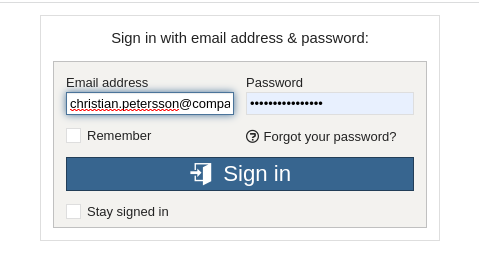
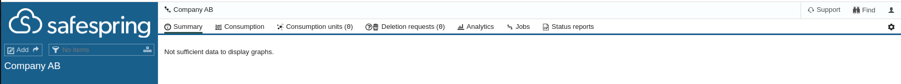
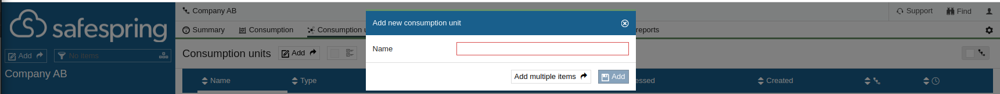
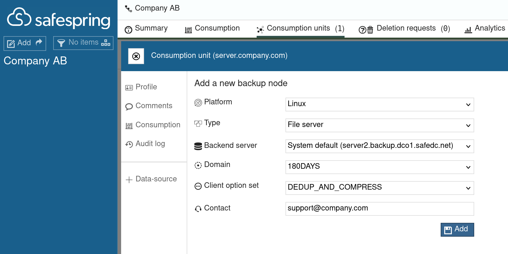
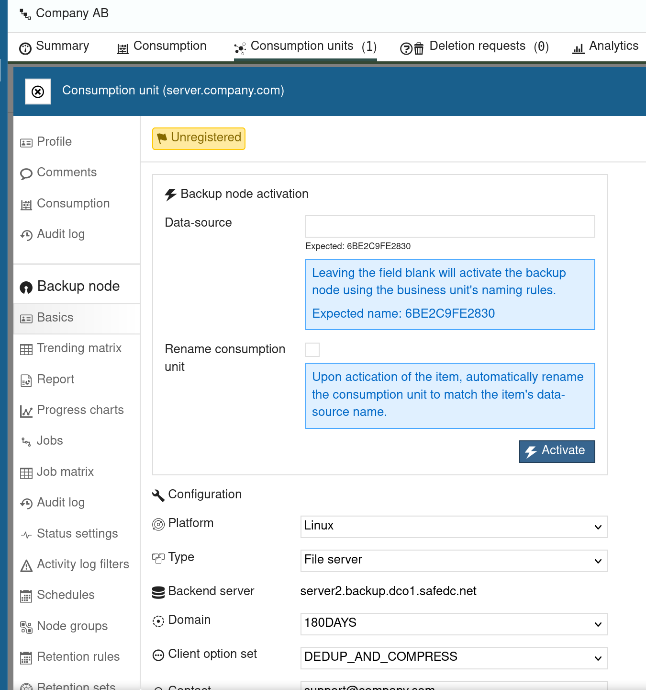

# Quickstart Guide
In this Quickstart Guide will we cover how to create 
- Consumption Unit and Assign that with a backup node
- Install IBM Spectrum Protect Backup-Archive Client
- Configure IBM Spectrum Protect Backup-Archive Client
- Schedule our first backup

## Create Consumption Unit
For more information please read [How-To Consumption Units](howto/consumption-units.md)

Login to [Safespring Backup Portal](baas-portal) with your credentials. [Need new credentials?](faq.md) talk to our [support](../service/support.md)

When you login for the first time you will see a empty desktop but if you already have node assigned you will see a summary on all created nodes.

Click on the "Consumption Units" tab and then "Add"

Type a friendly name, e.g. hostname or FQDN. and press "Add"
When the consumption unit has been created the portal will ask you if you want to add/assign a backup node to the consumption unit, press "Yes" to continue.

Fillout the form like, Platform, preferred backup server, Domain, Client Option set and contact details (e.g. Server owner E-Mail or Support Email).

We are recommending that you let "Data-source" be empty to let us randomizing the nodename to keep the data anonymous.
Press "Activate" to proceed with the activation of your consumption unit.

Next step is to install the IBM Spectrum Protect Backup-Archive Client.

## Install IBM Spectrum Protect Backup-Archive Client
Install the IBM Spectrum Protect Backup-Archive Client, you can download the latest client from [IBMs FTP Server][ibm-ftp]

- [Patch Version](http://ftp.software.ibm.com/storage/tivoli-storage-management/patches/client/)
- [Maintenance Version](http://ftp.software.ibm.com/storage/tivoli-storage-management/maintenance/client/)

Please follow in the installation infstructions for your Operating System.

- [Microsoft Windows](install/windows.md)
- [Linux](install/linux.md)

[baas-portal]:https://portal.backup.sto2.safedc.net/
[ibm-ftp]:http://ftp.software.ibm.com/storage/tivoli-storage-management/