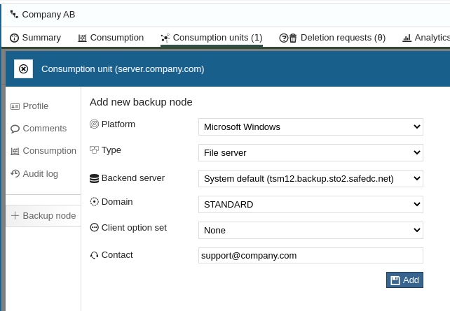
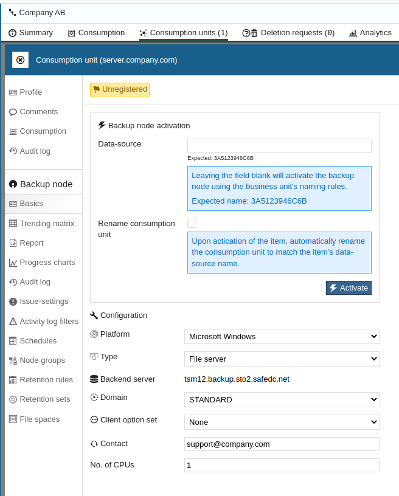

# Quickstart Guide

In this Quickstart Guide, we will cover how to:

- Create a Consumption Unit and Assign that with a backup node
- Install IBM Storage Protect Backup-Archive Client
- Configure IBM Storage Protect Backup-Archive Client
- Schedule our first backup

## Create Consumption Unit

For more information,
please read [How-To Consumption Units](howto/consumption-units.md)

Login to <a href="https://portal.backup.sto2.safedc.net/" target="_blank">
Safespring Backup Portal</a> with your credentials. 
[Need new credentials?](faq.md#credentials-to-safespring-backup-portal) 
Talk to our [support](../service/support.md).

When you log in for the first time, you will see an empty dashboard. 
But if you already have a node assigned, 
you will see a summary on all created nodes.

Click on the **Consumption units** tab and then **Add**.

Type a friendly name, e.g., hostname or FQDN. 
Then click **Add**.
When the consumption unit has been created, the portal will ask you if you 
want to add/assign a backup node to the consumption unit, 
click **Yes** to continue.

Fill out the form like, Platform, preferred backup server, Domain, Client 
Option set and contact details (e.g., Server owner E-Mail or Support Email).

The Client Option Set defaults to DEDUP_AND_COMPRESS to allow but not force the client
to attempt to use deduplication and compression before sending data over to the server
to reduce transfer time and amount. Other options include FORCE_ENCRYPT which
will unconditionally make the client locally encrypt all data before transfer with a
key you need to enter once. These two options are mutually exclusive. There is a
None option that sets no client options.

The Domain decides the retention time of your backups. 
For example, if you choose 60DAYS, 
then previously backed-up files will remain on the backup server for 60 days. 
STANDARD sets the retention time to 180 days.

We are recommending that you let "Data-source" be empty to let us randomize the 
node name.
Click **Activate** to proceed with the activation of your consumption unit.

The next step is to install the IBM Storage Protect Backup-Archive Client.

## Install IBM Storage Protect Backup-Archive Client

Install the IBM Storage Protect Backup-Archive Client. You can download the 
latest client from 
<a href="https://public.dhe.ibm.com/storage/tivoli-storage-management/maintenance/client/v8r1/" target="_blank">
IBMs FTP Server</a>

- <a href="https://public.dhe.ibm.com/storage/tivoli-storage-management/patches/client/" target="_blank">Patch Version</a>
- <a href="https://public.dhe.ibm.com/storage/tivoli-storage-management/maintenance/client/" target="_blank">Maintenance Version</a>

Please follow the installation instructions for your operating system.

- [Microsoft Windows](install/windows.md)
- [Linux](install/linux.md)
- [Apple macOS](install/apple-macos.md)