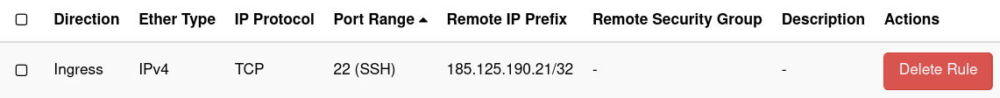

Restore Testing
==================

Recovering data to another machine for testing purposes can be done 
by granting another node access to the data of the machine's backup node. 
We call it a **proxy node**. This article guides you 
through the process of testing your backups, including the assignment of proxy 
node and configuring the backup-archive client on your testing machine 
accordingly.

Step 1: A node for the test machine
-----------------------------------------
Apart from your production backup node, that has all your data, 
you will need another node for your test machine. If you do not have one 
already one, create it in Cloutility and configure your test machine's 
backup-archive client to use it. You can follow the 
[Quickstart Guide](../quickstart-guide.md).

Next, in Cloutility, click on **Consumption Units -> [Your Test Node] -> 
Basics -> Proxy configuration -> Targets -> Add**. 
Then select the production node that you wish to test the backups of.

!!! note 
     Make sure that the test machine uses the same operating system as 
     the production machine.

Step 2: Configure the test machine client
------------------------------------------
On the test machine, there is one additional setting you need to add to your
configuration file, that is the `ASNODENAME` option. This tells the client
to use the data of another node rather than the client's node. That other 
node must have been added as a proxy target, or else this option won't work. 
This is what you did in Step 1.

Add this line to `/opt/tivoli/tsm/client/ba/bin/dsm.sys` (Linux) or
`C:\Program Files\Tivoli\TSM\baclient\dsm.opt` (Windows) or 
`C:\Program Files\Tivoli\TSM\TDPSql\dsm.opt` (MSSQL):
```
  ASNODENAME PRODUCTION_NODE_NAME
```
Replace `PRODUCTION_NODE_NAME` with the name of your production node.

### Encryption

If you want to restore client-side encrypted data, you will also have to 
specify the decryption key password. The backup service will not be able to
supply the password (unless `ENCRYPTKEY generate` is set).

For more information, see the article on [recovering encrypted data](encryption.md).

Step 3: Restore test your data
------------------------------------
This can be done in many different ways, depending on if you are using a GUI
or a command line interface.

In general, we recommend the [How to Restore Files](basics.md) article for 
more information on how to restore files.

If you are testing MSSQL backup data (Windows), then you will need to use the 
**DP For SQL Management Console** on the test machine.

Appendix A: Security Considerations
------------------------------------
The test machine, and especially the test machine's node, should be protected 
_at least_ equally well as the production machine. That is because it has access
to all the data backed up from the production machine.

For a virtual machine on Safespring Compute, a good way to help secure the test
machine is to use Security Groups to limit ingress traffic only to specific
IP addresses:



Other security practices would be to:

- **(On Windows)** Always verify the fingerprint of the certificate from RDP before 
  accepting it during the first connection. 
  To find the true fingerprint:
      1. If the machine is a virtual machine on OpenStack, use the console to 
        access it the first time.
      2. Open PowerShell and run the following command:
        ```powershell
        Get-ChildItem 'Cert:\LocalMachine\Remote Desktop\' | Export-Certificate -FilePath "$($env:USERPROFILE)\Desktop\RDcert.cer" | Get-FileHash; Remove-Item -Path "$($env:USERPROFILE)\Desktop\RDcert.cer"
        ```
        This should give you the SHA256 digest which you can compare with the 
        fingerprint your RDP client is showing.
        <br/>
        Unfortunately, it is not possible to copy-and-paste through the 
        console. The best option is to open the web browser inside the console
        and go to https://docs.safespring.com/, then copy this command from 
        there.
- **(On Linux)** Always verify the fingerprint of the SSH server. 
  If the machine is a virtual machine on OpenStack, use the log of the instance
  to find the fingerprint.
