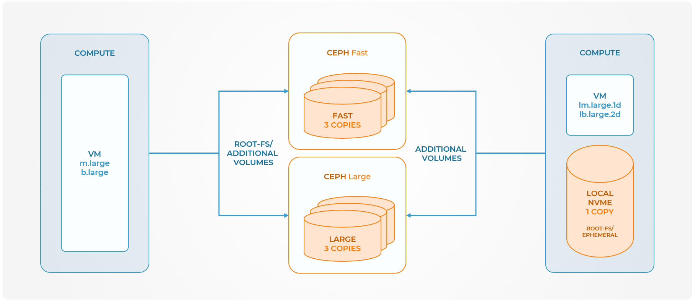

# Flavors

This page includes OpenStack CLI commands. See the [API Access documentation](api.md) for instructions on how to install and configure the command line client.

Flavors define the compute, memory, storage model, and performance profile of an instance. The most important distinction in Safespring Compute is whether you use:

- `b2` flavors for resilient, volume-backed instances
- `l2` flavors for high local-disk performance with higher recovery responsibility

## What should I choose?

- Choose `b2` if you want the safer default for general virtual machines, stateful services, and workloads where fast recovery matters.
- Choose `l2` if you need very high local disk performance and your workload can tolerate loss of a node-local root disk or be recreated quickly.

## Quick comparison

| Flavor type | Boot from | Storage location | Best for | Main trade-off |
| ----------- | --------- | ---------------- | -------- | -------------- |
| `b2` | Volume created from an image | Shared block storage | General-purpose servers, stateful workloads, safer recovery | Lower raw local-disk performance than `l2` |
| `l2` | Image | Local NVMe disk on the compute host | High-IOPS workloads, clustered systems, ephemeral nodes | If the local disk fails, the instance cannot be restored by Safespring |

## Key limitations

- `b2` flavors must be booted from a volume
- `l2` flavors must be booted from an image
- `b2` flavors cannot be resized to `l2` flavors, and `l2` flavors cannot be resized to `b2`
- Non-GPU flavors cannot be resized to GPU flavors, and GPU flavors cannot be resized to non-GPU flavors
- Special flavors cannot be resized to standard flavors, and vice versa

## Flavor naming

The first part of the flavor name, such as `b2` or `l2`, denotes a flavor generation. Safespring may introduce other generations in the future with different properties.

Examples:

- `b2.c4r16` means generation `b2`, `4` vCPUs, `16` GB RAM
- `l2.c8r16.500` means generation `l2`, `8` vCPUs, `16` GB RAM, and `500` GB local disk

## Available b2 flavors

Use `b2` when you want instances backed by shared block storage.

| Flavor | vCPU | RAM (MB) | Root disk |
| ------ | ---: | -------: | --------: |
| `b2.c1r2` | 1 | 2048 | 0 |
| `b2.c1r4` | 1 | 4096 | 0 |
| `b2.c2r4` | 2 | 4096 | 0 |
| `b2.c2r8` | 2 | 8192 | 0 |
| `b2.c4r8` | 4 | 8192 | 0 |
| `b2.c4r16` | 4 | 16384 | 0 |
| `b2.c8r16` | 8 | 16384 | 0 |
| `b2.c8r32` | 8 | 32768 | 0 |
| `b2.c16r32` | 16 | 32768 | 0 |
| `b2.c16r64` | 16 | 65536 | 0 |

## Available l2 flavors

Use `l2` when local NVMe performance matters more than recoverability of the node-local root disk.

| Flavor | vCPU | RAM (MB) | Local disk (GB) | Read IOPS | Write IOPS |
| ------ | ---: | -------: | --------------: | --------: | ---------: |
| `l2.c2r4.100` | 2 | 4096 | 100 | 10000 | 5000 |
| `l2.c2r4.500` | 2 | 4096 | 500 | 50000 | 25000 |
| `l2.c2r4.1000` | 2 | 4096 | 1000 | 100000 | 50000 |
| `l2.c4r8.100` | 4 | 8192 | 100 | 10000 | 5000 |
| `l2.c4r8.500` | 4 | 8192 | 500 | 50000 | 25000 |
| `l2.c4r8.1000` | 4 | 8192 | 1000 | 100000 | 50000 |
| `l2.c8r16.100` | 8 | 16384 | 100 | 10000 | 5000 |
| `l2.c8r16.500` | 8 | 16384 | 500 | 50000 | 25000 |
| `l2.c8r16.1000` | 8 | 16384 | 1000 | 100000 | 50000 |
| `l2.c16r32.100` | 16 | 32768 | 100 | 10000 | 5000 |
| `l2.c16r32.500` | 16 | 32768 | 500 | 50000 | 25000 |
| `l2.c16r32.1000` | 16 | 32768 | 1000 | 100000 | 50000 |

## Boot and storage model

### b2 flavors

Instances created with `b2` flavors do not include root disk in the flavor itself. In the Horizon interface, you will see `0` in the `Root Disk` column for these flavors.

To boot a `b2` instance:

1. Create a volume
2. Select `Image` as `Volume Source`
3. Choose the desired image
4. Launch the instance from that volume

You can also start from the `Volumes` view and use `Launch as Instance` after the volume has been created from an image.



!!! info "Pro tip"
    After creating the volume from the image, you can start from the `Volumes` view and click `Launch as Instance` in the context menu for the new volume. The `Launch Instance` dialog will open with the correct `Source` settings already selected.

### l2 flavors

`l2` flavors include a root disk in the flavor itself. The `l` stands for `local disk`, meaning the instance boots with storage on the compute host’s local NVMe.

To boot an `l2` instance:

1. Open the `Launch Instance` dialog
2. In the `Source` tab, choose `Image`
3. Boot directly from the image

The image is copied to the local root disk before the instance starts.

## Failure and recovery model

### b2 flavors

`b2` flavors use shared block storage. This means:

- storage disk failures are typically handled in the storage layer
- compute host failures are easier to recover from because the root disk lives outside the compute host
- migrating an instance to another compute host is faster than with local-disk-backed instances

In many cases, customers will not notice an underlying storage disk failure before Safespring operations has already started handling it. If a storage disk fails, Safespring operations detects and replaces the failed disk, while the storage cluster starts copying data to another disk to preserve data integrity.

### l2 flavors

`l2` flavors are designed for workloads where very high read and write performance matters, for example:

- `etcd` in Kubernetes
- clustered database members
- storage-intensive ephemeral workloads

!!! warning "Important note"
    `l2` flavors deliver high performance, but the root disk is a single point of failure. If the local disk fails, the instance cannot be restored by Safespring. Use `l2` only for stateless workloads, well-backed-up systems, or clusters that can recreate failed nodes quickly.

When using `l2` flavors as members of a cluster, Safespring recommends using [Server Groups](server-groups.md) with anti-affinity so that nodes are spread across different compute hosts.

Do not use `l2` for ordinary stateful servers that cannot be restored by launching a new instance and reattaching or rebuilding the application state.

## IOPS behavior

### b2 flavors

For `b2`, the IOPS quota is determined by the attached volume type, not by the flavor itself.

For `fast` volumes:

- `100` read IOPS and `50` write IOPS per GB
- upper limit: `100000` read IOPS and `50000` write IOPS

Examples:

- `10 GB` volume -> `1000` read IOPS / `500` write IOPS
- `20 GB` volume -> `2000` read IOPS / `1000` write IOPS

For `large` volumes:

- `2` IOPS per GB for both read and write
- lower limit: `50` read IOPS and `50` write IOPS
- upper limit: `4000` read IOPS and `4000` write IOPS

Example:

- `100 GB` volume -> `200` read IOPS / `200` write IOPS

Volumes smaller than `25 GB` still receive the lower limit of `50` read IOPS and `50` write IOPS.

These limits apply to all mounted volumes on the instance, not just the boot disk.

### l2 flavors

For `l2`, the reserved IOPS scale with the amount of local disk included in the flavor:

- a flavor ending in `.500` reserves five times the IOPS of a flavor ending in `.100`
- a flavor ending in `.1000` reserves ten times the IOPS of a flavor ending in `.100`

That means larger `l2` disk sizes are not only larger, but also faster.

If you have API access, you can inspect flavor metadata with:

```bash
openstack flavor list --long
```

## Resizing

Thanks to improvements in the underlying compute platform, self-service resizing between compatible flavor sizes is now supported. However, the platform does not prevent every invalid conversion.

The customer is responsible for ensuring flavor compatibility before starting a resize.

!!! info "Conclusion"
    Boot `l2` flavors from `Image`. Boot `b2` flavors from a volume created from an image. Invalid combinations, such as booting `l2` from volume or `b2` from image, will fail.

We strongly recommend creating a backup before resizing, even between compatible flavors. The safest option is still to recreate the server and reattach the operating system volume when possible. Use resize only when recreate and reattach is not feasible.

Please note:

- resizing is an offline operation
- the instance is shut down before the resize starts
- resize duration depends on the instance configuration
- large `l2` flavors can take significantly longer to resize

## Pricing

The full Safespring pricing list and associated public flavors can be found at [Price list and Calculator](https://www.safespring.com/en/price/). You do not need to enter your e-mail address; scroll to the bottom of the page to see the public pricing list.
