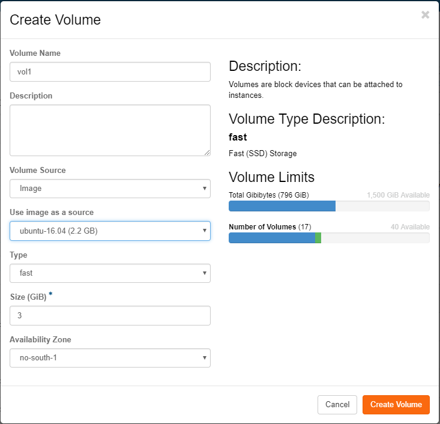
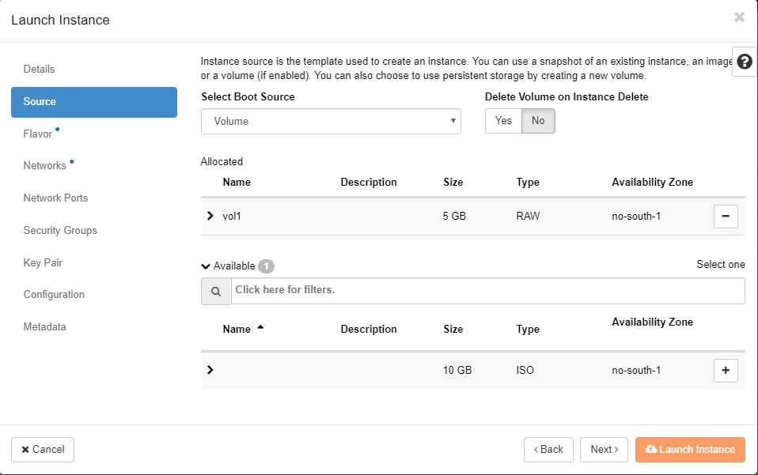

# Getting Started

## I just got a Safespring Compute account, what now?

Start by logging into the portal. You will be greeted with an overview of the project/account statistics. It usually starts off rather empty, but as machines are added, resources will be summarized there.

* **Swedish site sto1** portal: https://dashboard.sto1.safespring.com
* **Swedish site sto2** portal: https://dashboard.sto2.safespring.com
* **Norwegian site osl2** portal: https://dashboard.osl2.safespring.com

## Understanding Your Account Structure

Before diving into creating virtual machines, it's helpful to understand how Safespring Compute is organized. The platform uses OpenStack's structure of domains and projects:

- **Domains** usually have the form "company.com"
- **Projects** are administrative entities under a domain, typically named like "project1.company.com" and "project2.company.com"
- A **project** acts as a separate environment - common setups include separate projects for test and production environments like "test.company.com" and "prod.company.com"

This structure allows you to share resources between different instances (virtual machines) within a project while keeping environments completely separate.

## Understanding the Overview Dashboard

When you log into the platform you will be greeted with the "Overview" screen where you can see how much resources you currently are using in the project.

The pie charts show how much of the resources compared to the set quota. In the dashboard you can see a summary of your resources usage.

* Shows running virtual machines vs. quota limit.
* Virtual CPU cores allocated to instances.
* Memory allocated to instances.
* Persistent storage volumes in the project.
* Current count of volume snapshots.
* Storage quota usage.
* Firewall rules for network access control.
* Not applicable - network creation is disabled in this platform.

## Virtual Machines

Openstack calls VMs "instances" so in order to start running a few machines, you go to the Instances category, and use Launch Instance(s) to get your first VM up.

**VCPUs**: Virtual CPU cores are allocated per instance. Each VCPU corresponds to a processor core on Safespring's platform. Your quota limits how many VCPUs you can use across all instances.

**RAM**: Memory is allocated to each instance based on the chosen flavor. The dashboard shows total RAM usage across all running instances in your project.

When creating an instance, you get asked about if you want to create a volume, and if you answer yes to that, also if you want it deleted after deleting the instance.

It is normally not necessary to create a (new) volume for a new instance, answering No means that you will get a disk of the preferred size pre-configured for your chosen OS image. For machines with shorter lifespans (tests, validation and so on) this may be a good alternative. Disks created alongside with the OS image are sometimes referred to as 'ephemeral disks'. Regardless of if you create a volume / disk manually or not, you can always attach more disks later on.

Before we go into starting VMs, let's take a quick look at the concepts and names used in this cloud implementation.

## Volumes and Images

Storage in OpenStack comes in two main types:

1. **Ephemeral storage**: Created with the instance and has the same lifetime as the instance. When you delete the instance, ephemeral storage is automatically removed.

2. **Persistent storage (Volumes)**: Can be created independently of instances and attached and detached to instances. This type of storage is not tied to a specific instance and persists even when instances are deleted.

**Volume Snapshots**: You can take point-in-time snapshots of any volume for backup or cloning purposes. These snapshots count against your storage quota, so clean up unused snapshots regularly.

**Volume Storage Quota**: The dashboard shows how much of your allocated storage quota is currently in use across all volumes in the project.

Whenever a disk is created in OpenStack, it will be a volume. A volume may be snapshotted and the snapshot may later be reused on the same instance or on other instances.

You may also add or upload "passive" disks called Images (including ISO images) that may be used to hold templates for instances or to install from, in the case of ISO images. A volume can be converted to an image, in case you prepare a machine and later want to duplicate it many times.

We supply a certain amount of public images, but you can have an own per-project list of images your project members can choose from which will not be visible to others. The public images are good starting points and may be used for generic instances, but the more specifics you add, the more reason for creating customized images where local edits can be prepared once and reused for all machines.

Also, while we try to keep the public images up-to-date when publishing them, keeping such an image patched, updated and secure falls upon you after starting the instance on it, after that point, any edits and improvements to the base image will not be reflected in your instance.

Using snapshots to freeze volumes is a useful technique for being able to back out of tests, but do mind to clean out unused snapshots when they are no longer of interest, since they count against your storage quota.

All flavors on Safespring's platform come with a 40 GB root disk. In the case you would want another size on the root disk you first create a volume under "Volumes" and pick Volume Source as Image and  then pick the image that corresponds to the operating system you want to run on the instance.

After creating the volume you head to the "Launch instance" dialogue. Under "Source" you pick "Volume" from the pick-list and then press the plus sign for the volume you created in the former step. You can also choose whether the volume should be persistent or not by switching the "Delete Volume on Instance Delete" option.

## Flavors and Local Storage
You can read more about the different flavors and what they mean [here](flavors.md)

## Boot from image

The simplest way of booting an instance is to boot it directly from the image service. By doing so you will use the ephemeral storage. Ephemeral storage means that the storage lifetime is tied to the instance. It will persist as long as the instance exists but will automatically be deleted if the instance is deleted. If the instance you're starting is of a stateless type, with maybe any more persistent data is stored on a separate volume this is a good option.

To boot an instance from image, use the regular "Launch instance" wizard in the GUI. In the "Source" tab make sure the dropdown menu at the top is "Image" and also make sure that the "Create New Volume" is set to "No".

In the flavor tab it is now important to pick a flavor with lokal storage in order for the image to be put somewhere. These flavors start with an "l", example lb.small which has a root disk on lokal disk of 20 GB.

Continue the wizard to create the server. Now you have created an image based instance which is backed by local storage on the compute node where it is running. The upsides with this is that local storage is much faster than central storage. The downside is that the local storage only is stored in one copy on the compute node which means that if the hard drive on that compute node fails, data loss will occur. If all the persistent datat is stored on a separate volume this is not a problem, but it is important to know the implications.

## Boot from volume

By booting from volume the instance root file system instead will be stored on persistent storage in the central storage solution. This means that the lifetime of the volume is separate from the lifetime of the instance, It is therefore possible to remove the instance and still keep the boot volume and at a later point boot up another instance with the same backing persistent storage which means that it is possible to recreate a removed instance in a later stage as long as the volume containing the root file system is not removed.

There are two ways of achieving this. Either by manually create the volume beforehand or using the same "Launch Instance" wizard but with other options. We will start with describing how to do it by manually creating the volume first.

1. Go to the "Volumes" tab in OpenStack and click "Create Volume".
2. In the following dialogue give the volume a name, pick "Image" as the volume source, and then pick which image you will use as boot media for the instance.
3. Pick storage type, fast or large. It is highly recommended to use "fast" for boot media since large will make the server slower and may only be applicable for some test servers.
4. Set the size. If you have picked an image this field will be filled in with the smallest possible size you can use for this image. It is usually a good recommendation to use more than the minimum so increase this value with maybe factor 2.
5. Click "Create Volume"

You will now get back to the volume listing view and you can now click the little arrow besides "Edit volume" and pick "Launch as instance". You will now get redirected to the "Launch Instance" dialogue, just that is prepared with the right options under the "Source" tab so that you will use you newly created volume to boot the instance. Finish the wizard to start you new instance with the volume backing its storage. Under the "Flavor" tab you now instead pick a flavor with no local storage since you already have the storage covereed with central storage.

The second option is to use the "Launch Instance" dialogue but under the "Source" tab pick image but leave the option "Create New Volume" at "Yes". You also se another option underneath which says "Delete Volume on Instance Delete". If you set this to "Yes" the volume will automatically get deleted when the instance is deleted, if "No" the volume will be kept even if you delete the instance. Since you have chosen to boot create a volume you probably would like to set this to "No" and manually delete the volume if you would like to do so after you have deleted the instance. Again, under the "Flavor" tab you now pick a flavor with no local storage, since it is not needed when booting from volume.

## Network

Safespring uses [Calico](https://www.tigera.io/project-calico/) as its networking engine — a pure layer 3 network with BGP routing and no floating IP addresses. There are three networks to choose from. Attach exactly one network to each instance.

| Network | Use case |
| --- | --- |
| **public** | Public IPv4 and IPv6 address, directly reachable from the internet. Use for instances that need to be publicly accessible. |
| **default** | Private RFC 1918 address with NAT for outbound internet access. Use for most instances — they can reach the internet and communicate with other Safespring instances, but are not directly reachable from outside. |
| **private** | Private RFC 1918 address with no internet access. Use for instances that should only communicate with other Safespring instances. |

!!! warning "Never attach more than one network interface to an instance"
    Each network assigns a default gateway via DHCP. Attaching multiple networks causes conflicting default gateways, asymmetrical routing, and unstable connectivity.

**Security groups** are the sole mechanism for controlling traffic between instances. All inbound traffic is denied by default. Security groups apply immediately to running instances without a restart. For instances that need to communicate with each other, security group rules must be in place even if they are on the same named network.

For a full explanation of the layer 3 architecture, RFC 1918 routing implications, security group management, and persistent IP addresses via Network Ports, see the [Networking documentation](networking.md).

## Cloud Init

Even though the web dashboard has the ability to show you an HTML5-based remote console interface for your instance, using SSH, remote desktop or something similar is usually preferred. The console is ok for rescue operations, but may not be comfortable enough for long time work.

In order to place customizations into your instances, most public cloud images support running something called Cloud Init at boot, which means it calls out to a web server early on first start to ask for configurations like scripts to run, software to install or users/pw to add.

Setting up a user, and/or setting up authorized\_keys for SSH becomes very important when using common shared images since it would be unfortunate if it came with logins enabled and a publically known password, since it would be a matter of timing if you or someone else notices a publicly available machine first and logs in using the commonly known password. Most public images will only allow console logins, or force you to add an SSH public key and then only let you in using that key.

The Windows images and the small CirrOS linux image will have a way to force you to set a password on the console, or tell you on the console what the password is, whereas the Ubuntu cloud images already have a user named 'ubuntu' prepared, but need you to add an SSH public key via cloud-init and from that account, let you elevate privileges to root via passwordless sudo.

When launching an instance you can add a cloud init file up to 16k in size. That limit is somewhat arbitrary, but should be enough to either do all you want, or teach the instance where to get further instructions. In the dashboard Launch Instance wizard, this is in the Configuration step, where it's called Customization Script. You may upload a prepared file or paste it into the web form directly. For ready-to-use examples for both Linux and Windows, see the [Cloud-init and Cloudbase-init how-to](howto/cloud-init.md).

More advanced customizations can be added as a "configuration drive" which will appear as a separate disk to the guest which holds whatever data and software needed for post-install, preferably in a generic way so it can be reused for many instances. It is further possible to add per-instance specific metadata in the last step of the launch wizard, which the instance can ask for while starting up.

