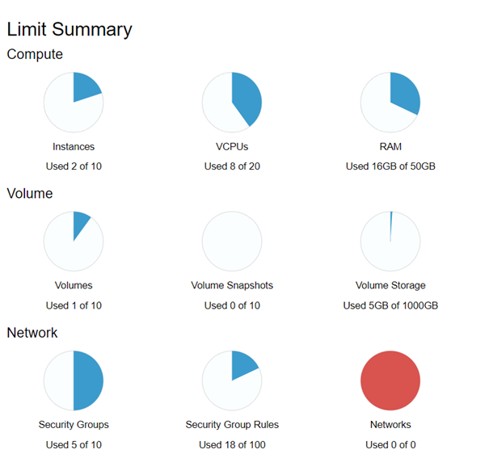
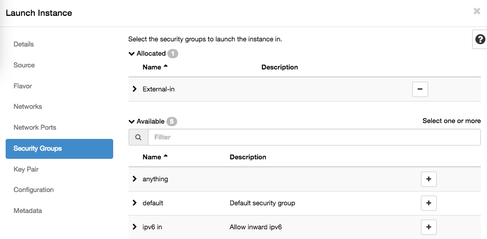
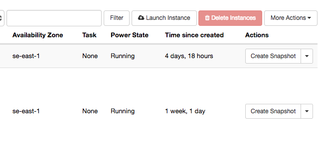
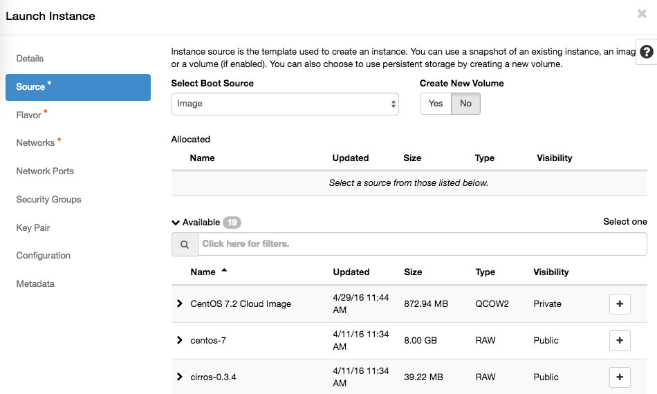
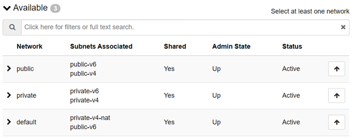
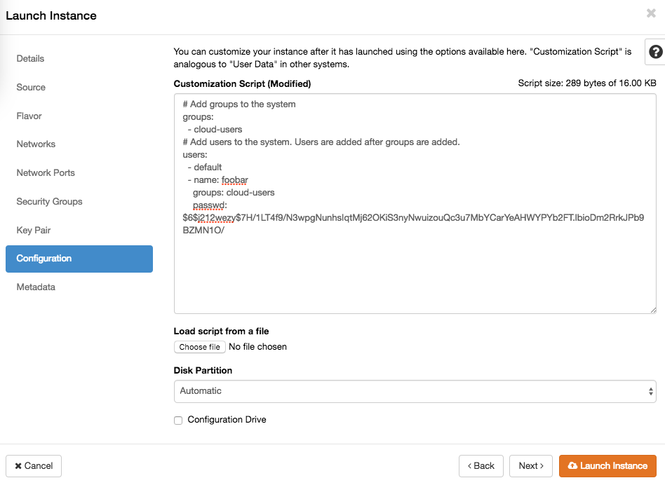

# Getting Started

## Log in to the dashboard

Go to the [Horizon dashboard](sites.md) for your site and log in with your credentials. After login you land on the **Overview** page, which shows your current resource usage against your quota limits.



Safespring organises resources into domains and projects. Each project is an isolated environment — a common setup is separate projects for test and production. See [Sites and account structure](sites.md) for details.

## Preparations

Before launching an instance, make sure you have an SSH key pair and a security group ready.

### SSH key pair

A key pair is required to log in to your instance — password login is disabled on most images. If you do not have one yet, see the [SSH key pairs how-to](howto/keypairs.md) for instructions on generating a key and importing it into the dashboard.

To import an existing key, go to **Compute → Key Pairs** and click **Import Public Key**.

### Security group

A security group controls inbound traffic to your instances. All inbound traffic is denied by default, so you need a security group that allows SSH (port 22) before you can connect.

Go to **Network → Security Groups**, click **Create Security Group**, give it a name (for example `allow-ssh`), and add a rule for **SSH** restricted to your IP address.



For detailed instructions, see [Networking — Security groups](networking.md#security-groups).

## Launch your first instance

In the left menu, go to **Compute → Instances** and click **Launch Instance**.



The wizard has several tabs — work through them in order.

### Details

Give your instance a name.

### Source

Set **Select Boot Source** to **Image** and pick an OS image from the list (for example `Ubuntu 24.04`).



Leave **Create New Volume** set to **Yes** and **Delete Volume on Instance Delete** to **No** — this gives you a persistent root disk that survives instance deletion. For a full explanation of boot storage options (ephemeral vs. volume-backed), see the [Volume documentation](volume.md#boot-storage-options).

### Flavor

Pick a flavor that matches your workload. Flavors starting with **b2** use central persistent storage and pair well with volume-backed boot. Flavors starting with **l2** use fast local storage. See the [Flavors documentation](flavors.md) for a full breakdown.

### Networks

Attach exactly one network:

| Network | Use case |
| --- | --- |
| **public** | Public IPv4 and IPv6, directly reachable from the internet |
| **default** | Private address with NAT for outbound internet access (recommended for most instances) |
| **private** | Private address, no internet access |



!!! tip "No routers, subnets, or floating IPs needed"
    Safespring uses [Calico](https://www.tigera.io/project-calico/)-based pure layer 3 networking. Unlike a standard OpenStack setup, you do not need to create virtual routers, configure subnets, or assign floating IPs — just attach one network and the instance is reachable at its assigned IP address straight away.

!!! warning "Attach exactly one network"
    Each network assigns a default gateway via DHCP. Attaching more than one causes conflicting gateways and unstable connectivity.

For a full description of the networking architecture, see the [Networking documentation](networking.md).

### Security Groups

Select the security group you created in the preparations step.

### Key Pair

Select the key pair you imported in the preparations step.

### Configuration (Cloud-init)

Optionally, paste a cloud-init script in the **Customization Script** field to automate configuration at first boot — installing packages, creating users, or running scripts.



For ready-to-use examples, see the [Cloud-init how-to](howto/cloud-init.md).

### Launch

Click **Launch Instance**. The instance will appear in the instances list and reach **Running** status within a minute.

## Connect to the instance

Connect via SSH using the default user for the image (for example `ubuntu` for Ubuntu images) and the IP address shown in the instances list:

```bash
ssh ubuntu@<ip-address>
```

## Next steps

- **Volumes** — boot storage options, attaching additional disks, and managing persistent storage: [Volume documentation](volume.md)
- **Networking** — security groups, persistent IPs, and the full Calico layer 3 architecture: [Networking documentation](networking.md)
- **Cloud-init** — automate instance configuration at first boot: [Cloud-init how-to](howto/cloud-init.md)
- **Flavors** — full breakdown of flavor types and storage implications: [Flavors documentation](flavors.md)
- **API access** — manage instances with the OpenStack CLI or Terraform: [API documentation](api.md)
- **Sites** — available sites, dashboard URLs, and account structure: [Sites documentation](sites.md)
