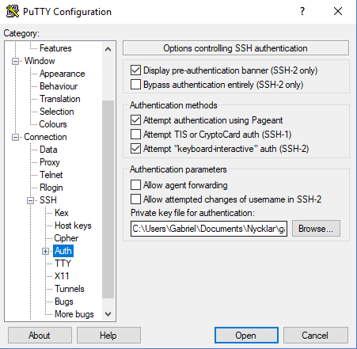

# SSH key pairs

A key pair is required to connect to an instance over SSH. You can either generate a key pair locally and import the public key, or let OpenStack generate one for you.

Generating the key pair locally is recommended — the private key never leaves your machine.

## Generate a key pair locally

### Linux and macOS

Use `ssh-keygen` to generate a key pair:

```bash
ssh-keygen -t rsa -b 4096 -C "your_email@example.com"
```

You will be prompted for a file location (the default `~/.ssh/id_rsa` is fine) and an optional passphrase. Using a passphrase is recommended — it protects the private key if your machine is compromised.

This creates two files:

- `~/.ssh/id_rsa` — your private key. Keep this secure and never share it.
- `~/.ssh/id_rsa.pub` — your public key. This is what you import into the dashboard.

### Windows

On Windows 10 and later, `ssh-keygen` is available in PowerShell:

```powershell
ssh-keygen -t rsa -b 4096 -C "your_email@example.com"
```

The key pair is saved to `C:\Users\<username>\.ssh\` by default.

If you prefer to use PuTTY:

1. Open **PuTTYgen**.
2. Select **RSA** as the key type and set the number of bits to **4096**.
3. Click **Generate** and move the mouse over the blank area to generate randomness.
4. Set a passphrase in the **Key passphrase** fields.
5. Click **Save private key** and save the `.ppk` file to a secure location.
6. Copy the public key text from the text field at the top of the PuTTYgen window — you will need this when importing into the dashboard.

## Import your public key into the dashboard

In the [Horizon dashboard](../sites.md), go to **Compute → Key Pairs** and click **Import Public Key**.

Give the key pair a name and paste the contents of your public key file:

- **Linux/macOS**: paste the contents of `~/.ssh/id_rsa.pub`
- **Windows (ssh-keygen)**: paste the contents of `C:\Users\<username>\.ssh\id_rsa.pub`
- **Windows (PuTTYgen)**: paste the public key text from the top of the PuTTYgen window

## Generate a key pair in the dashboard

Alternatively, go to **Compute → Key Pairs** and click **Create Key Pair**. Give it a name and click **Create Key Pair**. The browser will download the private key as a `.pem` file — save it securely, as it cannot be retrieved again.

- **Linux/macOS**: use the `.pem` file directly with the `-i` flag: `ssh -i ~/Downloads/my-key.pem ubuntu@<ip-address>`
- **Windows (PuTTY)**: convert the `.pem` file to PuTTY's `.ppk` format using PuTTYgen: go to **File → Load private key**, select **All files (*.*)** and open the `.pem` file, then click **Save private key**.

## Connect to an instance

### Linux and macOS

```bash
ssh -i ~/.ssh/id_rsa ubuntu@<ip-address>
```

If you are using the default key (`~/.ssh/id_rsa`) it is picked up automatically and the `-i` flag can be omitted.

### Windows (OpenSSH)

```powershell
ssh ubuntu@<ip-address>
```

### Windows (PuTTY)

1. Open PuTTY and enter the instance IP address under **Session → Host Name**.
2. Go to **Connection → SSH → Auth → Credentials** and browse to your `.ppk` file under **Private key file for authentication**.
3. Click **Open** to connect.



!!! note "Default username"
    The default SSH username depends on the image: `ubuntu` for Ubuntu, `debian` for Debian, `almalinux` for AlmaLinux, `rocky` for Rocky Linux, and `cirros` for CirrOS. The root user is typically disabled.
