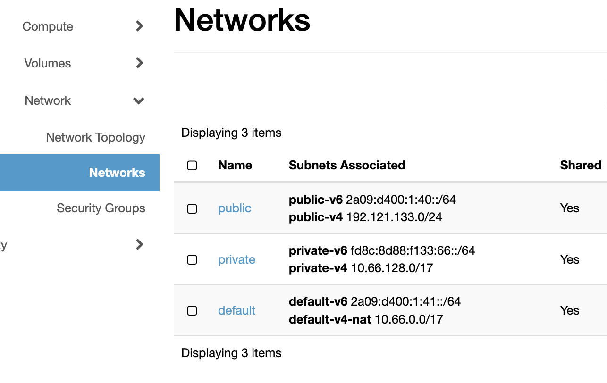
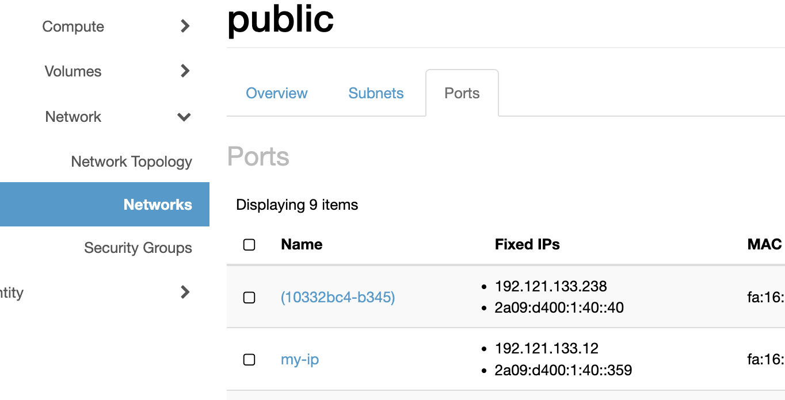
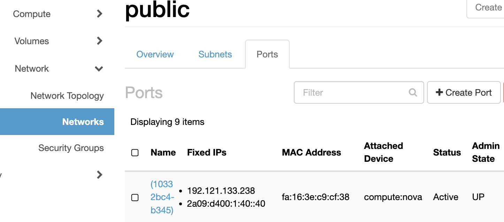
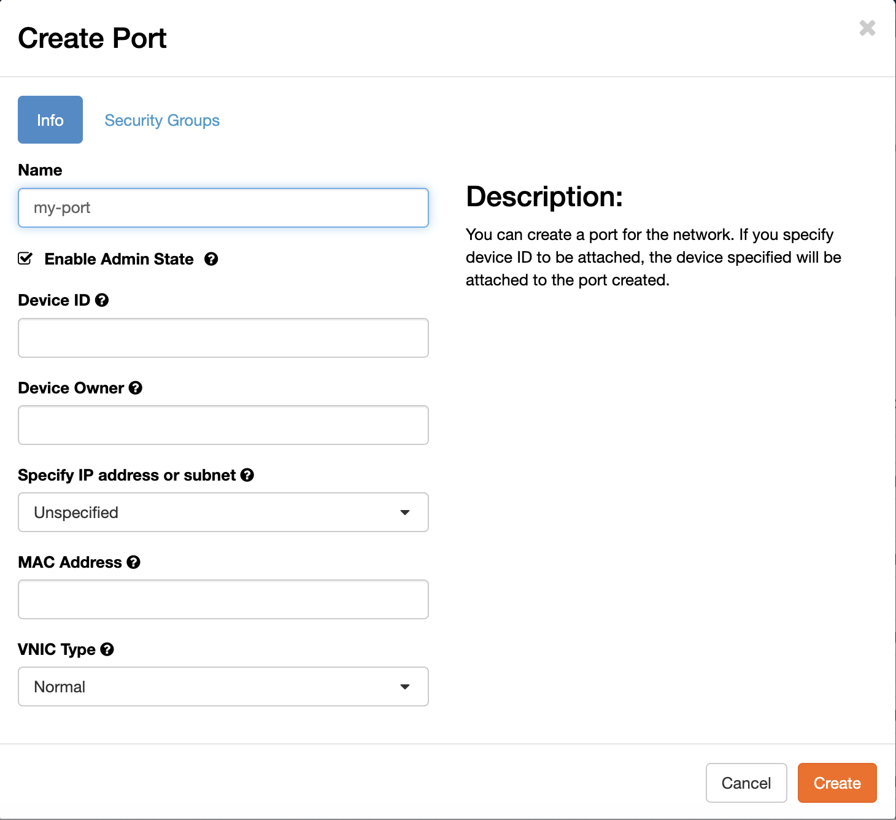

# Network Ports

A network port is a virtual network interface that exists independently of any instance. By creating a port before launching an instance and attaching the port at launch, the IP address is preserved across the instance lifecycle — you can delete and recreate instances without losing the IP.

This is useful when you need a stable IP address for a service, such as a load balancer frontend, a database, or an instance you plan to replace with a newer image.

!!! warning "Attach only one network interface per instance"
    Safespring uses Calico networking. Each network assigns a default gateway via DHCP. Attaching more than one network interface gives the instance multiple default gateways, causing asymmetric routing and unreliable connectivity. Always attach exactly one port or network per instance.

For more details on how networking works on the Safespring platform, see [API Access](../api.md) and [Getting Started](../getting-started.md#network).

## Creating a port in the dashboard

Open the **Network** menu and select **Networks**.



Click the network you want to create the port in — for example **public** for a public IP address, or **default** for a private IP.

On the network detail page, select the **Ports** tab.



Click **+ Create Port**.



In the **Create Port** dialog, enter a name for the port. The remaining fields are optional:

- **Device ID** and **Device Owner** — leave blank; these are filled automatically when you attach the port to an instance.
- **IP Address** — leave blank to have an address assigned automatically from the subnet, or enter a specific address if you need a fixed IP.
- **MAC Address** — leave blank unless you have a specific requirement.



Click **Create** to create the port. The port now appears in the list and has an IP address assigned to it.

### Attaching the port when launching an instance

When creating a new instance, go to the **Network** step in the Launch Instance wizard. Instead of selecting a network, skip that step and proceed to **Network Ports**. Select the port you created. The instance will be attached to that port and will use its IP address.

## Creating a port with the CLI

This page includes OpenStack CLI commands. See the [API Access documentation](../api.md) for instructions on how to install and configure the command line client.

### Create a port

```bash
openstack port create --network <network-name> <port-name>
```

For example, to create a port on the **public** network:

```bash
openstack port create --network public my-service-port
```

The output shows the assigned IP address and port ID:

```
+-------------------------+--------------------------------------+
| Field                   | Value                                |
+-------------------------+--------------------------------------+
| id                      | aead4548-e41d-4724-acd5-6aeb8d9fbce8 |
| name                    | my-service-port                      |
| network_id              | ...                                  |
| fixed_ips               | ip_address='185.189.29.42', ...      |
| status                  | DOWN                                 |
+-------------------------+--------------------------------------+
```

### Launch an instance attached to the port

Pass `--port` instead of `--network` when creating the instance:

```bash
openstack server create \
    --image ubuntu-24.04 \
    --flavor l2.c2r4.100 \
    --key-name my-key \
    --port my-service-port \
    my-instance
```

### List ports

```bash
openstack port list
```

To filter by network:

```bash
openstack port list --network public
```

### Show port details

```bash
openstack port show my-service-port
```

### Delete a port

Ports are not deleted when an instance is deleted. Delete unused ports explicitly to keep the network clean:

```bash
openstack port delete my-service-port
```

A port that is currently attached to an instance cannot be deleted. Detach the port first or delete the instance.

## Detaching and reattaching a port

You can move a port from one instance to another without losing its IP address.

Detach the port from the current instance:

```bash
openstack server remove port <instance-name> <port-name-or-id>
```

Attach it to another instance:

```bash
openstack server add port <instance-name> <port-name-or-id>
```

This is useful when replacing an instance with a newer image — create the new instance, then move the port from the old instance to the new one.
