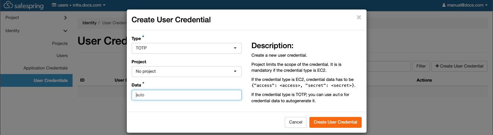
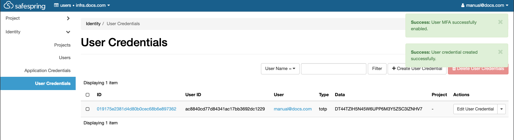
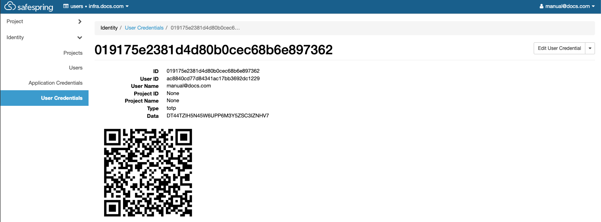

# Multi Factor Autentication (MFA)

Time-based one-time password (TOTP) is a computer algorithm that generates a one-time password (OTP) using the current time as a source of uniqueness. You could either use a GUI app like "Google Autenticator" or a shell command like "oauthtool" to generate the passcode. The passcode will have a lifetime of 30 seconds.

## Horizon
### Create user credentials

Goto the site where you would like to enable MFA,  

*`https://dashboard.<site>.safespring.com/horizon/identity/credentials/`*

Press the "Create User Credentail" button under "User Credentials" in the side menu. Select type TOTP, specify any specific project, or leave as is with "No Project" to apply to all your projects. In the "Data" field you can either leave as is to generate a new secret or you could specify a specific one. It should be a minimum of 128 bits (16 bytes) encoded in base32. 32 bytes is default.



### Generate security string
*Shell command to generate security string.*
```
>  LC_ALL=C tr -dc 'A-Z2-7' </dev/urandom | head -c 32; echo 
DT44TZIH5N45W6UPP6M3Y5ZSC3IZNHV7
```

When you have saved the new credential you should get two confirmation popups. Now your user has MFA enabled and it must be used from now on.  


If you didn't select a specific project but you want one you can edit the credental.

### Show QR-code
You now need to copy and save your secret key if you would like to use and add it to your passcode generator. If you click on the ID URL you will be presented with a QR-code that you can scan with your favourite secutity app.  



On next login you will get prompted for the TOTP passcode. It can then be obtained from you app or shell tool. Add the fresh passcode and press "Log in" to finalize the login.  


### Warning

!!! warning "Deleting all your credentials will NOT disable MFA. You will not be able to login again until support has disabled it on your user."
## Openstack CLI

### Prerequisits
To operate MFA with Openstack CLI you need to have a working environment. Please see [here](/compute/api/#install-the-openstack-command-line-client) how to set it up. 

You also need to have your users ID and your projects ID. You can get them in Horizon.  

* *`https://dashboard.<site>.safespring.com/horizon/identity/users/`*
* *`https://dashboard.<site>.safespring.com/horizon/identity/`*

### Create credential
When creating your credential you need your user_id, secret_string and the project_id.  

```
~/.virtualenvs/OS/safespring
> openstack --os-cloud=infra.docs credential create ac8840cd77d84341ac17bb3692dc1229 \
 --type totp DT44TZIH5N45W6UPP6M3Y5ZSC3IZNHV7 --project 748223378c284aa2af5162ecec15920b  
+------------+----------------------------------+
| Field      | Value                            |
+------------+----------------------------------+
| blob       | DT44TZIH5N45W6UPP6M3Y5ZSC3IZNHV7 |
| id         | 026b51f02393494589de6733a2bfcdad |
| project_id | 748223378c284aa2af5162ecec15920b |
| type       | totp                             |
| user_id    | ac8840cd77d84341ac17bb3692dc1229 |
+------------+----------------------------------+
```

Now you have created the credential but MFA is not activated on your user. See the empty "options" field.  

```
~/.virtualenvs/OS/safespring
> openstack --os-cloud=infra.docs user show ac8840cd77d84341ac17bb3692dc1229               
+---------------------+----------------------------------+
| Field               | Value                            |
+---------------------+----------------------------------+
| default_project_id  | None                             |
| domain_id           | 0edce43bccd045f1bce8824b68c5a3cb |
| email               | manual@docs.com                  |
| enabled             | True                             |
| id                  | ac8840cd77d84341ac17bb3692dc1229 |
| name                | manual@docs.com                  |
| description         | None                             |
| password_expires_at | None                             |
| options             | {}                               |
+---------------------+----------------------------------+
```
### Enable MFA and rules
Now you can enable mfa and set the auth rules like this.  

```
~/.virtualenvs/OS/safespring                                            
> openstack --os-cloud=infra.docs user set --enable-multi-factor-auth \
 --multi-factor-auth-rule password,totp ac8840cd77d84341ac17bb3692dc1229
```

As you can see now we cannot use password only any more.

```
~/.virtualenvs/OS/safespring                                                
> openstack --os-cloud=infra.docs user show ac8840cd77d84341ac17bb3692dc1229
Not all required auth rules were satisfied: [['password', 'totp']]
```
### clouds.yaml with MFA user
Now you must expand your clouds.yaml with a new section using MFA.

```
  infra.docs.mfa:
    auth_type: "v3multifactor"
    auth_methods:
      - v3password
      - v3totp
    auth:
      auth_url: https://v2.api.<site>.safedc.net:5000/v3/
      username: "manual@docs.com"
      password: <REDACTED>
      project_id: 748223378c284aa2af5162ecec15920b
      project_name: "infra.docs.com"
      project_domain_name: docs.com
      user_domain_name: "users"
    region_name: "<site>"
    interface: "public"
    identity_api_version: 3
```
### Verify it is working
Now you can use the cli with MFA as well.
```
~/.virtualenvs/OS/safespring                                                                                    
> openstack --os-cloud=infra.docs.mfa user show ac8840cd77d84341ac17bb3692dc1229  
TOTP passcode: 
+---------------------+----------------------------------------------------------------------------------------+
| Field               | Value                                                                                  |
+---------------------+----------------------------------------------------------------------------------------+
| default_project_id  | None                                                                                   |
| domain_id           | 0edce43bccd045f1bce8824b68c5a3cb                                                       |
| email               | manual@docs.com                                                                        |
| enabled             | True                                                                                   |
| id                  | ac8840cd77d84341ac17bb3692dc1229                                                       |
| name                | manual@docs.com                                                                        |
| description         | None                                                                                   |
| password_expires_at | None                                                                                   |
| options             | {'multi_factor_auth_enabled': True, 'multi_factor_auth_rules': [['password', 'totp']]} |
+---------------------+----------------------------------------------------------------------------------------+
```
### Oathtool direct input
You could then input your passcode directly to not get prompted for the passcode.
```
~/.virtualenvs/OS/safespring                                                                                                                        
> openstack --os-cloud=infra.docs.mfa user show \
--os-passcode=`oathtool --totp -b DT44TZIH5N45W6UPP6M3Y5ZSC3IZNHV7` \
ac8840cd77d84341ac17bb3692dc1229
+---------------------+----------------------------------------------------------------------------------------+
| Field               | Value                                                                                  |
+---------------------+----------------------------------------------------------------------------------------+
| default_project_id  | None                                                                                   |
| domain_id           | 0edce43bccd045f1bce8824b68c5a3cb                                                       |
| email               | manual@docs.com                                                                        |
| enabled             | True                                                                                   |
| id                  | ac8840cd77d84341ac17bb3692dc1229                                                       |
| name                | manual@docs.com                                                                        |
| description         | None                                                                                   |
| password_expires_at | None                                                                                   |
| options             | {'multi_factor_auth_enabled': True, 'multi_factor_auth_rules': [['password', 'totp']]} |
+---------------------+----------------------------------------------------------------------------------------+
```

## Application Credentials
This is an important section if you are using application credentials.

!!! warning "If you have Application Credentials on your user you MUST add a rule for that too. See the extra 'multi-factor-auth-rule'"
### Rule MUST be added.

```
~/.virtualenvs/OS/safespring
> openstack --os-cloud=infra.docs.mfa \
--os-passcode=`oathtool --totp -b DT44TZIH5N45W6UPP6M3Y5ZSC3IZNHV7` \
user set  --enable-multi-factor-auth \
--multi-factor-auth-rule "password,totp" \
--multi-factor-auth-rule "application_credential" \
ac8840cd77d84341ac17bb3692dc1229
```
## MFA on application credentials
### Additional rules
This works on application credentials too. Then you need to add 'totp' to the application_credential multi-factor-auth-rule.
```
~/.virtualenvs/OS/safespring                                                                                                                        
> openstack --os-cloud=infra.docs.mfa \
--os-passcode=`oathtool --totp -b DT44TZIH5N45W6UPP6M3Y5ZSC3IZNHV7` \
user set  --enable-multi-factor-auth \
--multi-factor-auth-rule "password,totp" \
--multi-factor-auth-rule "application_credential,totp" \
ac8840cd77d84341ac17bb3692dc1229
```
### clouds.yaml with MFA for application credential
Now you must expand your clouds.yaml with a new section using MFA and Application Credentials.
```
  infra.docs.mfa.appcred:
    auth_type: v3multifactor
    auth_methods:
      - v3applicationcredential
      - v3totp
    auth:
      auth_url: https://v2.api.<site>.safedc.net:5000/v3/
      application_credential_id: "48f671e98fba4577bde7d9cdb03ad94d"
      application_credential_secret: "<REDACTED>"
      user_id: ac8840cd77d84341ac17bb3692dc1229
    region_name: <site>
    interface: public
```

Then you can use application credentials with MFA,
```
~/.virtualenvs/OS/safespring
> openstack  --os-cloud=infra.docs.mfa.appcred --os-passcode=`oathtool --totp -b DT44TZIH5N45W6UPP6M3Y5ZSC3IZNHV7` server list
+--------------------------------------+------+--------+-----------------------------------------+--------+-------------+
| ID                                   | Name | Status | Networks                                | Image  | Flavor      |
+--------------------------------------+------+--------+-----------------------------------------+--------+-------------+
| 1c8a6a82-54cb-421e-990b-38d83c656ed9 | JM   | ACTIVE | default=10.66.3.97, 2a09:d400:1:41::353 | cirros | l2.c2r4.100 |
+--------------------------------------+------+--------+-----------------------------------------+--------+-------------+
```
