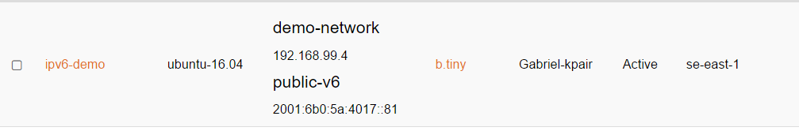
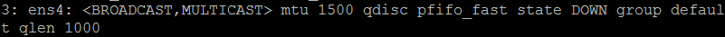

# IPv6 in Sunet IaaS
This document describes how to enable IPv6 on an instance in the IaaS platform.
##Background
There are mainly three ways to get an IPv6 address:

* Static configuration. This means that you get and IPv6 address that you configure on your instance. Since this involves manual work keeping track of which addresses that are free or not it is not the preferred solution in the IaaS platform.
* Stateless Address Auto Configuration (SLAAC). This is a new option in IPv6 compared to IPv4 where the instance gets a prefix (with the netmask /64) in a Router Advertisement from the default router in the network. The last 64 bits of the address is generated by the instance itself, either from MAC-address on the interface (Modified EUI-64) or randomly (Privacy Extensions). The default router for the instance is set to the sender of the Router Advertisement. Since the Router Advertisements are sent in the link local scope (addresses that can never be routed to another segment) the default router in the routing table will also be the routers link local address instead of the first address in the network prefix from the Router Advertisement.
* DHCPv6. This options works in many ways like the old DHCP-protocol for IPv4 but with some notable differences:
	* The default router is still configured with Router Advertisement – and not with DHCPv6.
	* Due to the abundance of addresses in IPv6 the leases from a DHCPv6 server are much more generous when it comes to the lease time resulting in that once you get an IPv6 address from the DHCPv6 server you can keep it virtually forever if the DHCPv6-server is set up with a big enough scope. This removes the need of static IPv6 addresses on servers serving IPv6 content.

##Configuration
In this guide, we will use the third option above: DHCPv6.

* Set up an instance in the Horizon dashboard. In this example, we will use an Ubuntu 16.04 image. We also set it up with a keypair so that we can SSH to the host later. In this demonstration, the b.tiny flavor will do. We also connect it to an IPv4 network and the public-ipv6 network. We will use the IPv4 network for IPv4 traffic and management.

* We can see that we have gotten two IP-addresses, one IPv4 and one IPv6 in two different network. We also assign a floating IP-address to the instance to be able to SSH to it as described [here](https://docs.cloud.ipnett.com/intro/gettingstarted.html).
* Before we can SSH to our new floating IP we will need to update our security groups to open port 22. This is done from “Edit Security Groups” in the “Create Snapshot”drop-down if you did not do it at instance creation. Security groups are described [here](https://docs.cloud.ipnett.com/intro/gettingstarted.html).
* Now you can log into you instance with SSH. If you are using the vanilla Ubuntu 16.04 image with no extra configuration you log in with the user “ubuntu” and provide the password, you have set on your key (which you also must provide in able to log in).  
* Run “sudo -s” to gain root rights and then “ip address show” to find the interface apart from your IPv4 interface. This other interface should be down:  

In this case we see that the interface that is down is named ens4.
* Go to the folder “/etc/network/interfaces.d” and create a file called “ens4.cfg” and fill it with the following contents:   
  
    auto ens4  

    iface ens4 inet6 dhcp  
        accept_ra 1  

Save and close the file.  
  
* Run the command “/etc/init.d/networking restart” to bring up your IPv6 interface. Run “ip address show” to ensure that your instance has gotten the same IPv6-address as stated in the IaaS Dashboard.
* Try and ping with the command “ping6 -n ping.sunet.se” to see that it works.

