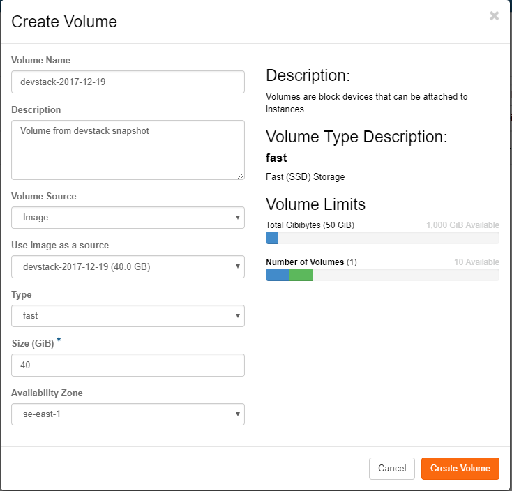
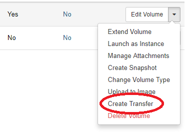
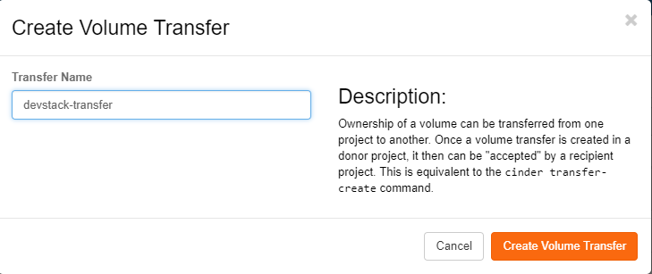
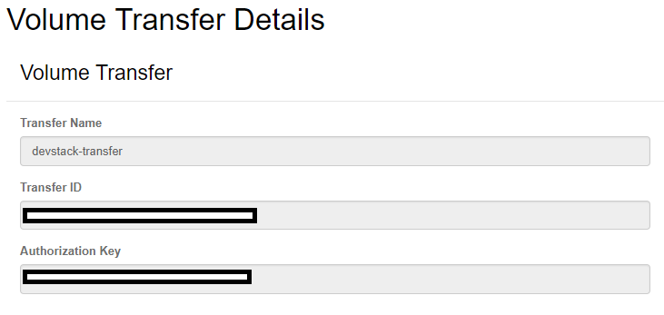
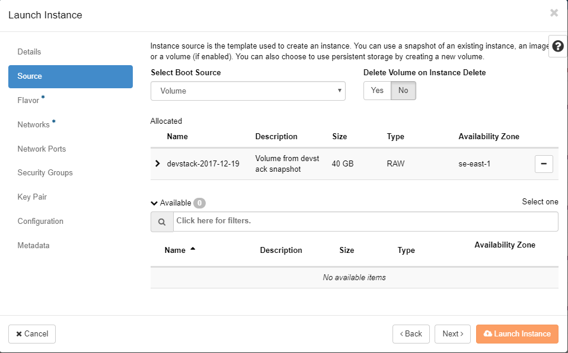

## Migrate an instance to another project
In order to migrate an instance from one project to another please perform the following steps:

### 1. Create a snapshot

Create a snapshot of the instance in the source project. Be aware that this takes a long time to complete.

### 2. Create a new volume

Create a new volume with the contents of the snapshot (instead of empty volume) in the source project.

### 3. Create a "Volume Transfer"

Create a "Volume Transfer" in the source project.

Name the transfer something:

You will be given back a transfer ID and an authorization key. Please write those down somewhere.

### 4. Accept the volume transfer

Accept the volume transfer in the destination project.

Provide the transfer ID and the authorization key.

### 5. Start the instance

Start the instance again from the volume in the destination project. Under `Source` in the `Launch Instance`-dialog - pick `Volume` and then the transferred volume.

