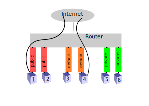
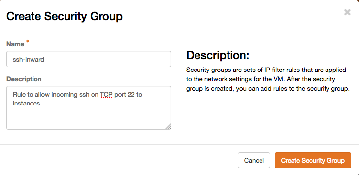
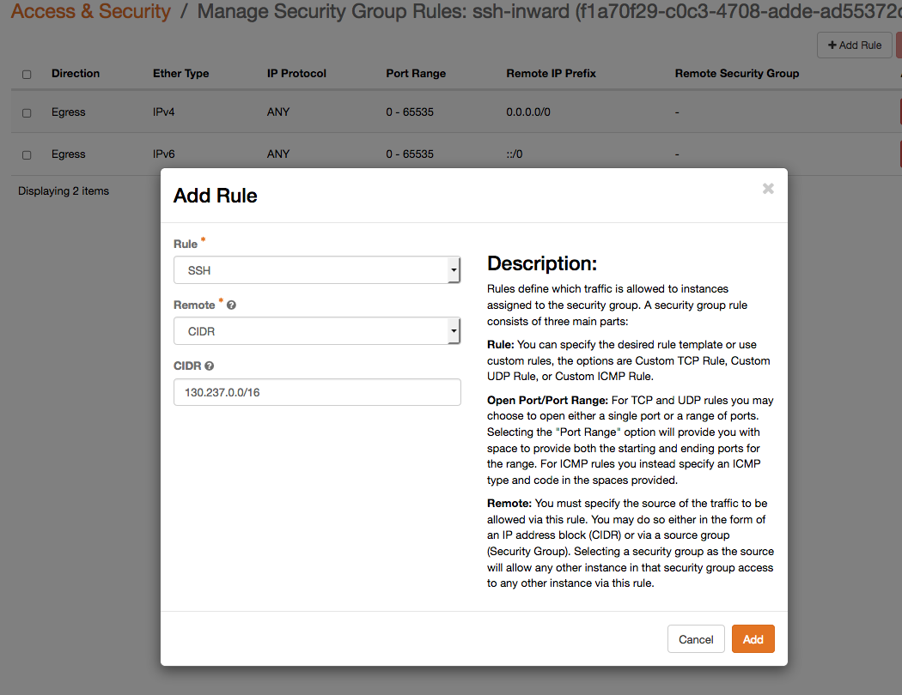

# Networking

This page describes how networking works on the Safespring Compute platform in detail. For a quick overview of the available networks and how to choose between them, see the [Network section in Getting Started](getting-started.md#network).

This page includes OpenStack CLI commands. See the [API Access documentation](api.md) for instructions on how to install and configure the command line client.

## Architecture: layer 3 routing with Calico

Safespring uses [Calico](https://www.tigera.io/project-calico/) as its networking engine, which operates as a pure layer 3 network using BGP routing. This is fundamentally different from traditional OpenStack deployments that use layer 2 bridging with software-defined switches and floating IP addresses. The Calico model is simpler, more performant, and has a smaller attack surface.

Each instance receives its own IP address from a shared pool via DHCP. The IP address remains static for the lifetime of the instance. Networks in this context are simply IP address allocation pools — the actual traffic between all instances is routed through the same layer 3 routing fabric regardless of which network they are attached to.

For a deeper understanding, see the blog post [Networking at Safespring](https://www.safespring.com/blogg/2022/2022-03-network/).

!!! warning "Never modify network configuration inside the instance"
    Instances must use the DHCP-provided default gateway as their first routing hop. Adding alternative default gateways, static routes, or modifying the DHCP configuration will cause packets to be dropped by the platform. If you need custom layer 2 connectivity between instances, use tunneling protocols such as WireGuard on top of the platform's layer 3 infrastructure. See the [VPN options](vpn.md) documentation for more details.

## No layer 2 connectivity — only layer 3

The diagram below shows 6 instances in the same project. Instances 1 and 2 are attached to the public network, 3 and 4 to the default network, and 5 and 6 to the private network. Despite sharing a network label, each instance is in its own separate routed network — they are not on the same layer 2 segment as each other.



All connectivity between instances is routed through the same routing fabric. Instance 1 on the public network can act as a jump host to reach instances 3, 4, 5, or 6 without being attached to the default or private networks. The only thing controlling what traffic is allowed between instances is security groups.

You cannot create your own networks. Each network has a separate DHCP scope from which instances get their IP addresses, which means you have less control over which specific IP address an instance gets, but the simpler model is significantly more stable than the previous platform version.

!!! warning "Never attach more than one network interface to an instance"
    Each network assigns a default gateway to the instance via DHCP. If an instance is attached to multiple networks, it will receive two default gateways, leading to asymmetrical routing and unstable network connectivity. Always attach exactly one network interface per instance.

## RFC 1918 routing implications

Traffic between all instances on the platform — including those on RFC 1918 subnets (default and private networks) — is routed directly by the platform. This means that the destination service sees the RFC 1918 IP address as the source address when traffic originates from a default or private network instance.

This has a subtle implication for tenants running public-facing services that are contacted by instances on a Safespring RFC 1918 subnet: if the public service or its operating system filters out RFC 1918 addresses (because they are not expected on a public-facing service), it will block traffic from those instances. Ensure that Safespring RFC 1918 subnets are allowed to access your service where needed.

You can list all IPv4 subnets with:

```bash
openstack subnet list | grep v4
```

## IPv6

The public network provides both a public IPv4 and a public IPv6 address. The default network will also provide a public IPv6 address, meaning you can have public IPv6 connectivity without attaching to the paid public network. The private network assigns a private IPv6 address, which is not routable on the internet — unlike the default and public networks, it cannot be used for public IPv6 connectivity.

## Network Ports and persistent IP addresses

By default, when you attach a network to an instance directly, the IP address is tied to the lifetime of the instance. If you delete and recreate the instance, it will get a new IP address.

To keep the same IP address across instance recreation — useful during restores, flavor changes, or emergencies — create a **Network Port** on the desired network and attach the port to the instance instead of the network directly. The port and its IP address persist independently of any instance.

See [Persistent IP addresses](howto/persistent-ip-address.md) for step-by-step instructions.

## Security groups

Security groups are the sole mechanism for controlling network access between instances. The default policy is to deny all inbound traffic. Each security group contains rules that define allowed protocols, ports, and source IP addresses or ranges. You can apply multiple security groups to an instance, and changes take effect immediately on running instances without a restart.

Safespring recommends using security groups exclusively for network access control rather than combining them with local firewalls inside the instance, as having both tends to make debugging connectivity issues more difficult.

Since all instances are connected to the same routing fabric, security groups must be used even between instances on the same named network — for example, two instances both on the default network still require a security group rule to allow traffic between them. This design eliminates layer 2 leakage entirely.

### Creating a security group

In the [Horizon dashboard](sites.md), go to **Network → Security Groups** and click **Create Security Group**. Give it a descriptive name — security groups are per project and not visible to other projects.



Then add rules to it. Common protocols have pre-defined entries in the rule type dropdown (SSH, HTTP, HTTPS, ICMP). For other protocols, select TCP or UDP manually and specify the port range. To allow traffic from any source, leave the CIDR field blank. To restrict to a specific source network or IP, enter it with an appropriate prefix length.



### Allowing traffic between a group of instances

A common pattern is to allow unrestricted communication between all instances that belong to a specific group — for example, all instances in a cluster. This can be done with the `self` rule, which allows traffic from any instance that has the same security group applied:

```hcl
resource "openstack_compute_secgroup_v2" "instance_interconnect" {
  name        = "interconnect"
  description = "Full network access between members of this security group"

  rule {
    ip_protocol = "tcp"
    from_port   = "1"
    to_port     = "65535"
    self        = true
  }

  rule {
    ip_protocol = "udp"
    from_port   = "1"
    to_port     = "65535"
    self        = true
  }
}
```

Apply this security group to all instances in the cluster and they will be able to reach each other freely, while still being isolated from everything else. See the [Terraform provider documentation](https://registry.terraform.io/providers/terraform-provider-openstack/openstack/latest/docs/resources/compute_secgroup_v2#self) for details on the `self` attribute.
