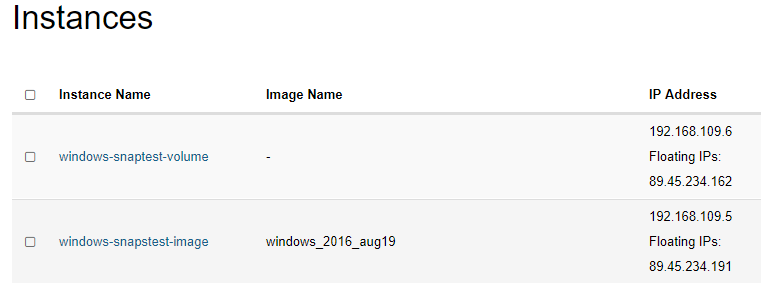
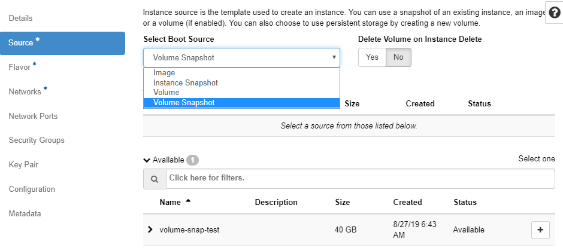
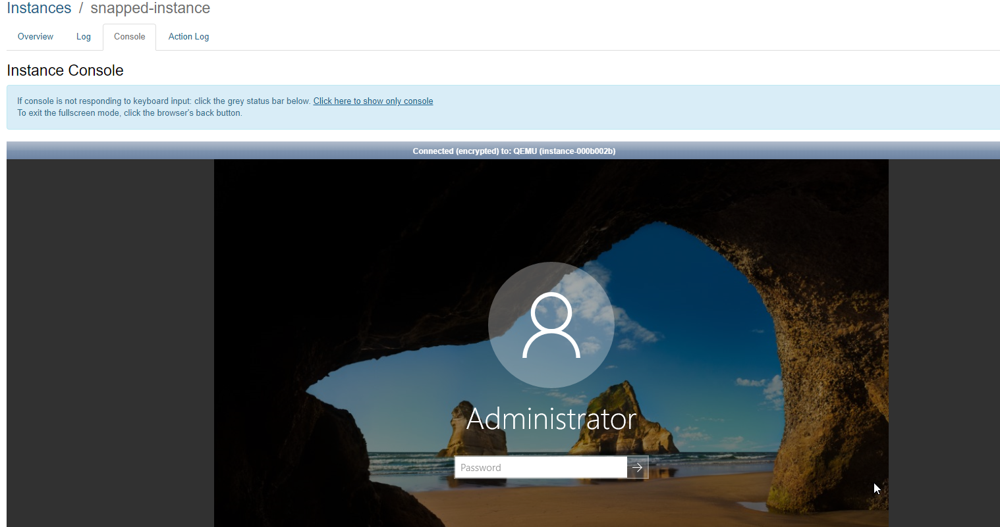
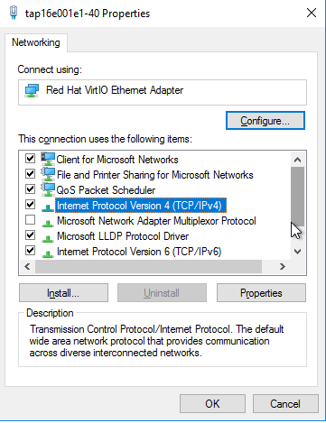
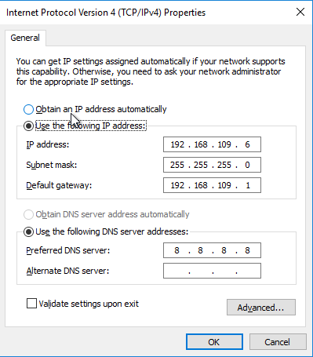

This document describes how to take snapshot of an instance in Safesprings platform and then how to start a copy of the instance from the snapshot. The way of doing this varies a bit depending on how the instance was created in the first place.

## Create a snapshot
There is mainly two variants to create an instance in Safesprings platform:

1. You create the instance from an image Safespring provides in the platform.
2. You create the instance from a volume. When doing this you will be able to alter the standard 40 GB size of the root filesystem. This option is also common if you have migrated the instance from another platform into Safespring.

The image below shows what the different types of method looks like in the instance view:

An instance which is started from an image has the image listed in the "Image"-column, whereas if the instance was created from a volume it just has a minus-sign in that column.

If the instance is created from an image, and does not have a minus-sign in the "Image"-column you can go ahead and press the "Create Snapshot"-button to create a snapshot.

If it instead was created from a volume, you should go to the "Volumes"-tab in the GUI and find the volume which is the root filesystem for the instance you want to snapshot.

Your snapshot will now show up under "Volume Snapshots" tab.

## Start a new instance from snapshot
In order to start a new instance from your snapshot you go to the "Launch Instance" dialogue in the Instance-listing.

### 1. Pick a source
When it is time to pick a source for the instance - use the dropdown and either pick "Instance Snapshot" or "Volume Snapshot" depending on which method you used to take the snapshot. Use "Instance Snapshot" if the original instance was created from an image and "Volume Snapshot" if the snapshot was taken from the volume.

### 2. Pick the same network
You fill in the other things that are needed, and put the new instance in the same network as the original and launch the instance.

* If it is a linux instance, you will now have a copy of you former instance and can check that the copy works as intended.
* If it is a Windows instance, you have to reconfigure the network in order to make the copy reachable and to be able to manage it over RDP.

You start by clicking the name of your new instance started from the snapshot and the click "Console". You will notice that the instance does not have working networking connectivity but you log in just like you normally do in the web console.

Once your in you right-click on the little network icon in the lower right corner and pick the "Open Network and Sharing Center".

Click "Change adapter settings" and right click the network adapter and pick "Properties". You will be presented by the following dialogue:

Double click the "Internet Protocol version 4" entry and you will see the following:

You see that the instance has the original instance IP-address configured which is the problem. Just pick "Obtain an IP-address automatically" and click "OK".

### 3. Let it reboot
After a short while the instance will reboot itself and when it is back up it will have the IP-address that is listed in the Instance-listing in the OpenStack GUI instead of the old one.

### 4. Success
Your snapshotted copy instance is now ready to use.
