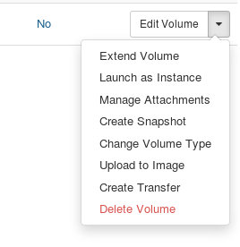

# Volume service

Volumes are persistent block storage devices that can be attached to instances. Unlike ephemeral storage that is tied to the instance lifecycle, volumes exist independently and persist even when instances are deleted. This makes them suitable for boot disks, databases, and any data that should outlive a specific instance.

This page includes OpenStack CLI commands. See the [API Access documentation](api.md) for instructions on how to install and configure the command line client.

## Volume types

Safespring Compute offers two volume types:

| Type | Use case | Read IOPS per GB | Write IOPS per GB | IOPS range |
| --- | --- | --- | --- | --- |
| **fast** | Boot disks, databases, applications with high I/O requirements | 100 | 50 | Up to 100000 read / 50000 write |
| **large** | Data archives, log storage, backups, infrequently accessed data | 2 | 2 | 50–4000 read / 50–4000 write |

For example, a 10 GB fast volume provides 1000 read and 500 write IOPS, while a 100 GB large volume provides 200 read and 200 write IOPS.

!!! info
    IOPS limits apply to all mounted volumes on an instance, not just boot drives. Keep this in mind when attaching additional volumes.

It is recommended to use **fast** for boot volumes since a large boot volume will make the instance noticeably slower. See the [Flavors documentation](flavors.md#b2-flavors) for more details on IOPS per volume type.

## Creating a volume

### Using the Horizon dashboard

1. Navigate to **Volumes** and click **Create Volume**.
2. Give the volume a name.
3. Under **Volume Source**, select **Image** if you want to create a bootable volume, or **No source, empty volume** for a data volume.
4. Select the volume type: **fast** or **large**.
5. Set the size in GB. If you selected an image as source, the minimum size is pre-filled.
6. Click **Create Volume**.

### Using the CLI

Create an empty volume:

```bash
openstack volume create --size 20 --type fast my-data-volume
```

Create a bootable volume from an image:

```bash
openstack volume create --size 20 --type fast --image ubuntu-24.04 my-boot-volume
```

## Attaching a volume to an instance

### Using the Horizon dashboard

In the **Volumes** listing, select **Manage Attachments** from the dropdown menu on the volume. Select the instance you want to attach it to and click **Attach Volume**.

### Using the CLI

```bash
openstack server add volume my-instance my-data-volume
```

After attaching, the volume appears as a new block device inside the instance (for example `/dev/sdb`). You need to format and mount it before use:

```bash
# Identify the new device
lsblk

# Create a filesystem (only for new empty volumes)
mkfs.ext4 /dev/sdb

# Mount it
mkdir -p /mnt/data
mount /dev/sdb /mnt/data
```

## Detaching a volume from an instance

!!! warning
    Always unmount the volume from within the instance before detaching it. Detaching without unmounting causes a hard disconnect from the I/O subsystem, which risks data loss.

```bash
# Inside the instance
umount /mnt/data
```

Then detach the volume:

### Using the Horizon dashboard

In the **Volumes** listing, select **Manage Attachments** from the dropdown menu and click **Detach Volume**.

### Using the CLI

```bash
openstack server remove volume my-instance my-data-volume
```

## Extending a volume

You can increase the size of an existing volume. The volume must be detached from any instance before extending.

### Using the Horizon dashboard

In the **Volumes** listing, select **Extend Volume** from the dropdown menu and enter the new size.

### Using the CLI

```bash
openstack volume set --size 50 my-data-volume
```

After extending and reattaching the volume to an instance, you also need to resize the filesystem inside the instance to use the new space:

```bash
# For ext4 filesystems
resize2fs /dev/sdb

# For XFS filesystems
xfs_growfs /mnt/data
```

## Deleting a volume

A volume must be detached before it can be deleted.

### Using the Horizon dashboard

In the **Volumes** listing, select **Delete Volume** from the dropdown menu.

### Using the CLI

```bash
openstack volume delete my-data-volume
```

!!! note
    Snapshots taken from a volume are independent and will remain even after the volume is deleted. These snapshots continue to consume storage quota. See the [Snapshots HOWTO](howto/snapshotting-instances.md) for details on managing snapshots.

## Changing volume type

It is possible to migrate between the **fast** and **large** volume types using the API or the UI.

### Prerequisites

* The volume has to be *detached* from any instance for the migration to work.

Please make sure to unmount the volume from within the instance before
detaching it. The volume will be detached from the I/O subsystem of your
instance, so not removing it properly could cause a "hard" disconnect,
with risk of data loss.

### Migrating using the UI

1. Find the correct volume using the Volumes tab of your compute project.

1. Select `Change Volume Type` in the pulldown menu for the volume you want to
   migrate.

    

1. Select the new volume type from the pulldown list

1. Set `Migration policy` to `On demand`

1. Click `Change Volume Type`

The volume service will now copy the volume from the old backend to the new.
Depending on the size of the volume, this operation will take some time.
