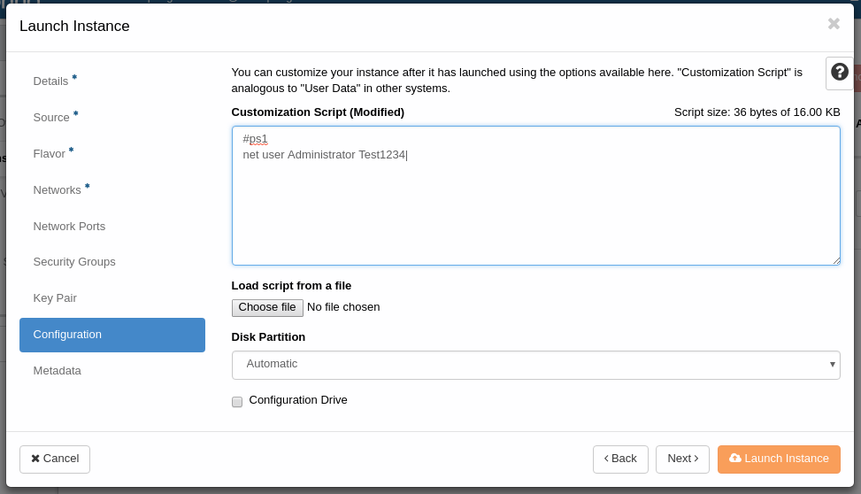

# Windows instances

## Cloudbase

We use a system called [cloudbase](https://cloudbase.it/) for initial set up of windows instances. This is similar to the cloud-init system we use for linux-based instances.

## Cloudbase admin user

Cloudbase generates an admin user it uses for configuration of the instance. The admin user is added to the Administrators group.

The admin user is assigned a random password on installation, which can be retrieved by the following method:

### Generating a key pair for admin user password retrieval

Under the Compute > Access & Security menu, select the "Key Pairs" tab, press "+Create Key Pair".

Give the key pair a describing name, for instance "windows-passwords". Press "Create Key Pair".

A file called windows-passwords.pem should be dowloaded to your computer. Take good care of this file as it is used to decrypt your admin passwords.

### Creating a Windows instance via webui

You create a Windows instance in much the same way as [any other instance](./getting-started.md), by selecting one of the windows images under the Source menu.

In the "Key Pair" section of the "Launch instance" dialog, select the key pair "windows-passwords" you created earlier.

### Retrieving the admin password via webgui

After creating the instance, locate it (under Compute > Instances) and click on the related pull-down menu. Select "Retrieve Password". Under "Private Key File", select "Choose file" and select the .pem file you downloaded earlier. Click "Decrypt Password".
The password should show up in the "Password" field.

### ALTERNATE: Retrieving the admin password using the nova commandline

If you have access to the openstack commandline tools you can use nova to retrieve the password. Ensure the correct `OS_` environment variables are set, then run

`nova get-password winbox1 ~/keys/windows-passwords.pem` - where winbox1 is your windows instance and ~/keys/windows-passwords.pem is the private key file from the key pair you generated earlier.

## Setting the Administrator password (and other things) under instance creation

Cloudbase can run powershell scripts under instance creation. This can for instance be used to set the Administrator user password. The script can either be written directly into the "Customization Sctipt" field under "Configuration" or uploaded as a file in the same dialog box.

For some reason it seems impossible to set the password for the "admin" user using this method, although setting it for "Administrator" seems to work just fine.

Basically anything that a user in the Administrators group can do via powershell should be able to run via this method.

also: ***BE WARNED THAT ANYTHING ENTERED IN THIS DIALOG BOX CAN END UP STORED IN LOG FILES ETC AND AS SUCH IF USED TO SET PASSWORDS THESE SHOULD ONLY BE FOR VERY TEMPORARY USAGE***
 
