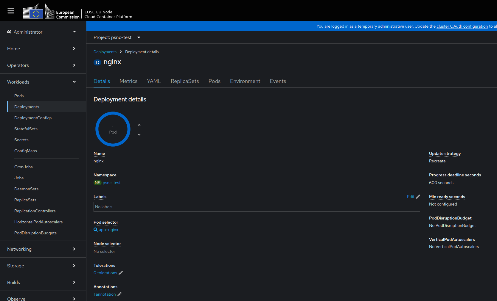

# FAQ

## How can I scale my application ?

Using the Web console under the correct object e.g. `deployments`
`https://eu-2.paas.open-science-cloud.ec.europa.eu/k8s/ns/<project_name>/deployments/nginx` under the `Deployment details` the arrows can be used to scale up and down the number of pods



```bash
oc scale deployment nginx -n <project_name> --replicas=0
oc get pods -w  # check pod is terminated
oc scale deployment nginx -n <project_name> --replicas=1
```

Autoscaling can be used by utilizing the [Horizontal Pod autoscaler](https://docs.okd.io/4.15/nodes/pods/nodes-pods-autoscaling.html) e.g. 
```bash
oc autoscale deployment/nginx -n <project_name> --min=5 --max=7 --cpu-percent=75
```

## How can I add configuration/secrets into my application?

- **Secrets and ConfigMaps:** Store key-value data, including text or small binary files. Secrets should be used for confidential information like passwords and certificates. You can mount ConfigMaps/Secrets as directories or individual keys as files for your application to read.
- **Environment Variables:** Can be set in various ways:
    - Manually on a resource [(e.g., Pod, Deployment, StatefulSet)](getting-started.md#core-concepts).
    - By referencing values from Secrets/ConfigMaps individually.
    - By injecting all Secret/ConfigMap values into the environment (with an optional prefix).
- **Command Line Arguments** can also be directly defined on your application.

Relevant Documentation:

- [ConfigMaps](https://kubernetes.io/docs/concepts/configuration/configmap/)
- [Secrets](https://kubernetes.io/docs/concepts/configuration/secret/)
- [Environment Variables](https://kubernetes.io/docs/tasks/inject-data-application/define-environment-variable-container/)

## I noticed permissions errors when accessing a file, what is the cause?

Each project has a range of user IDs (UIDs), and every pod is assigned a different UID, which is different from standard Kubernetes. Some containers may require specific UID/group permissions.

For mounted PersistentVolumeClaims, Secrets, and ConfigMaps, the Container Platform automatically sets the appropriate permissions.

To address this:

- Modify container permissions so that a user with a random UID can run the application (recommended).
- Submit a support ticket to request custom security permissions via support@safespring.com or the official European Open Science Cloud help desk.
  - Note that permissions are tied to ServiceAccounts.
  - Ensure your pod runs with the specified ServiceAccount and that SecurityContext is set.

Relevant Documentation:

- [Service Accounts](https://kubernetes.io/docs/tasks/configure-pod-container/configure-service-account/)
- [Security Context](https://kubernetes.io/docs/tasks/configure-pod-container/security-context/)
- [Security Context Constraints](https://docs.okd.io/latest/authentication/managing-security-context-constraints.html)

## How can I access images from a private registry project?

1. **Get Credentials for Your Registry:** - for example obtain credentials from [Container Registry Web UI](registry.md#obtaining-credentials).

2. **Create a Secret with Credentials and Domain:** Create a Secret containing the registry credentials and domain, then link it to the ServiceAccount or specify its name in the imagePullSecrets of your Pod, Deployment, etc. The Container Platform will handle authentication automatically.

Relevant Documentation:

- [Using Image Pull Secrets](https://docs.okd.io/latest/openshift_images/managing_images/using-image-pull-secrets.html#images-allow-pods-to-reference-images-from-secure-registries_using-image-pull-secrets)
- [Pulling Images from a Private Registry](https://kubernetes.io/docs/tasks/configure-pod-container/pull-image-private-registry/)
- [Container Registry](registry.md)

## I am unable to mount volumes, what can I do?

OKD will automatically retry mounting the volume.

If the problem persists for several minutes, the issue might be that the volume is full, preventing OKD from properly mounting it, or the quota reached its limits. Here’s a possible solution:

1. Try expanding the volume following the [Expand Volume](persistent-volume.md#expand-volume) guide

2. If this doesn’t work, and you can see that the volume has been scaled properly in the PVCs, please report the issue to support@safespring.com.

## How can I spot potential problems ?

Debugging **Deployments**, **StatefulSets**, **Pods** and other resources in an OKD project focuses on:

- Checking pod status and logs.
- Describing deployments, statefulsets and pods to identify issues.
- Reviewing events and resource quotas.
- Inspecting image pulls, health probes, and network configurations.

By following these techniques, you should be able to identify the root cause of most issues in OKD deployments.

### 1. Check the Status of the Resource

To start debugging a deployment, check its status.

```bash
oc get deployment <deployment-name> -n <namespace>
```

This will show you if the deployment is in a healthy state. Check the number of replicas that are available, desired, and updated.

### 2. Describe the Resource

The `describe` command gives detailed information about a deployment, including events related to its progress.

```bash
oc describe deployment <deployment-name> -n <namespace>
```

Look for the **Events** section at the bottom of the output for any errors or warnings. This will indicate if there are issues with scheduling pods, image pulls, or insufficient resources.

### 3. Check the Status of Pods

Once you know which deployment is having issues, inspect the pods it created:

```bash
oc get pods -n <namespace>
```

You will see the status of each pod, including:
- **Running**
- **Pending**
- **CrashLoopBackOff**
- **Error**

If a pod is not in the `Running` state, you can use the following commands to investigate further.

### 4. Describe a Pod

To get detailed information about a specific pod:

```bash
oc describe pod <pod-name> -n <namespace>
```

This command provides:
- **Container states**: Running, Waiting, Terminated, etc.
- **Events**: Look at the events section for potential errors like image pull issues, readiness or liveness probe failures, and scheduling errors.

### 5. View Pod Logs

If a pod is running but not behaving as expected, you can check its logs:

```bash
oc logs <pod-name> -n <namespace>
```

If your pod has multiple containers, specify the container name:

```bash
oc logs <pod-name> -c <container-name> -n <namespace>
```

For pods that restart frequently (e.g., in **CrashLoopBackOff** state), you can view logs from the previous instance:

```bash
oc logs <pod-name> -c <container-name> --previous -n <namespace>
```

### 6. Inspect Events in the Namespace

Events in OKD provide helpful insight into what is happening within your project. These logs include scheduling, resource availability, and networking-related issues.

```bash
oc get events -n <namespace>
```

Reviewing events will give you a timeline of what went wrong, such as issues pulling images, scheduling pods, or mounting volumes.

### 7. Check for Resource Quotas and Limits

Sometimes pods fail to schedule due to insufficient resources (CPU or memory), which may be caused by resource quotas or limits set at the project level.

Check quotas in the namespace:

```bash
oc describe quota -n <namespace>
```

Check limits (both container and pod limits):

```bash
oc describe limits -n <namespace>
```

### 8. Debug a Stuck or Failed Pod

If a pod is stuck in a pending state or continuously restarting (e.g., **CrashLoopBackOff**), you can use `oc debug` to start an interactive troubleshooting session.

```bash
oc debug pod/<pod-name> -n <namespace>
```

This will create a copy of the pod with debugging utilities, allowing you to enter the pod and inspect its contents.

You can also debug the node where the pod is scheduled if it's a node-related issue:

```bash
oc debug node/<node-name>
```

### 9. Verify Image Pull and Permissions Issues

If the pod is stuck in **ImagePullBackOff**, it indicates a problem pulling the container image. Check for these possible issues:
- Incorrect image name or tag.
- No access to the private image registry.
- Missing image pull secrets.

You can also describe the pod to see image pull errors:

```bash
oc describe pod <pod-name> -n <namespace>
```

If you are using a private registry, make sure the correct image pull secret is configured:

```bash
oc get secrets -n <namespace>
```

### 10. Debugging Using Remote Shell

You can open a remote shell to a running pod for more in-depth debugging:

```bash
oc rsh <pod-name> -n <namespace>
```

This gives you direct access to the container’s shell, where you can inspect logs, files, or processes inside the pod.

### 11. Check Health Probes (Liveness and Readiness)

If your pods are failing health checks, check the configured liveness and readiness probes in the pod spec.

Use `oc describe pod` to see if the probes are failing:

```bash
oc describe pod <pod-name> -n <namespace>
```

If the probes are misconfigured or the application takes too long to start, the pod may restart continuously or fail to become ready.

### 12. Check Network Policies

Network policies might block traffic to or from the pod. Ensure that your pod has the appropriate network policies to allow inbound/outbound traffic. You can check existing network policies with:

```bash
oc get networkpolicy -n <namespace>
```

You can then describe specific network policies to see if they are impacting the pod’s networking.

### 13. Inspect Persistent Volume Claims (PVCs)

If your application uses persistent storage, a pod might fail to start if it cannot mount a persistent volume. Check for PVCs that are not in the `Bound` state:

```bash
oc get pvc -n <namespace>
```

If a PVC is stuck in the `Pending` state, describe it to find out more:

```bash
oc describe pvc <pvc-name> -n <namespace>
```
