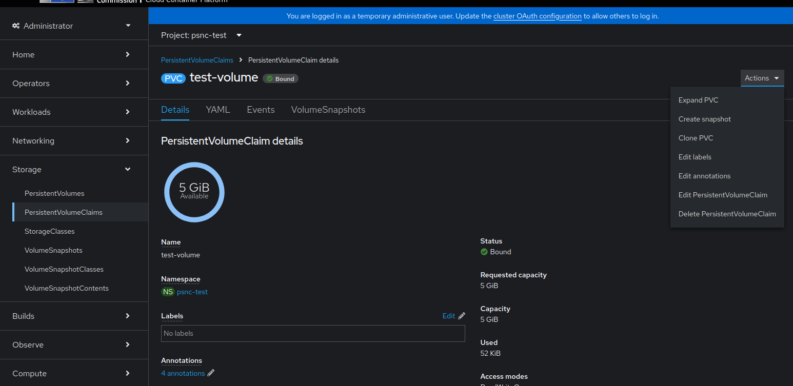
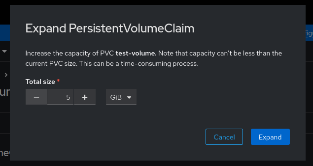

# Persistent Volumes

Container filesystems are ephemeral by default, meaning they reset after an application restart. If your app needs persistent data storage (e.g., for PostgreSQL), use a PersistentVolumeClaim (PVC). This PVC can be mounted to any path within your container. Consider the following:

- **Size:** Can be expanded later but not reduced.
- **StorageClass:** Represents the "kind" or "tier" of storage (e.g., faster storage with less quota, slower with more).
- **AccessMode:** Typically, only one pod can mount a given PVC at a time, though some storage classes allow multiple pods to access it simultaneously.

## Storage classes

Available storage classes are based Cinder block storage volumes - `ReadWriteOnce` mode is possible at the moment and the retention policy is `Delete`.

- `large` - well suited for most common use case and recommended for long term storage
- `fast` (default) - best for application that require fast random RW capabilities where performance is very important

## Backups

All objects (e.g. pods, deployments etc) that exist in your project are backed with a backup service provide by [Velero](https://velero.io). However volumes (which means volumes under a PVC) must fullfil some extra requirements in order to be backed up, as they require opt-in approach:

- PVC must be mounted to at least one running Pod;
- That Pod must have proper annotation `backup.velero.io/backup-volumes` (see example below)
    - This annotation contains names of the volumes that should be backed up where name references `spec.volumes[].name`l
    - If you want to backup multiple volumes mounted to the same pod, you can separate names by a single comma.

!!! warning
    Currently, only administrators can restore projects and volume data.

###  Velero Backup Annotation

Run the following for each pod that contains a volume to back up:

```bash
oc -n <project_name> annotate pod/YOUR_POD_NAME backup.velero.io/backup-volumes=YOUR_VOLUME_NAME_1,YOUR_VOLUME_NAME_2,...
```
where the volume names are the names of the volumes in the pod spec.

For example, for the following pod:
```yaml
apiVersion: v1
kind: Pod
metadata:
  name: sample
  namespace: cool-test
spec:
  containers:
  - image: docker.io/nginxinc/nginx-unprivileged
    name: nginx
    volumeMounts:
    - name: pvc-volume
      mountPath: /volume-1
    - name: emptydir-volume
      mountPath: /volume-2
  volumes:
  - name: pvc-volume
    persistentVolumeClaim:
      claimName: test-volume-claim
  - name: emptydir-volume
    emptyDir: {}
```
You’d run:

```bash
oc -n cool-test annotate pod/sample backup.velero.io/backup-volumes=pvc-volume,emptydir-volume
```

This annotation can also be provided in a pod template spec if you use a controller to manage your pods.

## Expand Volume

!!! warning
    It is recommended to stop the pod e.g. by setting replicas to 0 `oc scale deployment myapp --replicas=0`, wait for termination of the pod and once the resize done successfully as described below, the replicas can be scaled up `oc scale deployment myapp --replicas=1`.

Persistent volumes can be expanded via the Web Console as illustrated below:





Via CLI the pvc can be expanded by changing the requested size.

1. Scale down the Deployment/StatefulSet to 0:

    ```bash
    oc scale deployment myapp --replicas=0
    oc get pods -w # check pod is terminated
    oc scale deployment myapp --replicas=1
    ```

2. Edit the PVC to increase its volume request:

    ```bash
    oc edit pvc <pvc_name>
    ```

3. Wait 3-5 minutes to ensure the API propagates the request.

4. Scale the deployment back to the appropriate size.

See more information at [OKD 4 docs - Expanding persistent volumes](https://docs.okd.io/4.15/storage/expanding-persistent-volumes.html)