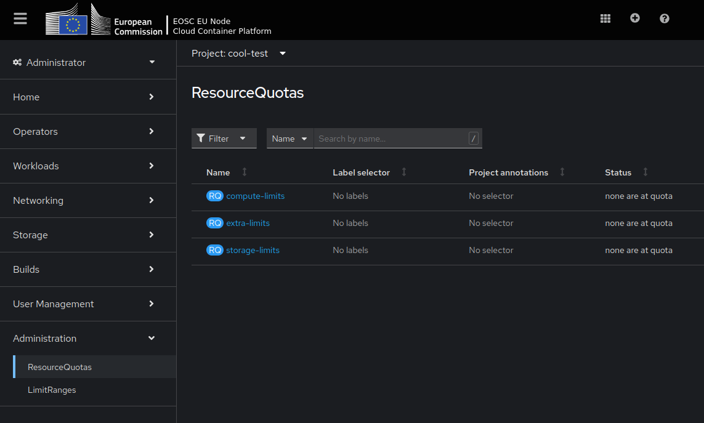
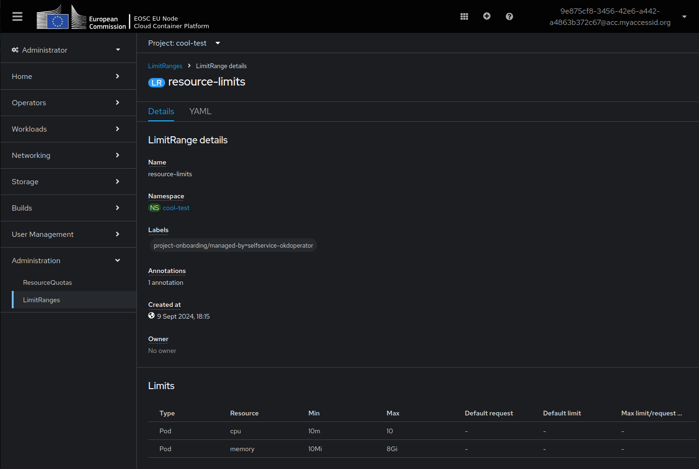

## Projects

Default quotas are assigned to projects and can be adjusted upon request by contacting support at support@safespring.com or through the official European Open Science Cloud help desk. You can check the quota assigned to your project in the Container Platform Web Console by navigating to Administration → ResourceQuotas (e.g., EOSC `https://eu-2.paas.open-science-cloud.ec.europa.eu/k8s/ns/<project_name>/core~v1~ResourceQuota`).



To view the quota for a project via the command line, use the following commands:
```bash
# check current project
oc project

# list projects
oc get projects

# switch to a specific project
oc project <project_name>

oc get quota -n <project_name>

# View detailed quota information:
oc describe quota -n <project_name>
```

You can check the limit assigned to your project in the Container Platform Web Console by navigating to Administration → ResourceQuotas (e.g., EOSC `https://eu-2.paas.open-science-cloud.ec.europa.eu/k8s/ns/<project_name>/core~v1~LimitRange`).



To view LimitRanges via the command line, use:

```bash
# Get limits
oc get limits -n <project_name>

# Get detailed limit information
oc describe limits resource-limits -n <project_name>
```

!!! note "Units of Measure"
    - `Memory` and `storage` are measured in bytes and can include SI suffixes, using powers of ten (E, P, T, G, M, K) or their power-of-two equivalents (Ei, Pi, Ti, Gi, Mi, Ki).
    - `CPU` is measured in millicores. Each node in a cluster calculates its total CPU capacity by multiplying the number of cores by 1000. For example, a node with 2 cores has a CPU capacity of 2000m. If you need 1/10 of a core, it’s represented as 100m. Fractional requests are allowed; for instance, setting `spec.containers[].resources.requests.cpu` to `0.5` requests half the CPU time compared to `1.0`.

### How to Set Requests and Limits

To ensure proper resource usage, each container should have a "resources" section defined in the deployment configuration.

Example:

```yaml
# In the section:
    spec:
      containers:
 
# For a specific container, add:
    resources:
      requests:
        memory: "256Mi"
        cpu: "100m"
      limits:
        memory: "1Gi"
        cpu: "500m"
```

!!! note
    There is no definitive guide for setting these limits, so it’s best to refine them through trial and error while setting realistic expectations.

    This process should be part of preparing you application for deployment, for reaching end-users. For a guide on autoscaling see [How to scale you application](faq.md#how-can-i-scale-my-application-).