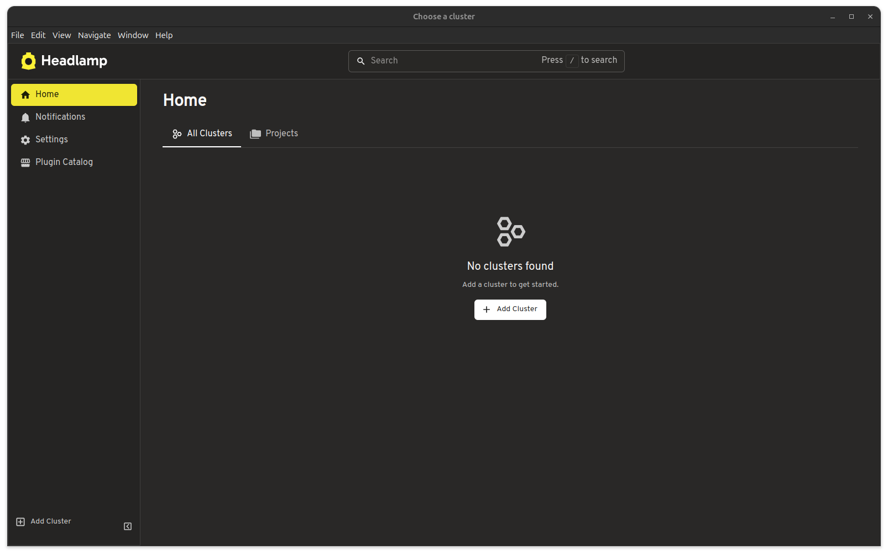
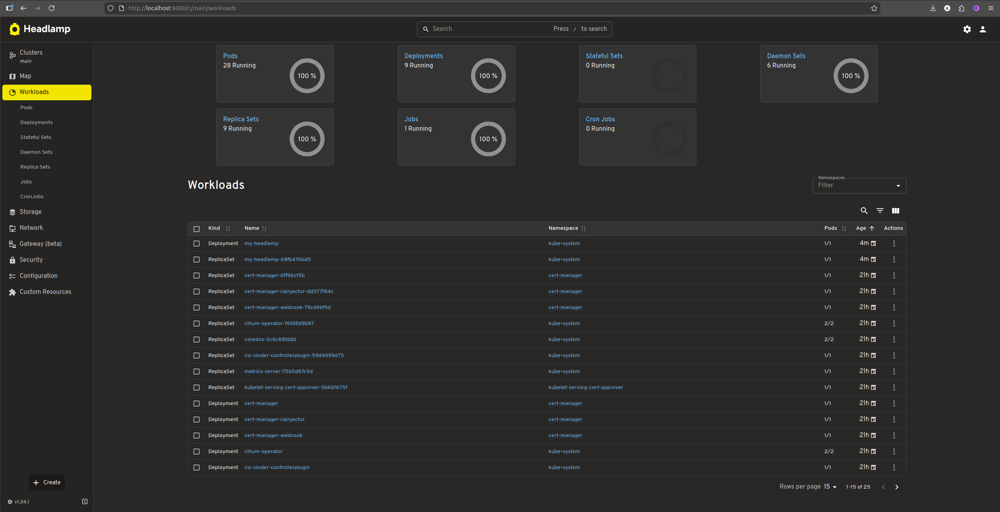

# Kubernetes Dashboard

Whilst most of the interaction with the newly provided cluster can be done through the [kubectl](https://kubernetes.io/docs/reference/kubectl/) command line tool. There are graphical user interfaces that can be used with the cluster such as the [web UI (Kubernetes Dashboard)](https://kubernetes.io/docs/tasks/access-application-cluster/web-ui-dashboard/) and [Headlmap](https://headlamp.dev/), out of which we will be focusing.

## Headlamp

Headlamp can be run as a desktop application as well as in-cluster. Some of the main advantages of using Headlamp include a [plugin system](https://headlamp.dev/plugins) with the option to [customize](https://headlamp.dev/docs/latest/development/plugins/getting-started) with your own brand and theme.

### Desktop Application

To get started with Headlamp for desktop follow the [Desktop App](https://headlamp.dev/docs/latest/installation/desktop/) installation instructions.



To add a cluster:

1. Add Cluster
2. Load from KubeConfig, where we need to add the kubeconfig [obtained from portal](portal-overview.md#accessing-kubernetes-cluster)
3. Finalize adding the cluster
4. You will be redirected to login
5. Access the cluster resources and browse available resources


### In-cluster Install

Make sure kubeconfig is [obtained from portal](portal-overview.md#accessing-kubernetes-cluster) and active in current shell via `KUBECONFIG` environment variable or specified via `--kubeconfig` flag for helm and kubectl command line tools.

#### 1. Add the Headlamp Helm Repository

First, add the official Headlamp Helm repository:

```bash
helm repo add headlamp https://kubernetes-sigs.github.io/headlamp/
```

Update your Helm repositories to ensure you have the latest charts:

```bash
helm repo update
```

#### 2. Install Headlamp

Install Headlamp in the `kube-system` namespace:

```bash
helm install my-headlamp headlamp/headlamp --namespace kube-system
```

#### 3. Create Service Account Token

```bash
kubectl create token my-headlamp --namespace kube-system
```

#### 4. Port Forwarding (Quick Access)

!!! info "Public Access"
  It is important to be aware when exposing cluster services of the [traffic management](manage-traffic.md) available.

For immediate access without setting up ingress and using [port forwarding access](https://kubernetes.io/docs/tasks/access-application-cluster/port-forward-access-application-cluster/):

```bash
kubectl port-forward -n kube-system service/my-headlamp 8080:80
```

Then access Headlamp at `http://localhost:8080` and use the token created at step 3 to access the UI.


