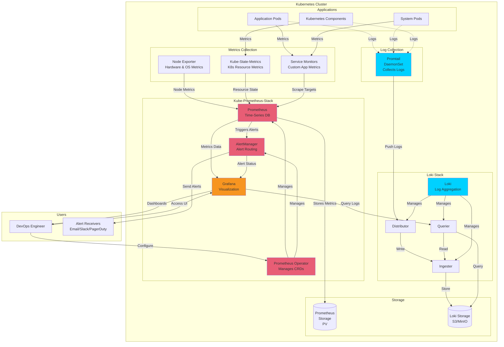

# Observability

For deploying a complete observability stack on Kubernetes we recommend:

- **Kube-Prometheus-Stack**: Includes Prometheus, Grafana, AlertManager, Prometheus Operator, Node Exporter, and Kube-State-Metrics
- **Loki**: Log aggregation system designed for efficiency and cost-effectiveness
- **Promtail**: Agent for collecting and forwarding logs to Loki

| Component | Purpose |
|-----------|---------|
| **Prometheus** | Collects and stores metrics as time-series data |
| **Grafana** | Visualizes metrics and logs through customizable dashboards |
| **AlertManager** | Manages and routes alerts based on defined rules |
| **Prometheus Operator** | Manages Prometheus instances using Kubernetes CRDs |
| **Node Exporter** | Collects hardware and OS-level metrics from cluster nodes |
| **Kube-State-Metrics** | Exposes Kubernetes object state metrics |
| **Loki** | Aggregates and indexes logs efficiently |
| **Promtail** | Collects logs from pods and forwards them to Loki |

The monitoring stack follows this data flow:

1. **Metrics Collection**: Node Exporter, Kube-State-Metrics, and Service Monitors collect metrics
2. **Metrics Storage**: Prometheus scrapes and stores metrics in its time-series database
3. **Log Collection**: Promtail (DaemonSet) collects logs from all pods
4. **Log Storage**: Loki receives, indexes, and stores logs
5. **Visualization**: Grafana queries both Prometheus and Loki for unified dashboards
6. **Alerting**: Prometheus evaluates rules and sends alerts to AlertManager



## Installation

### Step 1: Add Helm Repositories

```bash
# Add Prometheus Community repository
helm repo add prometheus-community https://prometheus-community.github.io/helm-charts

# Add Grafana repository
helm repo add grafana https://grafana.github.io/helm-charts

# Update repositories
helm repo update
```

### Step 2: Create Monitoring Namespace

```bash
kubectl create namespace monitoring
```

### Step 3: Install Kube-Prometheus-Stack

#### Quick Installation (Default Settings)

```bash
helm install kube-prom-stack prometheus-community/kube-prometheus-stack \
  --namespace monitoring
```

#### Production Installation (With Custom Values)

Create a `prometheus-values.yaml` file:

```yaml
# prometheus-values.yaml
global:
  rbac:
    create: true

prometheus:
  prometheusSpec:
    replicas: 2
    retention: 15d
    retentionSize: "45GB"
    
    # Storage configuration
    storageSpec:
      volumeClaimTemplate:
        spec:
          storageClassName: "fast"
          accessModes: ["ReadWriteOnce"]
          resources:
            requests:
              storage: 50Gi
    
    # Resource limits
    resources:
      requests:
        memory: 2Gi
        cpu: 1
      limits:
        memory: 4Gi
        cpu: 2
    
    # Enable ServiceMonitor discovery across all namespaces
    serviceMonitorSelectorNilUsesHelmValues: false
    serviceMonitorSelector: {}
    serviceMonitorNamespaceSelector: {}

alertmanager:
  alertmanagerSpec:
    replicas: 3
    storage:
      volumeClaimTemplate:
        spec:
          storageClassName: "fast"
          accessModes: ["ReadWriteOnce"]
          resources:
            requests:
              storage: 10Gi

grafana:
  enabled: true
  adminPassword: "ChangeMeStrongPassword"
  
  # Persistence for Grafana
  persistence:
    enabled: true
    storageClassName: "fast"
    size: 10Gi
  
  # Ingress configuration (optional)
  ingress:
    enabled: true
    annotations:
      kubernetes.io/ingress.class: nginx
      cert-manager.io/cluster-issuer: letsencrypt-prod
    hosts:
      - grafana.yourdomain.com
    tls:
      - secretName: grafana-tls
        hosts:
          - grafana.yourdomain.com
  
  # Additional data sources will be added later
  sidecar:
    datasources:
      enabled: true
      defaultDatasourceEnabled: true

# Node Exporter configuration
nodeExporter:
  enabled: true

# Kube-State-Metrics configuration
kubeStateMetrics:
  enabled: true
```

Install with custom values:

```bash
helm install kube-prom-stack prometheus-community/kube-prometheus-stack \
  --namespace monitoring \
  -f prometheus-values.yaml
```

### Step 4: Install Loki

Create a `loki-values.yaml` file:

```yaml
# loki-values.yaml
loki:
  commonConfig:
    replication_factor: 1
  
  schemaConfig:
    configs:
      - from: "2024-04-01"
        store: tsdb
        object_store: s3
        schema: v13
        index:
          prefix: loki_index_
          period: 24h
  
  ingester:
    chunk_encoding: snappy
  
  querier:
    max_concurrent: 4
  
  pattern_ingester:
    enabled: true
  
  limits_config:
    allow_structured_metadata: true
    volume_enabled: true
    retention_period: 672h  # 28 days

  storage:
    type: s3

# Deployment mode
deploymentMode: SimpleScalable

# Backend replicas
backend:
  replicas: 2

# Read replicas
read:
  replicas: 2

# Write replicas
write:
  replicas: 3

# Enable MinIO for storage (for testing/development)
minio:
  enabled: true

# Disable for production and use cloud storage instead
# For AWS S3:
# loki:
#   storage_config:
#     aws:
#       region: us-east-1
#       bucketnames: my-loki-bucket
#       s3forcepathstyle: false
```

Install Loki:

```bash
helm install loki grafana/loki \
  --namespace monitoring \
  -f loki-values.yaml
```

### Step 5: Install Promtail

Create a `promtail-values.yaml` file:

```yaml
# promtail-values.yaml
config:
  # Point to Loki service
  clients:
    - url: http://loki-gateway/loki/api/v1/push
  
  snippets:
    pipelineStages:
      - cri: {}
      - regex:
          expression: '.*level=(?P<level>[a-zA-Z]+).*'
      - labels:
          level:

# Resource limits
resources:
  requests:
    cpu: 100m
    memory: 128Mi
  limits:
    cpu: 200m
    memory: 256Mi
```

Install Promtail:

```bash
helm install promtail grafana/promtail \
  --namespace monitoring \
  -f promtail-values.yaml
```

### Step 6: Verify Installation

```bash
# Check all pods in monitoring namespace
kubectl get pods -n monitoring

# You should see pods for:
# - prometheus-operated
# - alertmanager
# - grafana
# - kube-state-metrics
# - node-exporter (one per node)
# - prometheus-operator
# - loki (backend, read, write)
# - promtail (one per node)
# - minio (if enabled)

# Check services
kubectl get svc -n monitoring

# Check persistent volumes
kubectl get pvc -n monitoring
```

---

## Configuration

### Configure Loki as a Grafana Data Source

Update your Prometheus stack to add Loki as a data source:

Create `prometheus-update-values.yaml`:

```yaml
grafana:
  additionalDataSources:
    - name: Loki
      type: loki
      uid: loki
      url: http://loki-gateway.monitoring.svc.cluster.local
      access: proxy
      editable: true
      isDefault: false
      jsonData:
        maxLines: 1000
```

Update the installation:

```bash
helm upgrade kube-prom-stack prometheus-community/kube-prometheus-stack \
  --namespace monitoring \
  -f prometheus-values.yaml \
  -f prometheus-update-values.yaml
```

### Configure AlertManager

Create an AlertManager configuration file:

```yaml
# alertmanager-config.yaml
alertmanager:
  config:
    global:
      resolve_timeout: 5m
      slack_api_url: 'https://hooks.slack.com/services/YOUR/SLACK/WEBHOOK'
    
    route:
      group_by: ['alertname', 'cluster', 'service']
      group_wait: 10s
      group_interval: 10s
      repeat_interval: 12h
      receiver: 'slack-notifications'
      routes:
        - match:
            severity: critical
          receiver: 'slack-critical'
        - match:
            severity: warning
          receiver: 'slack-warnings'
    
    receivers:
      - name: 'slack-notifications'
        slack_configs:
          - channel: '#monitoring'
            title: 'Kubernetes Alert'
            text: '{{ range .Alerts }}{{ .Annotations.summary }}\n{{ end }}'
      
      - name: 'slack-critical'
        slack_configs:
          - channel: '#critical-alerts'
            title: 'CRITICAL: Kubernetes Alert'
            text: '{{ range .Alerts }}{{ .Annotations.summary }}\n{{ end }}'
      
      - name: 'slack-warnings'
        slack_configs:
          - channel: '#warnings'
            title: 'Warning: Kubernetes Alert'
            text: '{{ range .Alerts }}{{ .Annotations.summary }}\n{{ end }}'
```

Apply the configuration:

```bash
helm upgrade kube-prom-stack prometheus-community/kube-prometheus-stack \
  --namespace monitoring \
  -f prometheus-values.yaml \
  -f alertmanager-config.yaml
```

### Create Custom PrometheusRules

Example alert rule:

```yaml
apiVersion: monitoring.coreos.com/v1
kind: PrometheusRule
metadata:
  name: custom-alerts
  namespace: monitoring
  labels:
    release: kube-prom-stack
spec:
  groups:
    - name: custom.rules
      interval: 30s
      rules:
        - alert: HighPodMemory
          expr: |
            sum(container_memory_usage_bytes{pod!=""}) by (pod, namespace) 
            / sum(container_spec_memory_limit_bytes{pod!=""}) by (pod, namespace) 
            > 0.9
          for: 5m
          labels:
            severity: warning
          annotations:
            summary: "Pod {{ $labels.namespace }}/{{ $labels.pod }} memory usage is above 90%"
            description: "Pod memory usage is {{ $value | humanizePercentage }}"
```

Apply the rule:

```bash
kubectl apply -f custom-alerts.yaml
```

### Create ServiceMonitor for Custom Applications

Example ServiceMonitor:

```yaml
apiVersion: monitoring.coreos.com/v1
kind: ServiceMonitor
metadata:
  name: my-app-monitor
  namespace: default
  labels:
    release: kube-prom-stack
spec:
  selector:
    matchLabels:
      app: my-application
  endpoints:
    - port: metrics
      interval: 30s
      path: /metrics
```

---

## Accessing the Stack

### Access Grafana

#### Method 1: Port Forwarding (Quick Access)

```bash
kubectl port-forward -n monitoring svc/kube-prom-stack-grafana 3000:80
```

Access at: `http://localhost:3000`

Default credentials:
- Username: `admin`
- Password: Check the secret or use what you set in values

Get password:
```bash
kubectl get secret -n monitoring kube-prom-stack-grafana \
  -o jsonpath="{.data.admin-password}" | base64 --decode ; echo
```

#### Method 2: LoadBalancer Service

```bash
kubectl patch svc kube-prom-stack-grafana -n monitoring \
  -p '{"spec": {"type": "LoadBalancer"}}'

# Get external IP
kubectl get svc -n monitoring kube-prom-stack-grafana
```

#### Method 3: Ingress (Recommended for Production)

Already configured in the prometheus-values.yaml example above.

### Access Prometheus

```bash
kubectl port-forward -n monitoring svc/kube-prom-stack-prometheus 9090:9090
```

Access at: `http://localhost:9090`

### Access AlertManager

```bash
kubectl port-forward -n monitoring svc/kube-prom-stack-alertmanager 9093:9093
```

Access at: `http://localhost:9093`
