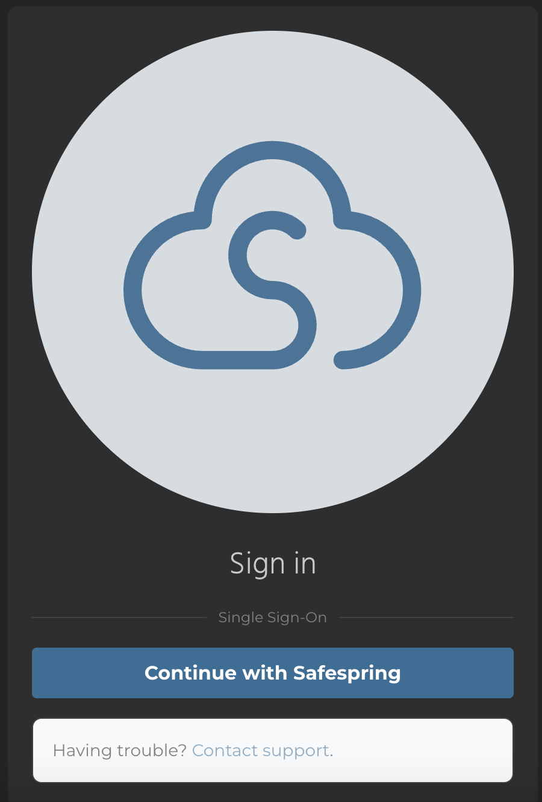
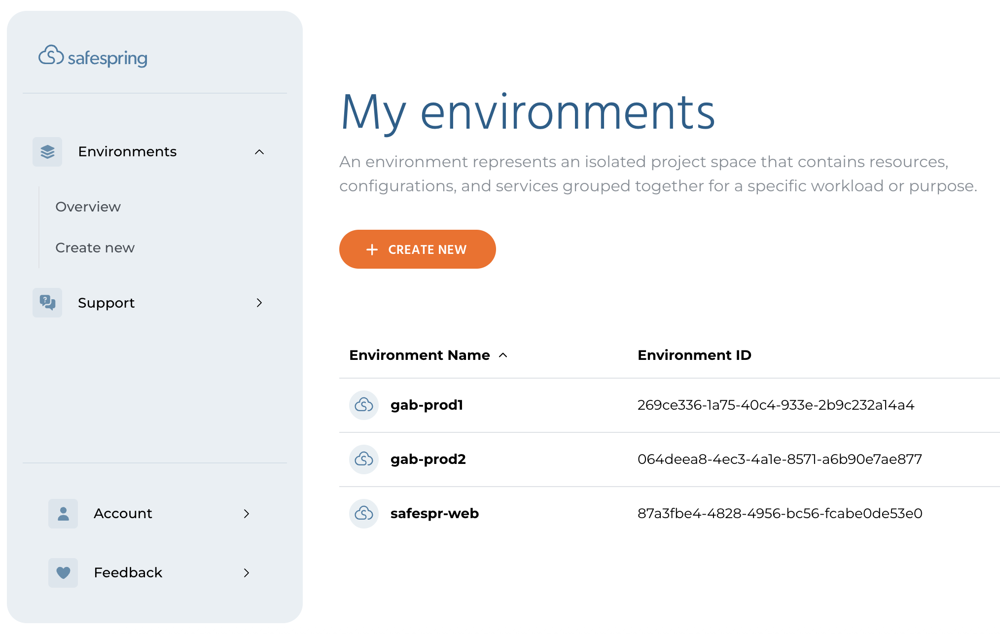
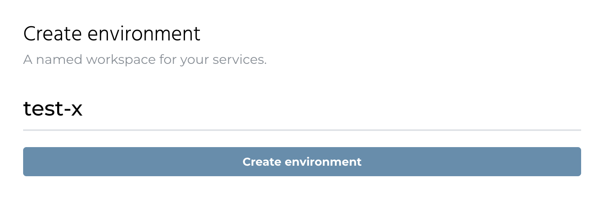
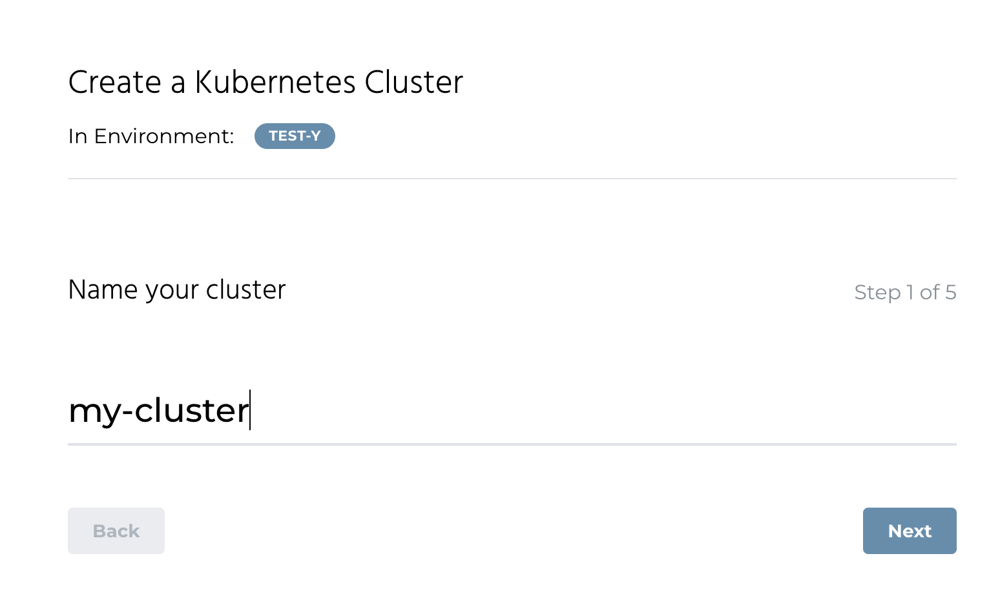
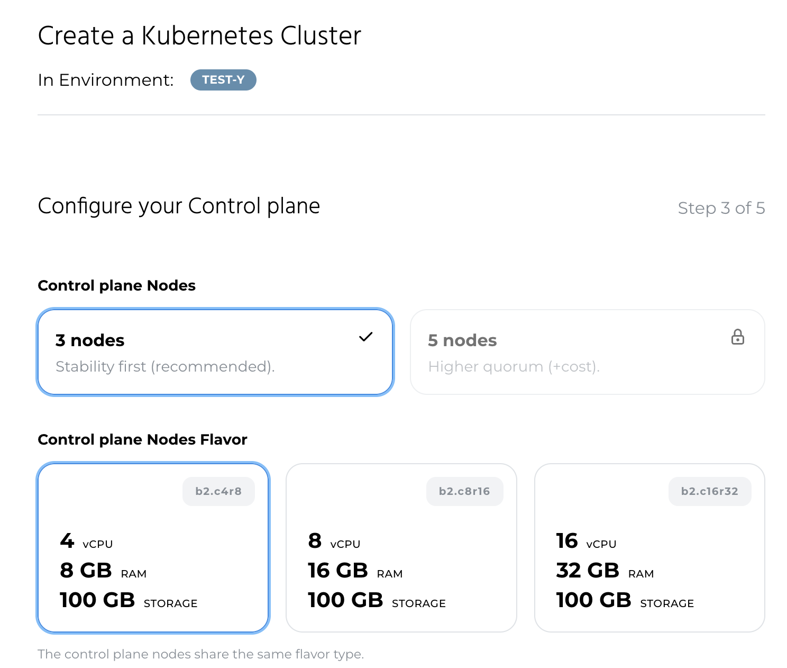
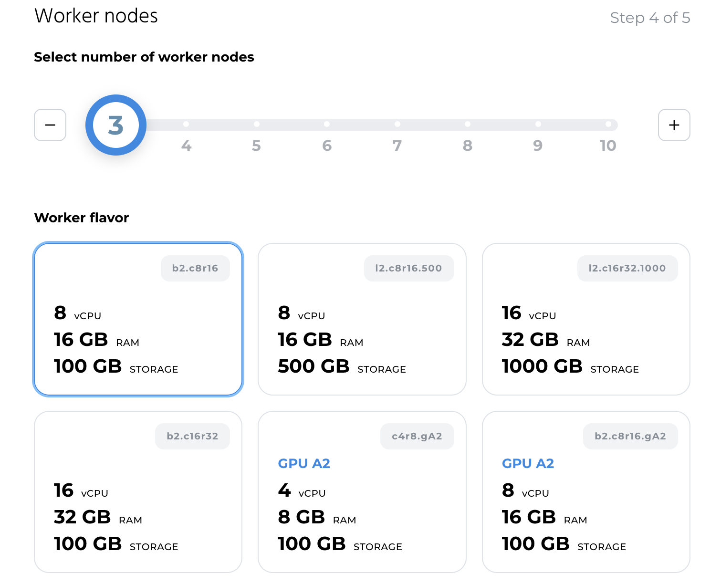
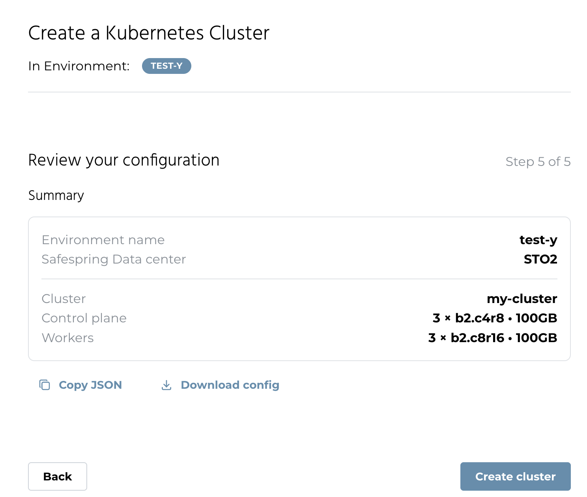
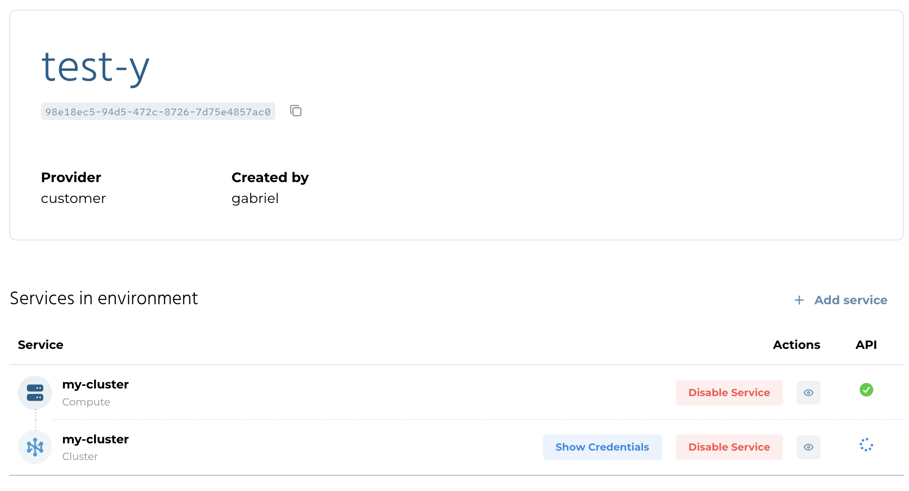
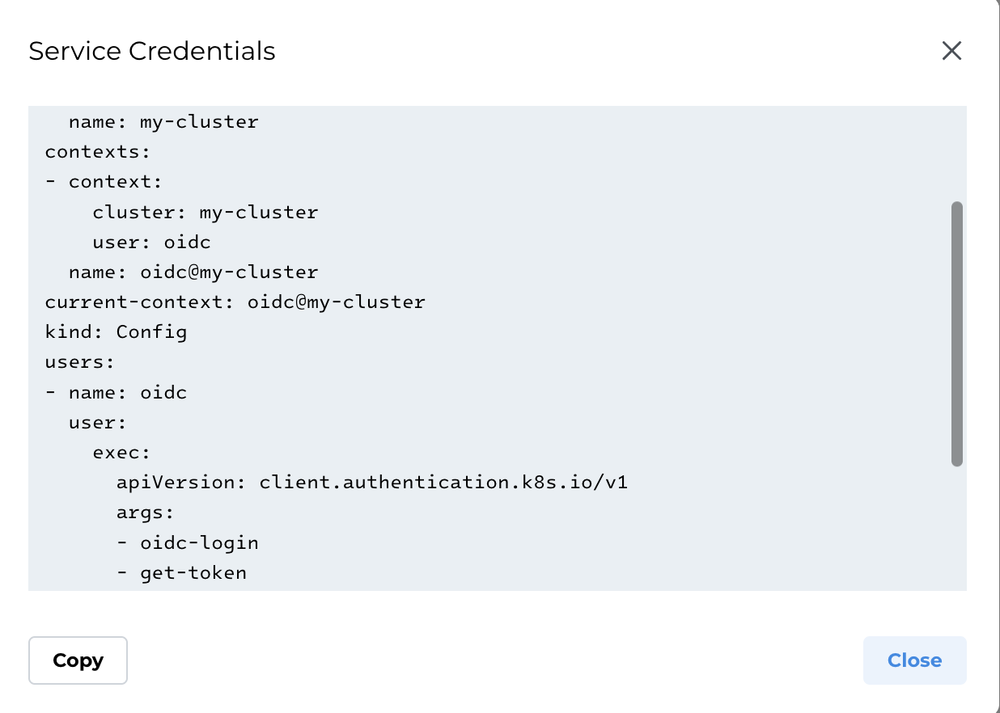
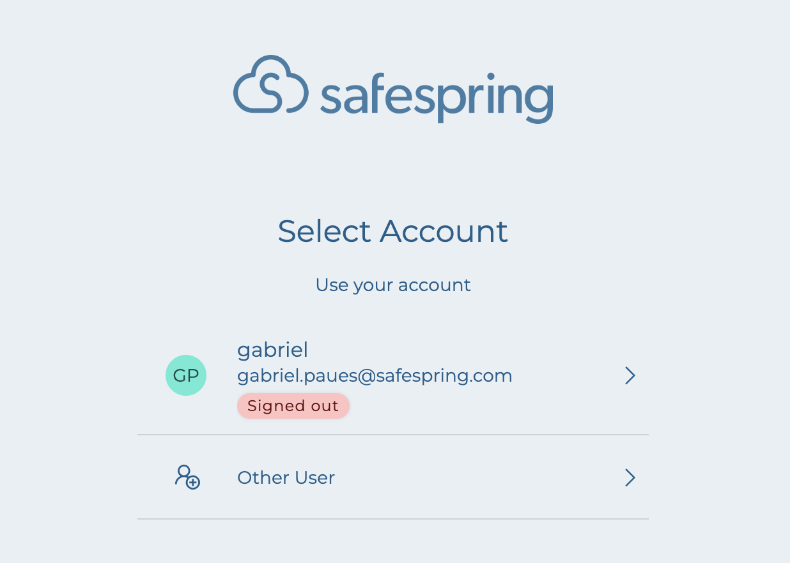

# Portal overview

## I just got a Safespring Portal account, what now?

As the first user for your domain you should have received three activation emails:

* **The portal** URL: https://portal.safespring.com
* **IDM in sto2** URL: https://sto2.idm.paas.safedc.net/
* **IDM in osl2** URL: https://osl2.idm.paas.safedc.net/

You should click the activation links in each and every one of the emails to ensure that you have all accounts you need in order to provision your services.

## Prerequisites

Before you begin working with your Safespring Portal clusters, you need to have the following tools installed:

* **kubectl** - The Kubernetes command-line tool. See [Install and Set Up kubectl](https://kubernetes.io/docs/tasks/tools/)
* **kubelogin** - A kubectl plugin for OIDC authentication. This is required to authenticate to your clusters. See the [kubelogin setup guide](https://github.com/int128/kubelogin?tab=readme-ov-file#setup) for installation instructions.

## Logging into the portal

You are now ready to go to https://portal.safespring.com:


You click the "Sign in" button and you see this:



You click the "Continue with ZITADEL" and log in.

## Viewing your environments

Once you have logged in you will be greeted with your "Environments Overview". If this is the first time you login that listing will be empty:


Environments is a way to group your resources into different separate environments in which you can run several clusters, compute projects or storage accounts.

You click "Create New" to create a new environment.



You give your environment a name and then click "Create environment".


You now see your new environment, where you can start resources.

## Create your first cluster

Click the button "Add Cluster" and give it a name:



In the next step you pick which site you want to start your cluster in:


Now it is time to choose the specifications of the control nodes in the cluster:



You can now choose how many worker nodes and how much resources each worker node should have:



In the last step you review the cluster configuration for the cluster you are about to create. You can also download the cluster configuration JSON file for later reference:



Your cluster is now creating.



### Accessing Kubernetes Cluster

Wait a few minutes and then click the **Show Credentials** button. If you get a [kubeconfig](https://kubernetes.io/docs/concepts/configuration/organize-cluster-access-kubeconfig/) file back your cluster is ready to use:



You can copy the file to a directory to a file named `.kubeconfig` in the environment where you have kubectl installed and run:

```shell
➜ export KUBECONFIG=$(pwd)/.kubeconfig
➜ kubectl get nodes
```

You will get redirected to the IDP of the data center where you provisioned your cluster:



You enter your password:


You will get a message that you have authenticated and if you go back to the terminal you will see the output of the command:

```shell
➜ kubectl get nodes
NAME                                     STATUS   ROLES           AGE     VERSION
my-cluster-control-plane-9pdn5           Ready    control-plane   8m35s   v1.33.5
my-cluster-control-plane-clrzd           Ready    control-plane   8m35s   v1.33.5
my-cluster-control-plane-rhx58           Ready    control-plane   8m17s   v1.33.5
my-cluster-vf9wj-md-worker-26bx9-fwlqn   Ready    worker          8m32s   v1.33.5
my-cluster-vf9wj-md-worker-26bx9-nf7x9   Ready    worker          8m31s   v1.33.5
my-cluster-vf9wj-md-worker-26bx9-qzjd2   Ready    worker          8m35s   v1.33.5
```

You can now start creating namespaces and start using your cluster.
