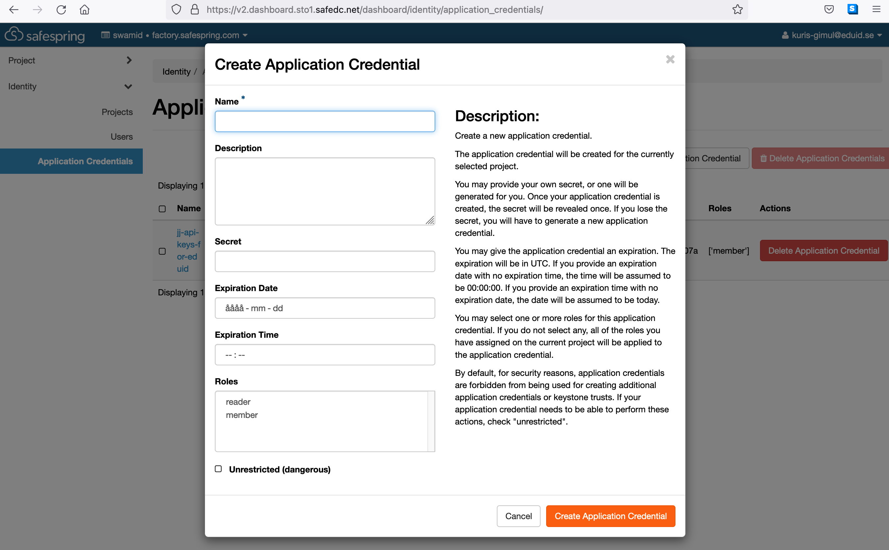

# Application credentials

Application credentials are credentials (id and secret) a user can create in a
project. These credentials are non-personal but cease to exist when the user
that created them is deleted/disabled. Application credentials in Safespring
compute platform gives the same permissions as the user creating them, but only
in the project the credentials is created.

!!! note "Application credentials is only relevant in context of using compute API and/or tools using the API (i.e. terraform, openstack cli etc)"

## Why application credentials

Application credentials enables better security in two ways:

1. Enables delegation of a reduced set of privileges (the project only), if the
   user created it have access to more resources (projects)
1. Enables revocation and rotation of secrets independently of the user account

Examples:

* A super user at an organisation may have access to a number of different
  projects at different sites. If other users only need access to a subset of
  all the projects that the superuser have access to, they can create application
  credentials in these projects, and hand out to users. When access
  is no longer needed the credentials can be revoked by deleting them.

* An application in the project need access to the compute API on behalf of a
  user. If the user stores their own user credentials in the application the
  application potentially gets a lot more privilege than needed, i.e. the
  impact of a break in will be more severe. Also it is wise to rotate secrets
  stored in applications regularly. If the user credential is used in the
  application those credentials need to follow the rotation policy of the
  application which may (should) be more frequent than the users' own
  credentials

In order to rotate credentials, just create a new one, change the application
to consume the new one, and then delete the old one.

## Creating application credentials using the dashboard

Login and go to (for sto1)

https://v2.dashboard.sto1.safedc.net/dashboard/identity/application_credentials/.

From there, click the button _Create Application Credential_. You will be
presented with the following dialog:



Fill in the fields to generate the credentials. You can choose to provide a
secret yourself, or you can let the platform do it. Make a secure record of the
secret.

## Creating application credentials from the command line

1. Install the openstack command line client
1. Configure the environment variables and/or `clouds.yaml` file with your user
   credentials and correct site and project.
1. Run `openstack application credential create <name-of-credential>`.
1. Securely record and transfer the `id` and the `secret` to the comsuming app
   or usage scenario.

Related openstack cli commands:

```
openstack application credential --help
Command "application" matches:
  application credential create
  application credential delete
  application credential list
  application credential show

openstack application credential create --help
...
```

## Configuring authentication with application credentials

To set up authentication for your project, use a clouds.yaml file, or env vars

```
# clouds.yaml file in .config/openstack/ - sto1 example
clouds:
  sto1-myproject:
    auth:
      auth_url: https://v2.dashboard.sto1.safedc.net:5000/v3/
      application_credential_id: <your_id>
      application_credential_secret: <your_secret>
    region_name: sto1
    interface: public
    identity_api_version: 3
    auth_type: v3applicationcredential
```

```
openstack token issue --os-cloud sto1-myproject
# or
export OS_CLOUD=sto1-myproject
openstack token issue
```

ENV vars based example

```
export OS_AUTH_TYPE=v3applicationcredential
export OS_AUTH_URL=<url to the compute API f.ex. https://v2.dashboard.sto1.safedc.net:5000/v3>
export OS_IDENTITY_API_VERSION=3
export OS_APPLICATION_CREDENTIAL_ID=<id of the noted credential>
export OS_APPLICATION_CREDENTIAL_SECRET=<secret of the noted credential>
```

!!! note "Make sure none of the user or project related environment variables are set, since that can prevent application credentials to work."

