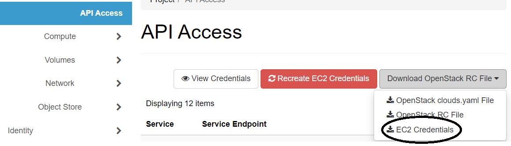
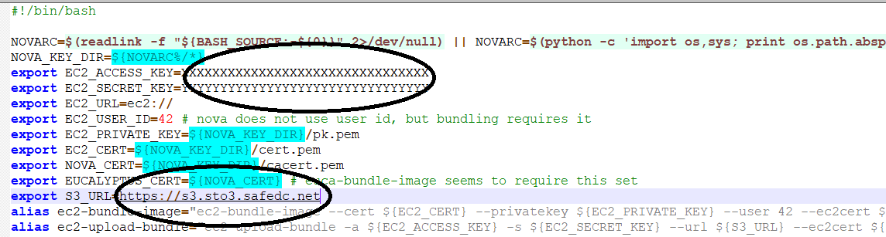
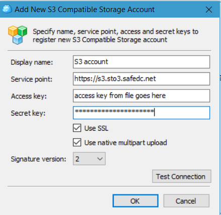

# Getting S3 api credentials 

In the new platform all compute accounts comes with credentials to the S3 storage solution. In order to use the S3 service on needs to download the credentials from the platform through the Compute portal.

1. Log into to you compute account and click "API Access" up in the left corner.
2. Then click on the button "Download OpenStack RC file" and then pick EC2 Credentials in the dropdown.



3. You will now download a zip file with the credentials Unpack the file and open the file ec2.sh in a texteditor.



4. The rows of interest is circled in the picture: EC2_ACCESS_KEY, EC2_SECRET_KEY and S3_URL.
5. Open up your favorite S3-client and copy the values from the file into the connection dialog of the S3-client:



You should now have access to you S3 account.

## Projects, accounts and access
Every user in a project will get their own set of S3 credentials. For example if there are three users in the OpenStack project demo.safespring.com there will be three sets of credentials available, one for each user. If a user has access to several OpenStack projects that user will also be able to fetch several sets of S3-credentials, one for each project that specific user has access to. A user can then create buckets in its own S3-account.

These sets of S3 credentials corresponds to accounts separate from each other and differents users in the same project will not be able to see each others buckets unless specifically setting up access to other users.

## Setting up policies to let other users reach your buckets
Let's say that user A has a bucket X that it wants another user B to get access to. This is done with a bucket policy and is declared with a JSON file which then is applied to the bucket:
``` code
    {
 "Version": "2012-10-17",
 "Id": "POLICY_NAME",
 "Statement": [
   {
     "Sid": "STATEMENT_NAME",
     "Effect": "EFFECT",
     "Principal": {
       "AWS": "arn:aws:iam::PROJECT_ID:root"
     },
     "Action": [
       "ACTION_1",
       "ACTION_2"
     ],
     "Resource": [
       "arn:aws:s3:::KEY_SPECIFICATION"
     ]
   }
 ]
}
```