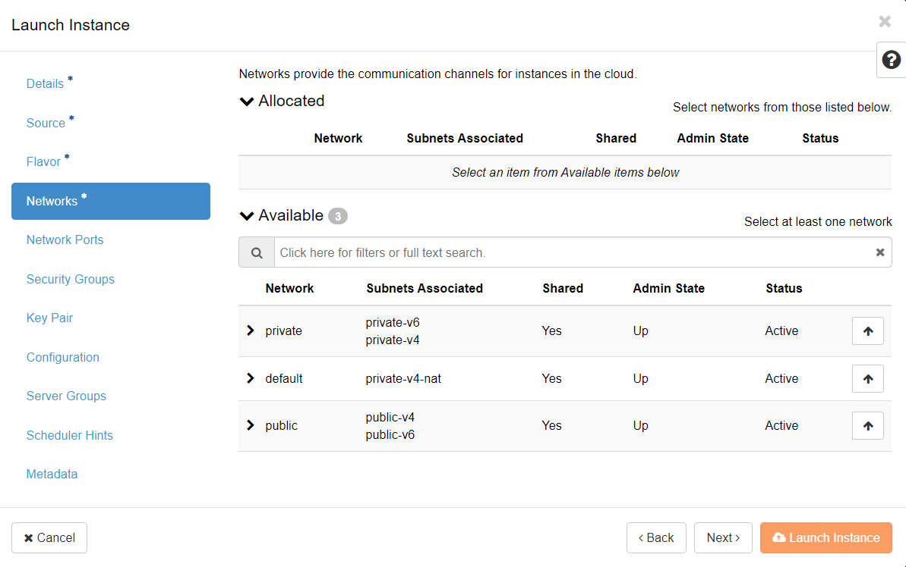
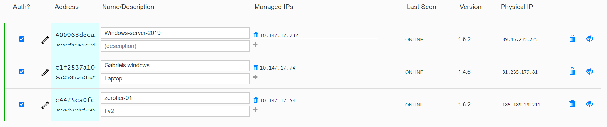

# VPN with wireguard

We have created an automated setup of a [wireguard VPN
server](https://github.com/safespring-community/wireguard-gateway) that can be
used as a starting point to access instances on the private network from hosts
attached to the same wireguard network. Optionally one can configure an on-premise
host as a router into the private network. On premise routing then need
to be adjusted to route traffic to the Safespring private network via that
local wireguard peer.

Of course the setup can be changed and/or wrapped into your specific needs. If
you find bugs or make enhancements, pull requests and/or issues are most
welcome.

Se detailed doc on: https://github.com/safespring-community/wireguard-gateway 


# VPN / overlay networking with zerotier
If you don't want to maintain a wireguard gateway then
[Zerotier](https://docs.zerotier.com/) can be an option

Zerotier is a product used to set up virtual networks with encrypted tunnels
which spans over the internet. When nodes are added to the virtual network they
can communicate with each other. In the standard setup layer 3 connectivity is
achieved but functionality for L2 tunnels is also supported.$ Zerotier can be
used instead of the classic VPN-tunnel setup. Instead of manually configuring
VPN-tunnels for access to resources a more automatic approach can be used for
easy addition and deletion of nodes to the virtual networks. All nodes
belonging to the networks will run an agent which comes for all major platforms
and is easy to install.$ Go to https://zerotier.com and sign up for an
account.$

## Automatic installation on Debian and RedHat based distributions

(This recipe might not be working on new Ubuntu versions due to a long running [open
 issue](https://github.com/zerotier/install.zerotier.com/issues/13)) with ZeroTier.

## Automatic installation on Debian and RedHat based distributions

Start with creating a new instance with the “Launch instance” dialogue in
Safesprings platform. Under “Network” you can pick either “public” or
“default”. The public-network will assign a public IP-address to the instance
and “default” will assign a private IP-address with dynamic NAT to the outside.
The reason for you using Zerotier in the first place is probably that you do
not want the instance to be publicly available so the network "default" is your
best choice here.



The next point of interest is the “Configuration” tab. This is where we will paste the cloud-init code below that will install the agent:

```code
#cloud-config
output: {all: '| tee -a /var/log/cloud-init-output.log'}
manage_etc_hosts: true
apt_update: true
runcmd:
 - curl -s 'https://raw.githubusercontent.com/zerotier/ZeroTierOne/master/doc/contact%40zerotier.com.gpg' | gpg --import && if z=$(curl -s 'https://install.zerotier.com/' | gpg); then echo "$z" | sudo bash; fi
 - sudo zerotier-cli join <network ID from Zerotiers webpage>
```

Make sure to insert your network ID from the Zerotier web page at the last row. Start the instance and go the the Zerotiers webpage. After a while you should see you host showing up in the “Members” section:




When the host show up, check the “Auth” checkbox to join the host to the network. It will now get an IP-address in the overlay network which you can reach from the other nodes in the networket
