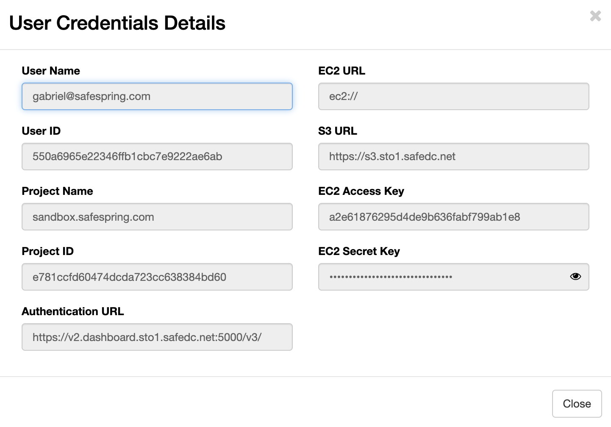

# General S3 information

S3 is an object store, much like an FTP server, except it scales to
much larger sizes and uses `https://` for both integrity, safety and
accessibility.

## Get S3 credentials

!!! note
    Every project on Safespring Compute has one S3 account connected to it but one project can have several users. This means
    that when different users press the "View Credentials" button on Safespring Compute they will get different key pairs of access and secret
    keys. Important to understand is that these different key pairs will give access to the SAME S3 account, tied to the project.

S3 credentials are mapped to projects on Safespring's Compute platform.
This means that if you want to get credentials for S3 you will have to log in to
version 2 of Safespring's Compute platform and then choose "Project" up to the right and then API Access.
You will now see a button which says "View Credentials" and if you click that you will be presented with an
information screen:

1. S3 URL: this is the service point URL to which to direct your S3 Client.
2. EC2 Access Key: the S3 access key
3. EC2 Secret Key: the S3 secret key

Alternatively, you can issue S3 credentials from the command line by
authenticating with an Application Credential — see
[Issue S3 credentials with the openstack CLI](howto/openstack-cli-credentials.md).

## S3 credentials, users, and project lifecycle

S3 credentials are issued per user, but the S3 account they unlock is bound
to the project (see the note at the top of this section). A few less
obvious consequences are worth keeping in mind:

* **Removing a user does not remove the data.** When a user is removed
  from the project, other users keep their access to the S3 account and
  its buckets unchanged.
* **A re-added user inherits existing data.** If every user is removed
  from a project and a new user is later added, the new user can see the
  buckets and objects created by the previous users — the data is bound
  to the project, not to any individual user.
* **Removing a user only invalidates that user's keys.** Their personal
  access/secret key pair stops working immediately, but keys held by
  other users in the same project are unaffected. Disabling a user's SSO
  sign-in without removing the underlying account leaves their
  credentials in place.

### Personal vs. shared credentials

When an application needs S3 credentials, it can be tempting to issue a
single shared key pair from a dedicated service account and reuse it
across the team. We recommend the opposite: keep credentials personal,
and let each user issue their own.

The reason is rotation blast radius. Consider two scenarios when someone
leaves the team:

1. **Termination for cause.** Every credential the leaving user had
   access to needs to be rotated. With personal credentials, that scope
   is limited to the keys that user issued. With a shared service-account
   credential, every application and team member that used the shared
   credential is affected.
1. **Amicable departure.** Whether to rotate is a policy decision, but
   the scope is the same as above — fewer credentials are in play when
   they are bound to individual users.

In both cases, personal credentials limit how much has to change when
someone leaves.

## Minimum required info for S3 access

Many clients will assume you are talking to AWS S3, in which case they might
want you to add region and country and other information. This information isn't
used by our endpoint, so you should be able to get many clients going with only
`access_key`, `secret_key`. Each user has their own access/secret key pair;
store them securely and do not share them with other users — see
[S3 credentials, users, and project lifecycle](#s3-credentials-users-and-project-lifecycle)
for the rationale.

The `https` URLs to the service:

!!! info "New URLs"
    + Norwegian site  - https://s3.osl2.safedc.net
    + Swedish site - https://s3.sto1.safedc.net
    + New Swedish secondary site - https://s3.sto2.safedc.net

The URL change was due to the rename from IPNett to Safespring of our
company.  The old IPNett URLs have now expired and all new client
configurations should point to the new safedc names.

The `new safedc.net` S3 URLs contain wildcard subdomain certificates so that
clients, libraries or frameworks who insist on accessing the domain with `https://BUCKETNAME.URL/dir/object`
for an object named `https://URL/BUCKETNAME/dir/object` will work as expected.
This feature is not yet fully tested but we'll update this documentation when
it is.

## Client Configuration Examples

To help you get started quickly with various S3 clients, we provide sample configurations for popular tools and applications. These examples include the correct endpoint URLs and configuration settings specific to Safespring's S3 service:

- [AWS CLI](howto/configs/aws-cli.md) - Command-line interface for Amazon Web Services
- [s3cmd](howto/configs/s3cmd.md) - Command-line S3 client with sync capabilities
- [Minio Client](howto/configs/minio-client.md) - High-performance S3-compatible client
- [Cyberduck](howto/configs/cyberduck.md) - GUI client for file transfers
- [Duck CLI](howto/configs/duck-cli.md) - Command-line version of Cyberduck
- [s3fs](howto/configs/s3fs.md) - Mount S3 buckets as local filesystems
- [CloudBerry](howto/configs/cloudberry.md) - Backup and file management tool
- [Nextcloud S3](howto/configs/nextcloud-s3.md) - Configure Nextcloud to use S3 storage

Each configuration guide includes installation instructions, setup details, and usage examples tailored for Safespring's S3 endpoints.

## Buckets, directories, files and objects

Your account will allow you to log in to the service, but in order to
store anything in it, you must first make a bucket.  In the AWS
service, the bucket name you choose will become a dns `CNAME` entry
(makes sense in order to be able to load-balance among millions of
customers) which makes the bucket names limited to what is acceptable
as a `DNS` entry.

For most GUI and text-based clients, the bucket will be
indistinguishable from a directory. Inside that bucket you may create
directories and/or files. Creating more than one bucket is possible,
but do mind that it can fail if the name isn't unique, or the name of
it would not work as a `DNS` entry. The directories and files inside can
have names with more variation of course.

## S3 bucket naming constraints

In earlier setups we were running with `rgw_relaxed_s3_bucket_names` set to
`true`. This allowed a bit more characters but could cause issues with clients
and solutions expecting the stricter standard bucket naming constraints. To avoid
such issues in the future we are now running  with the default constraints
which can be seen here
<https://docs.ceph.com/en/octopus/radosgw/s3/bucketops/#constraints>.
