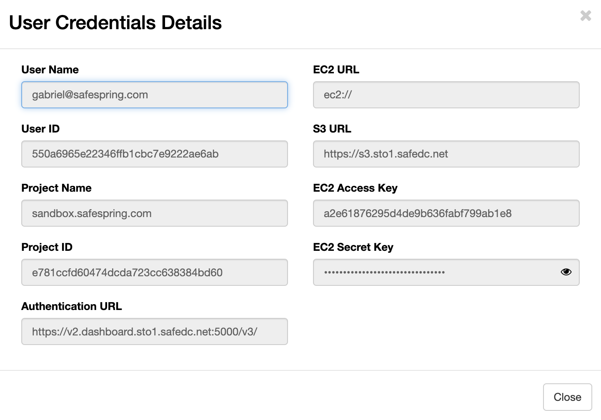

# Access Safespring S3 object storage

Safespring Storage is an S3-compatible object storage service. It is separate
from Amazon Web Services: clients connect to a Safespring endpoint with an
access key and secret key.

This page explains how to obtain those credentials, choose the endpoint for
your site, configure a client, and understand buckets and objects.

This guide covers the standard Storage tier. Every Safespring Compute project
has a standard Storage account, and its users obtain personal credentials
through Compute. The archive tier uses a separate account; [contact
support](../service/support.md) to request one. See [S3 quotas](quota.md) for
the differences between the tiers.

Before you start, you need access to the relevant Safespring Compute project
and an S3-compatible client. If you do not have project access, [contact
support](../service/support.md).

## Get S3 credentials

!!! note
    Every project on Safespring Compute has one S3 account connected to it but one project can have several users. This means
    that when different users press the "View Credentials" button on Safespring Compute they will get different key pairs of access and secret
    keys. Important to understand is that these different key pairs will give access to the SAME S3 account, tied to the project.

Storage credentials are issued through the Compute project that owns the
Storage account. Sign in to the [Horizon dashboard for your site](../compute/sites.md),
select the correct project, then open **Project → API Access** and select **View
Credentials**. The credentials view contains:

1. S3 URL: this is the service point URL to which to direct your S3 Client.
2. EC2 Access Key: the S3 access key
3. EC2 Secret Key: the S3 secret key

Alternatively, you can issue S3 credentials from the command line by
authenticating with an Application Credential — see
[Issue S3 credentials with the openstack CLI](howto/openstack-cli-credentials.md).

## S3 credentials, users, and project lifecycle

S3 credentials are issued per user, but the S3 account they unlock is bound
to the project (see the note at the top of this section). A few less
obvious consequences are worth keeping in mind:

* **Removing a user does not remove the data.** When a user is removed
  from the project, other users keep their access to the S3 account and
  its buckets unchanged.
* **A re-added user inherits existing data.** If every user is removed
  from a project and a new user is later added, the new user can see the
  buckets and objects created by the previous users — the data is bound
  to the project, not to any individual user.
* **Removing a user only invalidates that user's keys.** Their personal
  access/secret key pair stops working immediately, but keys held by
  other users in the same project are unaffected. Disabling a user's SSO
  sign-in without removing the underlying account leaves their
  credentials in place.

### Personal vs. shared credentials

When an application needs S3 credentials, it can be tempting to issue a
single shared key pair from a dedicated service account and reuse it
across the team. We recommend the opposite: keep credentials personal,
and let each user issue their own.

The reason is rotation blast radius. Consider two scenarios when someone
leaves the team:

1. **Termination for cause.** Every credential the leaving user had
   access to needs to be rotated. With personal credentials, that scope
   is limited to the keys that user issued. With a shared service-account
   credential, every application and team member that used the shared
   credential is affected.
1. **Amicable departure.** Whether to rotate is a policy decision, but
   the scope is the same as above — fewer credentials are in play when
   they are bound to individual users.

In both cases, personal credentials limit how much has to change when
someone leaves.

## Connection details

To connect, a client needs the service endpoint, access key, and secret key
shown by **View Credentials**. Some clients assume Amazon S3 and ask for a
region or other AWS-specific settings; Safespring endpoints do not use those
values. Each user has their own access/secret key pair. Store the pair securely
and do not share it with other users — see
[S3 credentials, users, and project lifecycle](#s3-credentials-users-and-project-lifecycle)
for the rationale.

Use the endpoint for the site that contains your project:

!!! info "Service endpoints"
    + Norwegian site  - https://s3.osl2.safedc.net
    + Swedish site - https://s3.sto1.safedc.net
    + Swedish secondary site - https://s3.sto2.safedc.net

See [S3 API compatibility](s3-compatibility.md) for supported request and
addressing behavior.

## Client configuration examples

To help you get started quickly with various S3 clients, we provide sample configurations for popular tools and applications. These examples include the correct endpoint URLs and configuration settings specific to Safespring's S3 service:

- [AWS CLI](howto/configs/aws-cli.md) - Command-line interface for Amazon Web Services
- [s3cmd](howto/configs/s3cmd.md) - Command-line S3 client with sync capabilities
- [Minio Client](howto/configs/minio-client.md) - High-performance S3-compatible client
- [Cyberduck](howto/configs/cyberduck.md) - GUI client for file transfers
- [Duck CLI](howto/configs/duck-cli.md) - Command-line version of Cyberduck
- [s3fs](howto/configs/s3fs.md) - Mount S3 buckets as local filesystems
- [CloudBerry](howto/configs/cloudberry.md) - Backup and file management tool
- [Nextcloud S3](howto/configs/nextcloud-s3.md) - Configure Nextcloud to use S3 storage

Each configuration guide includes installation instructions, setup details, and usage examples tailored for Safespring's S3 endpoints.

## Buckets, objects, and directory-like prefixes

Create a bucket before uploading data. A bucket contains objects; each object
has a key and data. S3 does not have real directories, although clients often
display slashes in object keys as a directory hierarchy.

You can create more than one bucket. Bucket names must be unique within the
service and follow DNS-compatible naming rules. Object keys allow a wider range
of characters than bucket names.

## S3 bucket naming constraints

In earlier setups we were running with `rgw_relaxed_s3_bucket_names` set to
`true`. This allowed a bit more characters but could cause issues with clients
and solutions expecting the stricter standard bucket naming constraints. To avoid
such issues in the future we are now running  with the default constraints
which can be seen here
<https://docs.ceph.com/en/octopus/radosgw/s3/bucketops/#constraints>.
