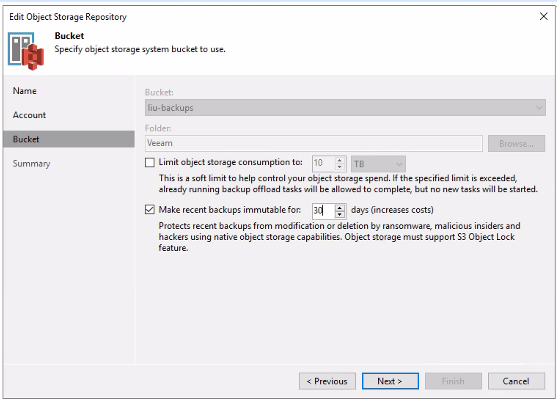

# Object locking feature
Object locking is a new feature, that exists for certain test accounts at
Safespring storage. Object locking makes all objects uploaded to a bucket
immutable for a certain time, which makes it impossible to delete uploaded
objects before that time has passed. For instance, if a timer on one month
is configured on a bucket, all objects uploaded to that bucket will be
immutable and locked for a month before they can be deleted.

This is very useful as a protection for crypto-lockers which are getting more
and more advanced and also attacks the backup solution to prevent an easy
recovery from such an attack. By enabling Object locking the malevolent software
will not be able to the delete backups which will make it possible to recover.

## Creating buckets that allow object locking
In order to use object locking you need to specify at creation time that the bucket is to allow locking of objects, this can be done with minios "mc" or with aws-cli command:

```shell tab="minios "mc""
mc —with-lock mb ceph/mybucket
```

```shell tab="aws-cli"
aws --endpoint=$S3_URL s3api create-bucket --bucket=bucketnamehere --object-lock-enabled-for-bucket
```

!!! note
    Object lock can only be enabled at bucket creation time. It cannot be added to an existing bucket.

## Retention modes

Object lock supports two retention modes: **COMPLIANCE** and **GOVERNANCE**. Both modes prevent objects from being deleted or overwritten during the retention period, but they differ in how strictly the protection is enforced.

### COMPLIANCE mode

In COMPLIANCE mode, a locked object version cannot be deleted or overwritten by any user, including the account owner. The retention period cannot be shortened. This mode is intended for regulatory requirements where data must be preserved for a defined period.

To upload an object with COMPLIANCE retention:

```shell
aws --endpoint=$S3_URL s3api put-object \
  --bucket mybucket \
  --key myfile.txt \
  --body myfile.txt \
  --object-lock-mode COMPLIANCE \
  --object-lock-retain-until-date "2026-03-01T00:00:00Z"
```

### GOVERNANCE mode

In GOVERNANCE mode, objects are protected from deletion and overwriting, but users with the `s3:BypassGovernanceRetention` permission can bypass the protection. This mode is useful for internal policies where an administrator may need to remove objects before the retention period expires.

To upload an object with GOVERNANCE retention:

```shell
aws --endpoint=$S3_URL s3api put-object \
  --bucket mybucket \
  --key myfile.txt \
  --body myfile.txt \
  --object-lock-mode GOVERNANCE \
  --object-lock-retain-until-date "2026-03-01T00:00:00Z"
```

To delete a GOVERNANCE-locked object before the retention period expires, use the `--bypass-governance-retention` flag:

```shell
aws --endpoint=$S3_URL s3api delete-object \
  --bucket mybucket \
  --key myfile.txt \
  --version-id VERSION_ID \
  --bypass-governance-retention
```

### Setting a default retention policy on a bucket

Instead of specifying retention on each upload, you can set a default retention configuration on the bucket. All objects uploaded to the bucket will then automatically inherit this retention policy.

```shell
aws --endpoint=$S3_URL s3api put-object-lock-configuration \
  --bucket mybucket \
  --object-lock-configuration '{"ObjectLockEnabled":"Enabled","Rule":{"DefaultRetention":{"Mode":"COMPLIANCE","Days":30}}}'
```

To check the current retention configuration:

```shell
aws --endpoint=$S3_URL s3api get-object-lock-configuration \
  --bucket mybucket
```

## Legal hold

In addition to retention periods, objects can be placed under a legal hold. A legal hold has no expiration date and remains in effect until explicitly removed. It can be applied independently of any retention mode.

To place a legal hold on an object:

```shell
aws --endpoint=$S3_URL s3api put-object-legal-hold \
  --bucket mybucket \
  --key myfile.txt \
  --legal-hold '{"Status":"ON"}'
```

To remove a legal hold:

```shell
aws --endpoint=$S3_URL s3api put-object-legal-hold \
  --bucket mybucket \
  --key myfile.txt \
  --legal-hold '{"Status":"OFF"}'
```

To check the legal hold status:

```shell
aws --endpoint=$S3_URL s3api get-object-legal-hold \
  --bucket mybucket \
  --key myfile.txt
```

## Inspecting object retention

To check the retention mode and date of a specific object:

```shell
aws --endpoint=$S3_URL s3api get-object-retention \
  --bucket mybucket \
  --key myfile.txt
```

## Object locking in Veeam
The latest versions of Veeam Backup has support for this feature and can be
enabled when creating an Object Storage Repository in Veeam:



